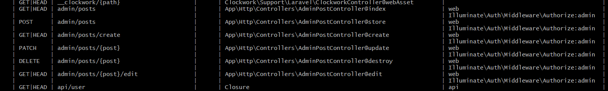

[< Volver al índice](/docs/readme.md)

# All About Authorization

En este episodio, aprenderemos diferentes aspectos como lo son: "Gate authorization", crear una directiva de blade, grupos de rutas y el "Route resource". A partir de esto, arreglaremos que los enlaces de administrador mostrados en el menú desplegable no se muestren a todos los usuarios que inicien sesión.

## 1. Gate Authorization

Con este tipo de autorización, podremos hacer que los enlaces del área de administración ubicados en la barra de navegación sólo se muestren a los usuarios administradores y no a todos. Por lo que, debemos declarar un "gate" de la librería _Facade_ en el método `boot` ubicado en `/app/Providers/AppServiceProvider.php`:

```php
public function boot()
{
    Model::unguard();

    Gate::define('admin', function (User $user) {
        return $user->username === 'JeffreyWay';
    });
}
```

Con esta implementación podríamos validar el usuario administrador desde el controlador de diferentes formas. Por ejemplo:

-   `Gate::allows('admin')` : Válida si en la puerta definida al inicio de la aplicación, si está o no autorizado el admin.

-   `request()->user()-can('admin')` : Lo mismo que el punto anterior.

-   `request()->user()-cannot('admin')` : Lo contrario que el primer punto.

-   `$this->authorize('admin')` : Esto no retorna un booleano, lo que hace es aceptar el paso únicamente de usuarios administradores. Por ejemplo: Si se añadiera al método que carga la página principal, sólo el usuario administrador tendría acceso a esta.

## 2. Solucionar problema de mostrar enlaces de administración a todos

Para dar solución a este problema, debemos ubicarnos en el archivo `/resources/views/components/layout.blade.php` y ubicarnos en el menú desplegable que está dentro de la etiqueta `nav` y podemos explorar diversas soluciones que realizan lo mismo:

### Solucionar con una condición normal:

Validar el valor `'admin'` de la autorización Gate con un `if`:

```html
@if(auth()->can('admin'))
    <x-dropdown-item href="/admin/posts/create" :active="request()->is('admin/posts/create')">New Post</x-dropdown-item>
    <x-dropdown-item href="#" x-data="{}" @click.prevent="document.querySelector('#logout-form').submit()">Log Out</x-dropdown-item>
@endif
```

### Solucionar con directiva de Blade `@can`

Validar el valor `'admin'` de la autorización Gate con la directiva `@can`:

```html
@can('admin')
    <x-dropdown-item href="/admin/posts/create" :active="request()->is('admin/posts/create')">New Post</x-dropdown-item>
    <x-dropdown-item href="#" x-data="{}" @click.prevent="document.querySelector('#logout-form').submit()">Log Out</x-dropdown-item>
@endcan
```

Es una forma corta de hacerlo.

### Crear directiva blade (forma seleccionada)

Si quisiéramos hacer de una forma más elegante la validación del valor `'admin'` de la autorización Gate, podríamos crear nuestra propia directiva de Blade llamada `@admin`. Para realizar esto debemos retornar al archivo `/app/Providers/AppServiceProvider.php` y en el método `boot()` agregamos las siguientes líneas de código e importamos la librería de Blade de _Facade_:

```php
Blade::if('admin', function () {
    return request()->user()?->can('admin');
});
```

Con esto, logramos crear nuestra propia directiva de blade de tipo condicional que validará si existe o no el valor de `'admin'` de la autorización Gate, añadiendo el `?` nos ahorramos una serie de problemas para cuando el usuario no haya iniciado sesión. Por lo que está implementada se verá de la siguiente forma:

```html
@admin
    <x-dropdown-item href="/admin/posts/create" :active="request()->is('admin/posts/create')">New Post</x-dropdown-item>
    <x-dropdown-item href="#" x-data="{}" @click.prevent="document.querySelector('#logout-form').submit()">Log Out</x-dropdown-item>
@endadmin
```

## 3. Eliminar el middleware `MustBeAdministrator.php`

Debido a las implementaciones realizadas en este capítulo, el código del middleware del archivo `/app/Http/Middleware/MustBeAdministrator.php` se encuentra duplicado y, por ende, eliminaremos este archivo.

### Eliminar referencias del middleware

Ahora, es necesario eliminar las referencias de este middleware:

-   Eliminar referencias del middleware `MustBeAdministrator` en el archivo `/app/Http/Kernel.php`, específicamente en el array `$routeMiddleware`.

## 4. Grupo de middleware en rutas

Para remplazar el middleware anterior en las rutas del área de administrador, podríamos solucionarlo con: `Ruta->middleware('can:admin');`, debido a que podemos hacer referencia a la autorización de tipo Gate con el middleware `can`. Pero existe la opción de eliminar un poco la duplicidad de esto, añadiendo las rutas en un grupo de rutas que referencia al middleware:

```php
Route::middleware('can:admin')->group(function () {
    Route::get('admin/posts/create', [AdminPostController::class, 'create']);
    Route::get('admin/posts', [AdminPostController::class, 'index']);
    Route::post('admin/posts', [AdminPostController::class, 'store']);
    Route::get('admin/posts/{post}/edit', [AdminPostController::class, 'edit']);
    Route::patch('admin/posts/{post}', [AdminPostController::class, 'update']);
    Route::delete('admin/posts/{post}', [AdminPostController::class, 'destroy']);
});
```

De esta manera, se le aplicarán a todas las rutas dentro del grupo, el mismo middleware.

## 5. Route resource

Laravel ofrece un helper llamado _Route Resource_ que permite tener las siete acciones RESTFUL básicas en un solo endpoint.

Comprobemos nuestras rutas actualmente ejecutando `php artisan route:list`:



Podemos apreciar que obtenemos todas nuestras rutas. Ahora, implementemos la funcionalidad de _Route Resource_ en nuestro grupo de rutas del área de administración:

```php
Route::middleware('can:admin')->group(function () {
    Route::resource('admin/posts', AdminPostController::class)->except('show');
});
```

Y si volvemos a ejecutar el comando `php artisan route:list` volveremos a obtener el mismo resultado, debido al helper de Laravel prepara automáticamente todas las rutas. Y ya que en nuestro caso no tenemos la acción `show` únicamente agregamos `->except('show')`, para indicar que esa no la tenemos.
