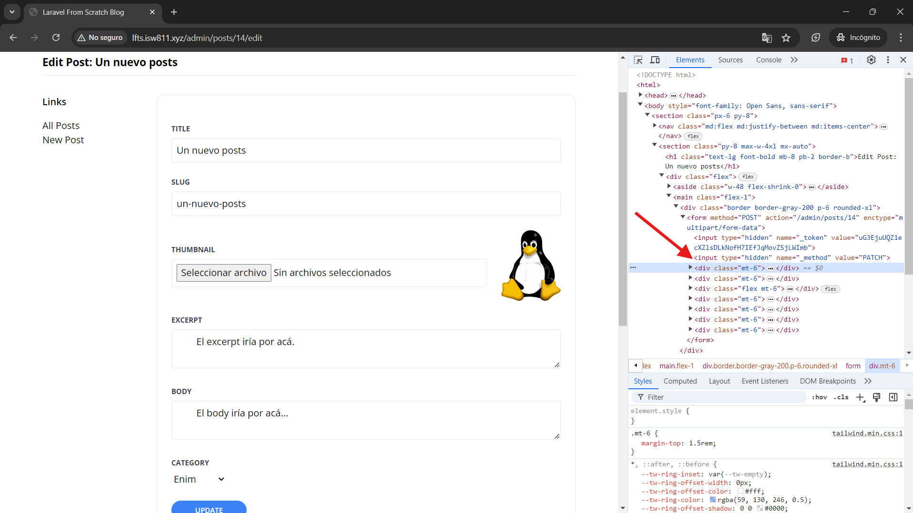
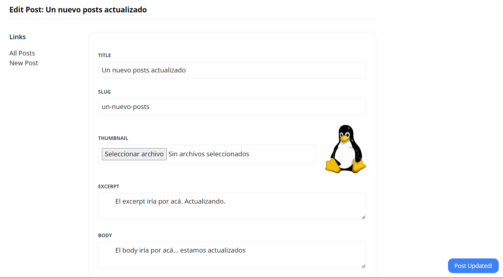
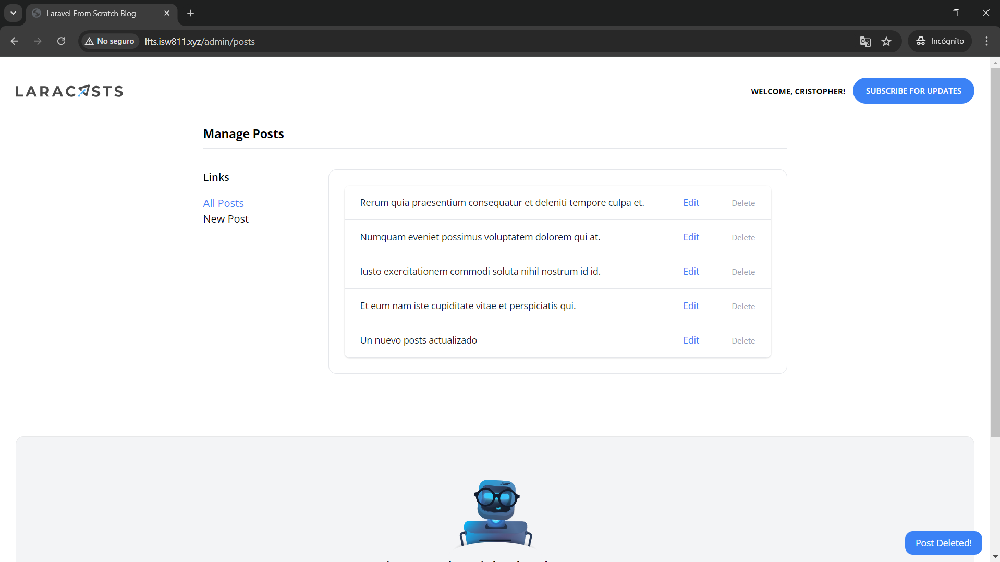

[< Volver al índice](/docs/readme.md)

# Create a Form to Edit and Delete Posts

En este episodio, crearemos los formularios e implementaremos la funcionalidad de editar y eliminar publicaciones.

## 1. Crear controlador para el área de administración de publicaciones

Con la ayuda de Artisan, crearemos un nuevo controlador llamado `AdminPostController` para poder llevar el control de algunas acciones del área de administración. Esto lo podemos crear ejecutando:

```bash
php artisan make:controller AdminPostController
```

## 2. Agregar ruta para mostrar la página principal del área de administración de publicaciones

Ahora, en donde se encuentran los endpoints del área de administración, añadiremos la siguiente ruta:

```php
Route::get('admin/posts', [AdminPostController::class, 'index'])->middleware('admin');
```

Esta nos permitirá mostrar la página principal de publicaciones con diferentes acciones disponibles. Debemos importar el archivo de controlador de `AdminPostController`.

## 3. Crear acción `index` en el nuevo controlador

Posteriormente, crearemos un método `index` en el archivo de controlador `/app/Http/Controllers/AdminPostController.php`:

```php
public function index()
{
    return view('admin.posts.index', [
        'posts' => Post::paginate(50)
    ]);
}
```

Este retornará la vista `admin/posts/index` y un paginado de 50 publicaciones (50 posts por cada página).

## 4. Crear directorio `/resources/views/admin/posts`

Crearemos el directorio `/resources/views/admin/posts` y en este moveremos el archivo de vista `/resources/views/posts/create.blade.php`. Importante recordar cambiar todas sus referencias:

-   En el controlador `PostController` en el método create, cambiar al valor `admin.posts.create`.

## 5. Actualizar barra lateral

En la barra lateral, creada en capítulos anteriores, generamos un enlace para ir al "dashboard", este lo actualizaremos para que nos envíe a la vista que crearemos en la [siguiente sección](#6-crear-indexbladephp-para-la-sección-de-administración).

Actualizar la barra lateral del archivo `/resources/views/components/setting.blade.php`:

```html
<aside class="w-48 flex-shrink-0">
    <h4 class="font-semibold mb-4">Links</h4>

    <ul>
        <li>
            <a
                href="/admin/posts"
                class="{{ request()->is('admin/posts') ? 'text-blue-500' : '' }}"
                >All Posts</a
            >
        </li>

        <li>
            <a
                href="/admin/posts/create"
                class="{{ request()->is('admin/posts/create') ? 'text-blue-500' : '' }}"
                >New Post</a
            >
        </li>
    </ul>
</aside>
```

Cambiamos el enlace y agregamos la clase `flex-shrink-0` al `aside`, para que se separe de forma correcta la barra lateral con el contenido principal.

## 6. Actualizar el menu desplegable de la barra de navegación

En el archivo `/resources/views/components/layout.blade.php`, remplazaremos este extracto de código `<x-dropdown-item href="/admin/dashboard">Dashboard</x-dropdown-item>` por el siguiente:

```html
<x-dropdown-item href="/admin/posts" :active="request()->is('admin/posts')"
    >Dashboard</x-dropdown-item
>
```

De esta manera, podemos navegar a la página principal desde el menú desplegable ubicado en el `nav` de todas las páginas.

## 7. Crear `index.blade.php` para la sección de administración

Ahora, para la sección de administración, crearemos el archivo de vista para su página principal en donde se mostrarán todos los posts. Para esto, nos iremos a las plantillas [predefinidas de Tailwind CSS](https://tailwindcss.com/docs/table-layout) y escogeremos una para agregarla en nuestro archivo de vista.

Crear el archivo `/resources/views/admin/posts/index.blade.php`:

```html
<x-layout>
    <x-setting heading="Manage Posts">
        <div class="flex flex-col">
            <div class="-my-2 overflow-x-auto sm:-mx-6 lg:-mx-8">
                <div
                    class="py-2 align-middle inline-block min-w-full sm:px-6 lg:px-8"
                >
                    <div
                        class="shadow overflow-hidden border-b border-gray-200 sm:rounded-lg"
                    >
                        <table class="min-w-full divide-y divide-gray-200">
                            <tbody class="bg-white divide-y divide-gray-200">
                                @foreach ($posts as $post)
                                <tr>
                                    <td class="px-6 py-4 whitespace-nowrap">
                                        <div class="flex items-center">
                                            <div
                                                class="text-sm font-medium text-gray-900"
                                            >
                                                <a
                                                    href="/posts/{{ $post->slug }}"
                                                >
                                                    {{ $post->title }}
                                                </a>
                                            </div>
                                        </div>
                                    </td>

                                    <td
                                        class="px-6 py-4 whitespace-nowrap text-right text-sm font-medium"
                                    >
                                        <a
                                            href="/admin/posts/{{ $post->id }}/edit"
                                            class="text-blue-500 hover:text-blue-600"
                                            >Edit</a
                                        >
                                    </td>

                                    <td
                                        class="px-6 py-4 whitespace-nowrap text-right text-sm font-medium"
                                    >
                                        <form
                                            method="POST"
                                            action="/admin/posts/{{ $post->id }}"
                                        >
                                            @csrf 
                                            @method('DELETE')

                                            <button
                                                class="text-xs text-gray-400"
                                            >
                                                Delete
                                            </button>
                                        </form>
                                    </td>
                                </tr>
                                @endforeach
                            </tbody>
                        </table>
                    </div>
                </div>
            </div>
        </div>
    </x-setting>
</x-layout>
```

**Puntos interesantes de la implementación:**

-   Al utilizar una plantilla o "template" predefinido, nos ahorramos mucho tiempo.

-   Simplificamos la plantilla a tal punto que eliminamos su `header` y muchos espacios innecesarios para nuestro accionar.

-   Al seleccionar cada publicación, nos dirigirá a su página específica para poder apreciarlo.

-   Se utilizó los componentes `x-layout` para añadir el navbar y footer, y `x-setting` para poder añadir la barra lateral y los estilos genéricos del área de administración.

-   Se predefinió el enlace para poder editar,  el cual se enviará a otra vista para poder actualizar todos sus valores.

-   Al igual que con un enlace para editar, dejamos predefinido el formulario para poder eliminar los registros de publicaciones. En donde, gracias a la directiva `@method('DELETE')`, el servidor podrá interpretar esta solicitud como una de tipo DELETE en la ruta `"/admin/posts/{{ wildcard-id }}"`.
## 8. Crear endpoint para editar

Debemos crear la ruta que nos permitirá llevarnos a editar cada publicación. Esta resultará así:

```php
Route::get('admin/posts/{post}/create', [AdminPostController::class, 'edit'])->middleware('admin');
```

Podemos apreciar que utilizamos el wildcard `{post}` para recibir el ID y de esta forma poder cargar la vista y saber a quién se va a actualizar.

## 9. Migrar funcionalidad de almacenar a `AdminPostController`

En el archivo de controlador `/app/Http/Controllers/PostController.php` tenemos las acciones de crear (lleva al formulario de crear publicaciones) y almacenar (guarda el nuevo registro en la base de datos). Estos métodos los moveremos al nuevo archivo de controlador `/app/Http/Controllers/AdminPostController.php`.

Por lo que, debemos actualizar las rutas para mostrar la vista con el formulario para crear publicaciones y el endpoint para almacenar el nuevo registro:

```php
Route::get('admin/posts/create', [AdminPostController::class, 'create'])->middleware('admin');
Route::post('admin/posts', [AdminPostController::class, 'store'])->middleware('admin');
```

## 10. Crear acción de editar en `AdminPostController`

Ahora, en `AdminPostController` crearemos la acción de `edit`, esta nos permitirá mostrar a los usuarios el formulario con los datos cargados y listos para actualizar. Esta acción resultará así:

```php
public function edit(Post $post)
{
    return view('admin.posts.edit', ['post' => $post]);
}
```

De esta forma, a la vista que creemos en la siguiente sección, le enviaremos los datos de la publicación solicitada a actualizar.

## 11. Crear vista para editar publicaciones

Antes de crear esta vista, es necesario hacer ciertos ajustes en algunos componentes:

### A. Componente `form/input`:

Modificar el archivo de componente `/resources/views/components/form/input.blade.php`:

```html
@props(['name'])

<x-form.field>
    <x-form.label name="{{ $name }}"/>

    <input 
        class="border border-gray-200 p-2 w-full rounded"
        name="{{ $name }}"
        id="{{ $name }}"
        {{ $attributes(['value' => old($name)]) }}
    >

    <x-form.error name="{{ $name }}"/>
</x-form.field>
```

Con estos cambios, podremos recibir el atributo `value` para poder mostrar el valor correspondiente al momento de editar. Para esto se tuvo que eliminar la propiedad `value` en la que antiguamente era que se imprimía el valor antiguo. Ahora, se debe enviar el valor antiguo desde donde se esté utilizando el componente y el atributo `required` cuando sea necesario, debido a que también se eliminó porque no en todas las ocasiones será necesario que sea requerida la entrada.

Así que en los formularios `posts/create` y `sessions/create` añadimos a todos los componentes `x-input` el atributo `required`.

### B. Componente `form/textarea`:

Modificar el archivo de componente `/resources/views/components/form/textarea.blade.php`:

```html
@props(['name'])

<x-form.field>
    <x-form.label name="{{ $name }}" />

    <textarea
        class="border border-gray-200 p-2 w-full rounded"
        name="{{ $name }}"
        id="{{ $name }}"
        required
        {{ $attributes }}
    >
        {{ $slot ?? old($name) }}</textarea
    >

    <x-form.error name="{{ $name }}" />
</x-form.field>
```

Con estos cambios, podremos recibir el slot o imprimir el valor anterior para el valor que se esté manejando.

### Continuar con la vista de publicaciones

Consecuentemente, hay que crear la vista `/resources/views/admin/posts/edit.blade.php`. Este será similar al formulario de crear publicación, así que veamos cómo queda:

```html
<x-layout>
    <x-setting :heading="'Edit Post: ' . $post->title">
        <form method="POST" action="/admin/posts/{{ $post->id }}" enctype="multipart/form-data">
            @csrf
            @method('PATCH')

            <x-form.input name="title" :value="old('title', $post->title)" required />
            <x-form.input name="slug" :value="old('slug', $post->slug)" required />

            <div class="flex mt-6">
                <div class="flex-1">
                    <x-form.input name="thumbnail" type="file" :value="old('thumbnail', $post->thumbnail)" />
                </div>

                thumbnail) }}" alt="" class="rounded-xl ml-6" width="100">
            </div>

            <x-form.textarea name="excerpt" required>{{ old('excerpt', $post->excerpt) }}</x-form.textarea>
            <x-form.textarea name="body" required>{{ old('body', $post->body) }}</x-form.textarea>

            <x-form.field>
                <x-form.label name="category" />

                <select name="category_id" id="category_id" required>
                    @foreach (\App\Models\Category::all() as $category)
                        <option 
                            value="{{ $category->id }}" {{ old('category_id', $post->category_id) == $category->id ? 'selected' : '' }}>
                            {{ ucwords($category->name) }}
                        </option>
                    @endforeach
                </select>

                <x-form.error name="category" />
            </x-form.field>

            <x-form.button>Update</x-form.button>
        </form>
    </x-setting>
</x-layout>
```

**Puntos interesantes de la implementación:**

-   Se utilizó los componentes `x-layout` para añadir el navbar y footer, y `x-setting` para poder añadir la barra lateral y los estilos genéricos del área de administración.

-   Debido a que los navegadores no entienden una solicitud de tipo PATCH, utilizamos la directiva `@method('PATCH')`. En el `form` utilizamos un método POST, pero para el servidor esto será como un PATCH gracias a la directiva de Blade.

-   Se utilizó el componente `x-form.input`, `x-form.textarea`, `x-form.field`, `x-form.label`, `x-form.error` y `x-form.button` para evitar la duplicidad en el código de formulario. Al igual que en el formulario de crear publicaciones.

-   En cada entrada y área de texto, se carga el valor que se tenga almacenado en la base de datos.

-   Para el caso de la miniatura, si existe una almacenada con el registro, esta será mostrada en una pequeña etiqueta `img` al lado de la entrada de tipo archivo.

-   Y para las categorías se aplica una condición ternaria mientras se cargan las opciones del menú desplegable, y en donde coincida con el almacenado se añadirá el valor `selected`.


### Resultado visual y los inputs ocultos

En la siguiente imagen, podremos apreciar cómo se cargan los datos y cómo además se genera un `input` de tipo oculto para especificarle al servidor que será un método de tipo PATCH:



## 12. Añadir endpoint para actualizar

Ahora, debemos de agregar la ruta que nos permitirá actualizar, está será de tipo PATCH y recibirá el ID por medio de un wildcard.

```php
Route::patch('admin/posts/{post}', [AdminPostController::class, 'update'])->middleware('admin');
```

## 13. Crear acción para actualizar

En el archivo del controlador `AdminPostController` crearemos la acción `update()`:

```php
public function update(Post $post)
{
    $attributes = request()->validate([
        'title' => 'required',
        'thumbnail' => 'image',
        'slug' => ['required', Rule::unique('posts', 'slug')->ignore($post->id)],
        'excerpt' => 'required',
        'body' => 'required',
        'category_id' => ['required', Rule::exists('categories', 'id')]
    ]);

    if (isset($attributes['thumbnail'])) {
        $attributes['thumbnail'] = request()->file('thumbnail')->store('thumbnails');
    }

    $post->update($attributes);

    return back()->with('success', 'Post Updated!');
}
```

**Puntos interesantes de la implementación:**

-   Se realizó una validación similar a la de almacenar, pero en este caso la imagen no es requerida y se ignorará el slug que posea este post para evitar errores.

-   Se valida si se está enviando una nueva imagen para actualizarlo, por lo contrario, seguirá la misma miniatura.

-   Luego de actualizar el registro, se retornará al formulario con un mensaje de éxito.

### Ejemplo de actualización:



## 14. Solucionar filtrado por categorías

Existe un problema, al seleccionar la categoría de una publicación en específico, esta no se filtra de la manera correcta, ya que la funcionalidad se había cambiado a realizar el filtrado por "query string". Para solucionar esto, cambiemos los siguientes puntos:

-   Actualizar el atributo `href` del enlace en el archivo de componente `/resources/views/components/category-button.blade.php`:

    ```html
    @props(['category'])

    <a
        href="/?category={{ $category->slug }}
        class="px-3 py-1 border border-blue-300 rounded-full text-blue-300 text-xs uppercase font-semibold"
        style="font-size: 10px"
    >
        {{ $category->name }}
    </a>
    ```

-   En el componente `/resources/views/components/post-featured-card.blade.php` implementar el componente anteriormente actualizado:

    ```html
    <x-category-button :category="$post->category" />
    ```

    Esto iría en lugar del enlace que apuntaba a `"categories/{{ $post->category->slug }}"`.

## 15. Añadir endpoint para eliminar publicaciones 

En nuestro archivo de rutas, añadiremos el siguiente endpoint que nos permitirá eliminar publicaciones:

```php
Route::delete('admin/posts/{post}', [AdminPostController::class, 'destroy'])->middleware('admin');
```

## 16. Crear acción destruir en `AdminPostController`

Por último, implementaremos el método `destroy` en el archivo `/app/Http/Controllers/AdminPostController.php`:

```php
public function destroy(Post $post)
{
    $post->delete();

    return back()->with('success', 'Post Deleted!');
}
```

Este se mantendrá bastante simple, ya que recibe el registro de la publicación, elimina dicha publicación y retorna un mensaje de éxito.

### Ejemplo de eliminar:


