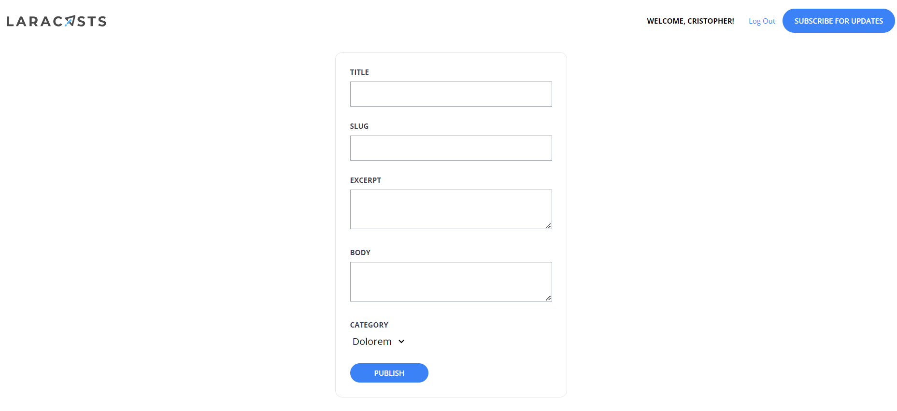

[< Volver al índice](/docs/readme.md)

# Create the Publish Post Form

En este episodio, implementaremos el diseño y funcionalidad del formulario para crear publicaciones en nuestro blog en la vista creada en el capítulo anterior `/resources/views/posts/create.blade.php`.

## 1. Construir el formulario

En el episodio anterior, en el archivo de vista `posts/create`, utilizamos el componente `x-layout`, una sección con un espaciado y un mensaje para pruebas.

Ahora, eliminaremos el mensaje de pruebas y en su lugar construiremos el formulario, que resultará de la siguiente manera:

```html
<x-panel class="max-w-sm mx-auto">
    <form method="POST" action="/admin/posts">
        @csrf

        <div class="mb-6">
            <label class="block mb-2 uppercase font-bold text-xs text-gray-700"
                    for="title"
            >
                Title
            </label>

            <input class="border border-gray-400 p-2 w-full"
                    type="text"
                    name="title"
                    id="title"
                    value="{{ old('title') }}"
                    required
            >

            @error('title')
                <p class="text-red-500 text-xs mt-2">{{ $message }}</p>
            @enderror
        </div>

        <div class="mb-6">
            <label class="block mb-2 uppercase font-bold text-xs text-gray-700"
                    for="slug"
            >
                Slug
            </label>

            <input class="border border-gray-400 p-2 w-full"
                    type="text"
                    name="slug"
                    id="slug"
                    value="{{ old('slug') }}"
                    required
            >

            @error('slug')
                <p class="text-red-500 text-xs mt-2">{{ $message }}</p>
            @enderror
        </div>


        <div class="mb-6">
            <label class="block mb-2 uppercase font-bold text-xs text-gray-700"
                    for="excerpt"
            >
                Excerpt
            </label>

            <textarea class="border border-gray-400 p-2 w-full"
                    name="excerpt"
                    id="excerpt"
                    required
            >{{ old('excerpt') }}</textarea>

            @error('excerpt')
                <p class="text-red-500 text-xs mt-2">{{ $message }}</p>
            @enderror
        </div>

        <div class="mb-6">
            <label class="block mb-2 uppercase font-bold text-xs text-gray-700"
                    for="body"
            >
                Body
            </label>

            <textarea class="border border-gray-400 p-2 w-full"
                    name="body"
                    id="body"
                    required
            >{{ old('body') }}</textarea>

            @error('body')
                <p class="text-red-500 text-xs mt-2">{{ $message }}</p>
            @enderror
        </div>

        <div class="mb-6">
            <label class="block mb-2 uppercase font-bold text-xs text-gray-700"
                    for="category_id"
            >
                Category
            </label>

            <select name="category_id" id="category_id">
                @foreach (\App\Models\Category::all() as $category)
                    <option
                        value="{{ $category->id }}"
                        {{ old('category_id') == $category->id ? 'selected' : '' }}
                    >{{ ucwords($category->name) }}</option>
                @endforeach
            </select>

            @error('category')
                <p class="text-red-500 text-xs mt-2">{{ $message }}</p>
            @enderror
        </div>

        <x-submit-button>Publish</x-submit-button>
    </form>
</x-panel>
```

### Puntos a resaltar de la construcción del formulario:

-   **Formulario:** Creamos un formulario el cual apunta a la acción `'/admin/posts'` con un método POST.

-   **Diseño:** Envolvemos el formulario con el componente `x-panel` para que las entradas no abarquen todo el ancho de la pantalla y se encuentren ordenadas en un panel. Además, añadimos unos estilos para que el panel se mantenga pequeño y centrado.

-   **Campos de entrada:** Utilizando el extracto de código que hemos utilizado para nuestras entradas a lo largo del curso, agregamos un `input` para las columnas `title` y `slug`. En el caso del `body` y `excerpt` un `textarea`, y añadimos la directiva `@error` en cada entrada y área de texto para manejar los errores que retorne el servidor.

-   **Botón de envío:** Utilizamos el componente `x-submit-button` para añadir el botón del envío del formulario.

-   **Selección de categorías:** En el dropdown de categorías, realizamos una consulta para traer todas las categorías y llenamos cada `option` con el ID y nombre de la categoría. En este caso estamos realizando una consulta desde una plantilla, esto para muchos no es muy recomendable, sin embargo esto depende de lo que estemos construyendo y en nuestro caso es aceptable, pero no es la mejor práctica.

-   **Persistir datos después de errores:** Referenciaremos la función `old()` para mantener los valores en el formulario, luego de que una validación del lado del servidor sea activada y retorne al usuario al formulario. A las categorías aplicaremos una condición ternaria para seleccionar la categoría correcta y añadir el atributo `selected` para que se seleccione.

### Resultado visual del formulario

Finalizado el formulario, se verá de la siguiente manera:



## 2. Agregar endpoint para "publicar" posts

Una vez finalizado el formulario, podemos agregar la ruta necesaria para crear las publicaciones.

```php
Route::post('admin/posts', [PostController::class, 'store'])->middleware('admin');
```

Esta se adjuntará posterior a la ruta `'admin/posts/create'` para tener todas las rutas de la sección de administrador juntas. Es destacable que para este punto también deseamos que sólo el usuario administrador del blog pueda realizar esta acción.

## 3. Crear acción `store()` en `PostController`

Posteriormente, crearemos el método `store()` en el archivo `/app/Http/Controllers/PostController.php`:

```php
public function store()
{
    // Validar los valores que vienen de la solicitud
    $attributes = request()->validate([
        'title' => 'required',
        'slug' => ['required', Rule::unique('posts', 'slug')],
        'excerpt' => 'required',
        'body' => 'required',
        'category_id' => ['required', Rule::exists('categories', 'id')]
    ]);

    // Obtener el usuario actual que este autenticado
    $attributes['user_id'] = auth()->id();

    // Crear el nuevo posts
    Post::create($attributes);

    // Redirección a la página principal
    return redirect('/');
}
```

**Esta implementación nos permitirá crear nuevas publicaciones, las cuales serán visibles en la página principal, y con esta implementación podemos asegurarnos de lo siguiente:**

-   Las validaciones permitirán que no se ingrese ningún valor vacío. Además, validará que no hay un slug con el mismo nombre y que ya exista la categoría que se está intentando ingresar.

-   Se obtiene el ID del usuario autenticado y se asocia al array `$attributes` con los valores con el nombre de la columna.

-   Luego, se crea la nueva publicación con el array `$attributes` y se redirecciona a la página home.

Ejemplo de validación de un slug existente:


## Resultado final

En este episodio hemos creado y diseñado un formulario. Además, se le ha añadido la funcionalidad necesaria para "publicar" los posts creados en nuestra página principal. Por ejemplo:

### Crear una nueva publicación:


### Post publicado con éxito:


