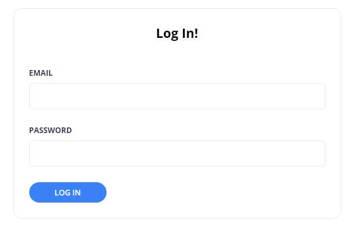
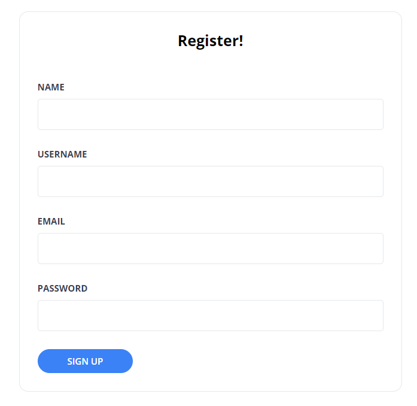
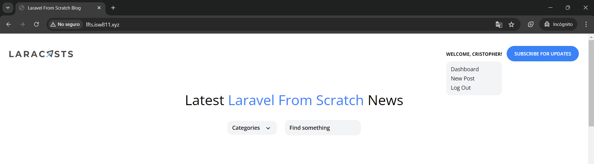
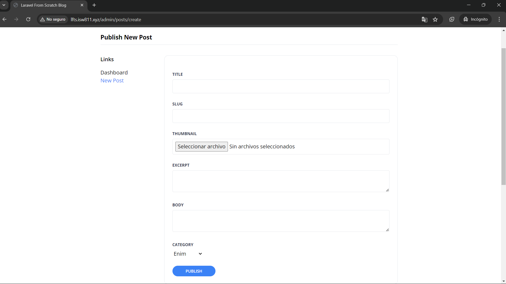

[< Volver al índice](/docs/readme.md)

# Extend the Admin Layout

En el presente episodio, agregaremos un dropdown al área de navegación con el componente creado unas secciones atrás; este permitirá acceder a la sección de administración. También modificaremos el diseño de nuestra sección de administración añadiendo un menú lateral.

## 1. Modificar componente `dropdown.blade.php`

En el archivo del componente `/resources/views/components/dropdown.blade.php` debemos agregar un atributo de tipo `class` al contenedor, resultando así:

```html
@props(['trigger'])
<!-- Cambios en la siguiente línea: -->
<div x-data="{show: false}" @click.away="show = false" class="relative">
    <!-- Trigger -->
    <div @click="show = ! show">{{ $trigger }}</div>

    <!-- Links -->
    <div
        x-show="show"
        class="py-2 absolute bg-gray-100 mt-2 rounded-xl w-full z-50 overflow-auto max-h-52"
        style="display: none;"
    >
        {{ $slot }}
    </div>
</div>
```

Con la clase `relative` podemos mantener el menú desplegable de un tamaño no muy largo y relativo a lo deseado.

## 2. Agregar menú desplegable en el componente `layout`

En el archivo `/resources/views/components/layout.blade.php`, específicamente en la sección en donde se encuentra el `nav` y se muestra el mensaje de bienvenida. El resultado de esto se verá así:

```html
<div class="mt-8 md:mt-0 flex items-center">
    @auth
    <x-dropdown>
        <x-slot name="trigger">
            <button class="text-xs font-bold uppercase">
                Welcome, {{ auth()->user()->name }}!
            </button>
        </x-slot>
        <x-dropdown-item href="/admin/dashboard">Dashboard</x-dropdown-item>
        <x-dropdown-item
            href="/admin/posts/create"
            :active="request()->is('admin/posts/create')"
            >New Post</x-dropdown-item
        >
        <x-dropdown-item
            href="#"
            x-data="{}"
            @click.prevent="document.querySelector('#logout-form').submit()"
            >Log Out</x-dropdown-item
        >

        <form id="logout-form" method="POST" action="/logout" class="hidden">
            @csrf
        </form>
    </x-dropdown>
    @else
    <a href="/register" class="text-xs font-bold uppercase">Register</a>
    <a href="/login" class="ml-6 text-xs font-bold uppercase">Log In</a>
    @endauth
    <a
        href="#newsletter"
        class="bg-blue-500 ml-3 rounded-full text-xs font-semibold text-white uppercase py-3 px-5"
    >
        Subscribe for Updates
    </a>
</div>
```

**Detalles de esta implementación:**

-   Utilizamos el componente `x-dropdown`, este fue creado hace unas secciones.

-   Reutilizamos el mensaje para utilizarlo como trigger del menú desplegable. Para esto tuvimos que cambiarlo por una etiqueta `button`.

-   Utilizamos el componente `x-dropdown-item` para añadir un enlace para navegar al Dashboard y formulario para crear nuevas publicaciones.

-   Se eliminó el botón de envío del formulario para cerrar sesión. En lugar de esto, se añadió un ID al formulario de cerrar sesión y un componente `x-dropdown-item` en el menú despegable y con ayuda de _Alpine.js_, cuando este sea presionado, se activará el envío del formulario y, por ende, se cerrará sesión.

## 3. Crear componente `setting` con una una barra lateral

Para evitar repetirte en cada página que creemos del área de configuraciones, crearemos el componente `/resources/views/components/setting.blade.php`:

```html
@props(['heading'])

<section class="py-8 max-w-4xl mx-auto">
    <h1 class="text-lg font-bold mb-8 pb-2 border-b">{{ $heading }}</h1>

    <div class="flex">
        <aside class="w-48">
            <h4 class="font-semibold mb-4">Links</h4>

            <ul>
                <li>
                    <a
                        href="/admin/dashboard"
                        class="{{ request()->is('admin/dashboard') ? 'text-blue-500' : '' }}"
                        >Dashboard</a
                    >
                </li>

                <li>
                    <a
                        href="/admin/posts/create"
                        class="{{ request()->is('admin/posts/create') ? 'text-blue-500' : '' }}"
                        >New Post</a
                    >
                </li>
            </ul>
        </aside>

        <main class="flex-1">
            <x-panel> {{ $slot }} </x-panel>
        </main>
    </div>
</section>
```

**Detalles de esta implementación:**

-   Este componente es una plantilla genérica para las diferentes páginas que podemos contener en el área de configuraciones.

-   Lo podemos dividir en tres secciones importantes: título (será recibido por medio de propiedades), sidebar (contendrá los links de navegación dentro del área de configuraciones) y la sección principal en donde se colocará el contenido de la página dentro del panel.

-   Para lograr la división de las secciones, se utilizó "flex box".

-   La barra lateral ocupa un ancho fijo de un 48% y el área principal se adapta para ocupar el resto del espacio.

-   Se dejó previsto el enlace para el área del "dashboard".

## 4. Adaptar `posts/create` al nuevo componente

Ahora, aplicaremos el nuevo componente `setting.php` en el archivo de vista `/resources/views/posts/create.blade.php`:

```html
<x-layout>
    <x-setting heading="Publish New Post">
        <form method="POST" action="/admin/posts" enctype="multipart/form-data">
            @csrf

            <x-form.input name="title" />
            <x-form.input name="slug" />
            <x-form.input name="thumbnail" type="file" />
            <x-form.textarea name="excerpt" />
            <x-form.textarea name="body" />

            <x-form.field>
                <x-form.label name="category" />

                <select name="category_id" id="category_id">
                    @foreach (\App\Models\Category::all() as $category)
                        <option
                            value="{{ $category->id }}"
                            {{ old('category_id') == $category->id ? 'selected' : '' }}
                        >{{ ucwords($category->name) }}</option>
                    @endforeach
                </select>

                <x-form.error name="category" />
            </x-form.field>

            <x-form.button>Publish</x-form.button>
        </form>
    </x-setting>
</x-layout>
```

Con esto, nos aseguramos de no repetirnos (DRY), obtener un resultado visual similar al anterior con algunos ajustes, ya que ahora el formulario será un poco más ancho y a la par tendrá una barra lateral para la navegación dentro del área de configuraciones.

## 5. Bajar tono de oscuridad al borde de las entradas y áreas de texto del formulario

En los archivos `/resources/views/components/form/input.blade.php` en el `input` y en el archivo `/resources/views/components/form/textarea.blade.php` en el `textarea` correspondientes cambiaremos el atributo `class`, resultando de la siguiente manera:

```html
class="border border-gray-200 p-2 w-full rounded"
```

Con esto haremos que el color del borde sea igual que el del panel y redondos. Esto es un ejemplo en el que para hacer un cambio no nos debemos ir a cada implementación de una entrada o área de texto, únicamente nos dirigimos al componente y realizamos los cambios necesarios.

## 6. Cambiar forma de recibir atributos en el componente `form/input`

En el archivo del componente `/resources/views/components/form/input.blade.php` eliminaremos la propiedad `type` y ahora la recibiremos como un estándar. Por lo que, todos los atributos que sean enviados a este componente serán agregados.

```html
@props(['name'])

<x-form.field>
    <x-form.label name="{{ $name }}" />

    <input
        class="border border-gray-200 p-2 w-full rounded"
        name="{{ $name }}"
        id="{{ $name }}"
        value="{{ old($name) }}"
        required
        {{
        $attributes
        }}
    />

    <x-form.error name="{{ $name }}" />
</x-form.field>
```

## 7. Limpiar formularios de registro y inicio de sesión

En el episodio anterior, únicamente limpiamos e implementamos los componentes creados para la entrada y área de texto en el formulario de `posts/create` (formulario de crear publicaciones). Ahora, lo haremos a nivel del formulario de registro e inicio de sesión.

### A. Formulario de `/resources/views/sessions/create.blade.php`

El código del formulario para iniciar sesión resultará de la siguiente manera:

```html
<x-layout>
    <section class="px-6 py-8">
        <main class="max-w-lg mx-auto mt-10">
            <x-panel>
                <h1 class="text-center font-bold text-xl">Log In!</h1>

                <form method="POST" action="/login" class="mt-10">
                    @csrf

                    <x-form.input
                        name="email"
                        type="email"
                        autocomplete="username"
                    />
                    <x-form.input
                        name="password"
                        type="password"
                        autocomplete="current-password"
                    />

                    <x-form.button>Log In</x-form.button>
                </form>
            </x-panel>
        </main>
    </section>
</x-layout>
```

Y visualmente, resultará de esta forma:



### B. EXTRA: Formulario de `/resources/views/register/create.blade.php`

Por último, como un trabajo extra, limpiaremos el formulario de registro. Este resultado será así:

```html
<x-layout>
    <section class="px-6 py-8">
        <main class="max-w-lg mx-auto mt-10">
            <x-panel>
                <h1 class="text-center font-bold text-xl">Register!</h1>

                <form method="POST" action="/register" class="mt-10">
                    @csrf

                    <x-form.input name="name" />
                    <x-form.input name="username" />
                    <x-form.input name="email" type="email" />
                    <x-form.input
                        name="password"
                        type="password"
                        autocomplete="new-password"
                    />
                    <x-form.button>Sign Up</x-form.button>
                </form>
            </x-panel>
        </main>
    </section>
</x-layout>
```

Resultado visual de la limpieza del formulario de registro:



## Resultado final

Finalmente, hemos implementado un menú desplegable para poder navegar entre las secciones del área de configuraciones y para poder salir de la sesión. Éste se ve así:



Además, hemos agregado un menú lateral y refactorizado el formulario de crear publicaciones, el cual, como podemos apreciar, quedó de una manera bastante interesante:



Y, al igual que en el capítulo anterior, limpiamos los formularios de registro e inicio de sesión utilizando componentes Blade.
