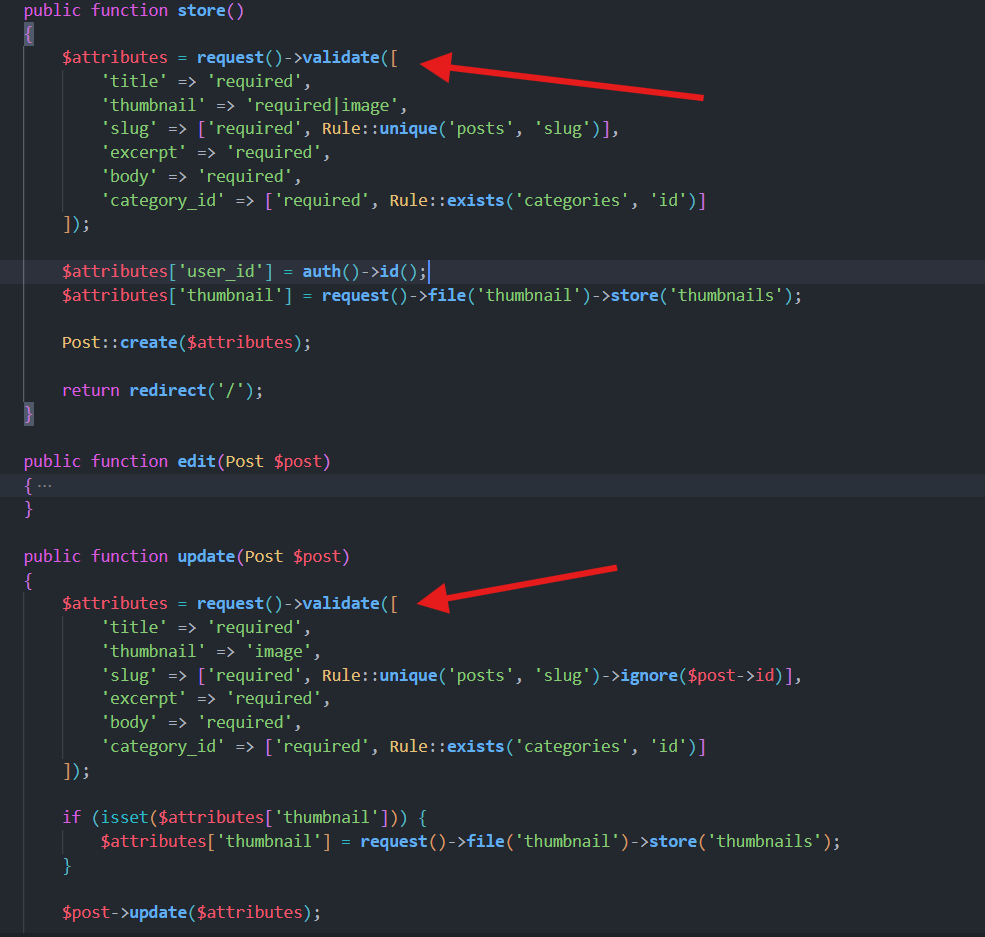

[< Volver al índice](/docs/readme.md)

# Group and Store Validation Logic

En el presente capítulo, extraeremos la lógica de validación de nuestros controladores en un método reutilizable, pero antes de esto, analizaremos las ventajas y desventajas de tener este código repetido.

## Problema de duplicación

El problema de duplicación de código se encuentra en el archivo del controlador `/app/Http/Controllers/AdminPostController.php`, específicamente en los métodos `store()` y `update()`. Lo podemos apreciar en la siguiente imagen:



## Consejo antes de extraer el código repetido

El consejo es tratar de no crear diferentes archivos con dependencias, direcciones y muchas funcionalidades que pueden llegar a complicar la sección al intentar eliminar un poco de duplicación de código.

## Ventajas y desventajas de la duplicación

Antes de llegar a una solución simple del problema, examinemos algunas ventajas y desventajas:

### Ventajas de mantener el código repetido:

-   Por lo general, no se agregan nuevas columnas, como para justificar el proceso de refactorizar por tener algo como esto.

-   Son un par de líneas de duplicación más, en contra de tener más archivos, dependencias y otros puntos necesarios para solucionar el problema.

### Desventajas de mantener el código repetido:

-   Duplicidad de código.

-   Disminuye la facilidad para hacer crecer la aplicación.

## Solución: Extraer la validación en un método

Una de las soluciones que le gusta y propone el instructor es extraer las validaciones en un método, pero con el cuidado necesario, esto debido a que las diferencias existentes son muy ligeras, pero con una importancia alta. Para solucionar esto, implementemos lo siguiente:

Crear el método `validatePost()` en el controlador `AdminPostController`:

```php
protected function validatePost(?Post $post = null): array
{
    $post ??= new Post();

    return request()->validate([
        'title' => 'required',
        'thumbnail' => $post->exists ? ['image'] : ['required', 'image'],
        'slug' => ['required', Rule::unique('posts', 'slug')->ignore($post)],
        'excerpt' => 'required',
        'body' => 'required',
        'category_id' => ['required', Rule::exists('categories', 'id')],
        'published_at' => 'required'
    ]);
}
```

**Puntos interesantes de esta implementación:**

-   Al recibir un valor nulo, como será el caso de `store()`, este nuevo método creará una nueva instancia de `Post`, con el objetivo de identificar cuándo se crea y cuándo se actualiza.

-   Con `$post->exists ? ['image'] : ['required', 'image']`, podemos asegurarnos de que si no existe una imagen (como en el caso del objeto vació), estamos creando un nuevo registro de publicación y por ende aplicar las validaciones requeridas.

-   Al mantener esta regla así: `['required', Rule::unique('posts', 'slug')->ignore($post)]` nos aseguramos de que al actualizar ignore el slug del post a actualizar y que al crear no ignore y sólo aplique la validación, ya que el objeto `$post` estará vació.

-   Las demás validaciones se mantienen igual.

-   Se retorna un array con los atributos validados.

Implementar solución en la acción `store()`:

```php
public function store()
{
    Post::create(array_merge($this->validatePost(), [
        'user_id' => request()->user()->id,
        'thumbnail' => request()->file('thumbnail')->store('thumbnails')
    ]));

    return redirect('/');
}
```

Realizamos una unión de arrays, entre los valores que retorna el método para validar y los valores necesarios a tomar (`user_id` y `thumbnail`).

Implementar solución en la acción `update()`:

```php
public function update(Post $post)
{
    $attributes = $this->validatePost($post);

    if ($attributes['thumbnail'] ?? false) {
        $attributes['thumbnail'] = request()->file('thumbnail')->store('thumbnails');
    }

    $post->update($attributes);

    return back()->with('success', 'Post Updated!');
}
```

En este caso, refactorizamos este método de tal forma que valide los valores con el nuevo método y tome los atributos de la solicitud de ahí mismo. Además, implementamos el Null coalescing operator `??` que es algo nuevo en PHP 8, para poder hacer condiciones.

## Resultado final

Finalmente, logramos refactorizar el controlador `AdminPostController` de tal manera que se eliminará la duplicidad de la lógica de validación y disminuirá la cantidad de código en los métodos `store` y `update`.
