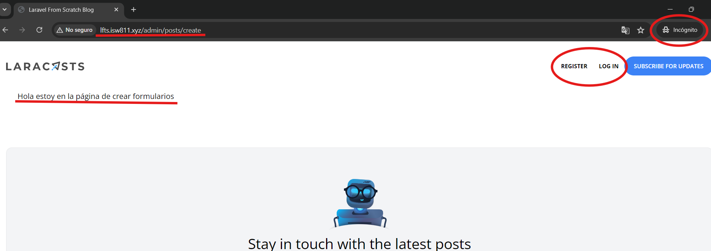
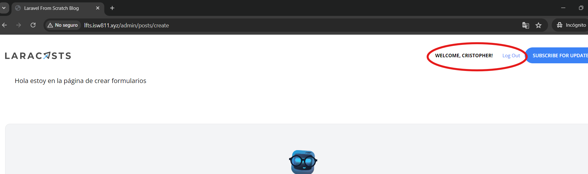

[< Volver al índice](/docs/readme.md)

# Limit Access to Only Admins

Con este capítulo, daremos inicio a la sección _Admin Section_. A lo largo del curso, hemos estado creando publicaciones por medio de línea de comando. Por lo que, el fin de esta nueva sección de administración es permitirnos publicar nuevos posts desde una vista. Sin embargo, primero debemos añadir una capa de seguridad para que solo usuarios administradores puedan realizar esta acción.

## 1. Añadir rutas para la sección de administración

En nuestro archivo `/routes/web.php`, posterior a las rutas existentes, añadiremos el siguiente endpoint que tendrá el fin de mostrar el formulario para poder crear las publicaciones:

```php
Route::get('admin/posts/create', [PostController::class, 'create']);
```

## 2. Crear acción `create` en `PostController`

Ahora, es necesario agregar la acción para mostrar el formulario de crear publicaciones para la sección de administración. Este método resultará así:

```php
public function create()
{
    return view('posts.create');
}
```

Esto nos permitirá retornar a la vista `posts/create`, la cual contendrá el formulario para crear posts.

## 3. Crear archivo de vista `posts/create`

Crearemos el archivo `create.blade.php` en la ubicación `/resources/views/posts/`. En este nuevo archivo de vista reutilizaremos el componente `x-layout` y la sección con unos espaciados. También añadiremos un mensaje relacionado con la página, para realizar diferentes pruebas. Este archivo resultará de la siguiente forma:

```html
<x-layout>
    <section class="px-6 py-8">
        Hola estoy en la página de crear formularios
    </section>
</x-layout>
```

### Problema de permisos de acceso

Actualmente, si accedemos a esta sección con la URL `http://lfts.isw811.xyz/admin/posts/create`, nos permitirá acceder a la vista, hayamos o no iniciado sesión y sin importar el tipo de usuario que sea. Por ejemplo, comprobemos esto accediendo en modo incógnito:



Y queremos que a este punto no accedan ni visitantes ni usuarios normales.

## 4. Limitar permisos sólo a administradores

Para poder limitar el acceso a usuarios administradores que tengan acceso a crear publicaciones, podríamos añadir lo siguiente a la acción `PostController`:

```php
if (auth()->user()?->username !== 'cristopher') {
    abort(Response::HTTP_FORBIDDEN);
}
```

Aunque, esto no sería una forma reutilizable y limpia de validar los permisos. Por lo que crearemos un middleware, por ello en la línea de comandos podemos ejecutar esto:

```bash
php artisan make:middleware MustBeAdministrator
```

Esto nos generará el archivo `/app/Http/Middleware/MustBeAdministrator.php`. En el cual podremos encontrar la acción `handle` y en esta añadiremos el código visto al inicio de este paso. Por lo que, el método quedará así:

```php
public function handle(Request $request, Closure $next)
{
    if (auth()->user()?->username !== 'cristopher') {
        abort(Response::HTTP_FORBIDDEN);
    }

    return $next($request);
}
```

Con esto, lo que haremos es validar si existe la sesión de un usuario y si ese usuario tiene el nombre de usuario `cristopher`. Por último, retornará a la siguiente capa de la cebolla (todos los pasos que queden por delante para que la aplicación funcione).

## 5. Activar el nuevo archivo middleware

Antes de realizar la activación, debemos saber que existen dos tipos de middlewares:

1. **Global:** Este tipo de middleware se ejecutará en cada solicitud de la aplicación.

2. **Específico:** Este tipo de middleware se ejecuta únicamente cuando deseamos aplicarlo, estos aplican en casos que no son apropiados para todas las rutas de nuestras aplicaciones, como lo es el middleware que acabamos de crear.

Una vez entendido esto, nos dirigimos al archivo `/app/Http/Kernel.php` y encontraremos varios arreglos:

-   `$middleware`: En este nos encontraremos los middlewares globales.

-   `$routeMiddleware`: En este nos encontraremos los middlewares específicos.

En el arreglo `$routeMiddleware`, posteriormente al valor `auth`, añadiremos nuestro nuevo middleware de la siguiente forma:

```php
'admin' => MustBeAdministrator::class,
```

De esta forma, el nuevo middleware está activado.

## 6. Añadir middleware a la ruta `'admin/posts/create'`

Añadiremos el middleware a la ruta `'admin/posts/create'` y esta resultará de la siguiente manera:

```php
Route::get('admin/posts/create', [PostController::class, 'create'])->middleware('admin');
```

## Consejo final

En caso de tener varios administradores, lo que se puede manejar es un arreglo de nombres de usuarios, los cuales permitan validar desde ese arreglo o añadir una columna a la tabla de usuarios en la que se diga si es o no administrador.

## Resultado final

Como resultado final, hemos implementado los permisos para que únicamente el usuario administrador (cristopher), pueda acceder a esta vista o URL. Por ejemplo:



De lo contrario, ya sea un visitante o usuario normal, recibirá un forbidden al intentar ingresar a esta vista.
