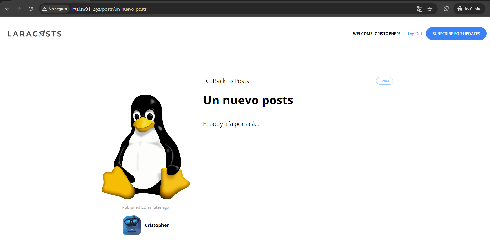

[< Volver al índice](/docs/readme.md)

# Validate and Store Post Thumbnails

En este capítulo, añadiremos una sección en el formulario de crear publicaciones para actualizar las miniaturas. Por lo que aprenderemos a manejar imágenes de manera local utilizando un `input` de tipo `file` y la clase `UploadedFile`.

## 1. Añadir título al formulario para crear publicaciones

Antes de empezar con el platillo fuerte del episodio, añadamos un título al formulario y ajustemos unos estilos para tener un panel un poco más largo y lograr alinear el título con el formulario.

```html
<x-layout>
    <section class="py-8 max-w-md mx-auto">
        <h1 class="text-lg font-bold mb-4">Publish New Post</h1>

        <x-panel>
            <!-- Formulario iría por acá... -->
        </x-panel>
    </section>
</x-layout>
```

Para lograr lo anterior mencionado, movimos los estilos de centrado y indicamos el tamaño máximo en mediano en la etiqueta `section`. En el comentario `<!-- Formulario iría por acá... -->` es donde iría todo el código que corresponde al formulario.

## 2. Adicionar atributo `enctype` al formulario

Para poder manejar archivos en nuestros formularios debemos adicionar el atributo `enctype="multipart/form-data"`, este permitirá manejar archivos de diferentes tipos, incluyendo imágenes, que en este caso es lo que nos interesa. Por lo que este se añade al formulario ubicado en el archivo `/resources/views/posts/create.blade.php`:

```html
<form method="POST" action="/admin/posts" enctype="multipart/form-data">
    <!-- Código HTML y Blade del formulario iría por acá... -->
</form>
```

## 3. Agregar nueva sección en el formulario

Ahora, agregaremos la nueva sección para actualizar las miniaturas de las publicaciones en el formulario ubicado en el archivo `/resources/views/posts/create.blade.php`:

```html
<div class="mb-6">
    <label
        class="block mb-2 uppercase font-bold text-xs text-gray-700"
        for="thumbnail"
    >
        Thumbnail
    </label>

    <input
        class="border border-gray-400 p-2 w-full"
        type="file"
        name="thumbnail"
        id="thumbnail"
        required
    />

    @error('thumbnail')
    <p class="text-red-500 text-xs mt-2">{{ $message }}</p>
    @enderror
</div>
```

Esto lo que nos permitirá es que al recibir la solicitud en el controlador, podamos recibir el archivo enviado con la función `file()` y manejemos todos los datos relacionados con el archivo, y nos dará acceso a una instancia de la clase `UploadedFile` de la versión de Illuminate en donde podremos aplicar diferentes acciones.

## 4. Configurar disco a utilizar

En el archivo `/config/filesystems.php` , existen diferentes formas en donde se guardarán nuestros archivos.

**Explicación de las opciones:**

1. `'local'` : Es la opción predeterminada, se almacenarán los archivos en `/storage/app`.

2. `'public'` : Segunda opción, creada para manejar assets en el directorio `/storage/app/public`. Esta es la deseada.

3. `'S3'` : Realizar conexión con Amazon S3.

Una de las ventajas que proporciona Laravel es que, sin importar dónde se almacenen los archivos, estos se podrán manejar de la misma manera. También, existe la opción de realizar conexiones ftp o sftp a otros servicios.

**Implementar comportamiento deseado:**

Para utilizar la opción de la carpeta `/storage/app/public` debemos cambiar las siguientes propiedades del array que retorna el archivo `/config/filesystems.php`:

```php
'default' => env('FILESYSTEM_DRIVER', 'public'),
```

Con esto, al añadir una nueva imagen creará una carpeta `/storage/app/public/thumbnails` y en esta agregará las miniaturas. En caso de tener en el archivo `.env` la variable `FILESYSTEM_DRIVER` se le debe de asignar el valor `public`.

## 5. Crear link simbólico

Crearemos un link simbólico ejecutando:

```bash
php artisan storage:link
```

Esto hará una conexión entre `/vagrant/sites/lfts.isw811.xyz/public/storage` y `/vagrant/sites/lfts.isw811.xyz/storage/app/public`, de esta manera todo lo que se almacene utilizando la clase `UploadedFile` lo tendremos a un fácil acceso en la carpeta `/public` en la raíz del proyecto. Una vez generado el enlace simbólico, se puede apreciar que se generará un archivo `storage` en la carpeta `public`:


Debido a que estamos en un sistema operativo Windows, no podremos apreciar las carpetas del enlace simbólico como en el vídeo, pero funciona igual.

## 6. Añadir columna `thumbnail` en la tabla posts

Debemos agregar en el archivo de migración `/database/migrations/2024_06_17_045210_create_posts_table.php` en su método `up()` este valor:

```php
$table->string('thumbnail')->nullable();
```

Para que este cambio se aplique, refrescamos la base de datos y añadimos registros genéricos con:

```bash
php artisan migrate:fresh --seed
```

## 7. Ajustar método `store` del controlador de publicaciones

En el archivo `/app/Http/Controllers/PostController.php` debemos ajustar la acción `store()`. De tal forma que valide el valor `thumbnail` siendo requerido y compruebe que es una imagen, almacene la miniatura en la carpeta `/storage/app/public/thumbnails` y que en la base de datos se almacene el "path" de la imagen.

Resultado del método `store()`:

```php
public function store()
{
    $attributes = request()->validate([
        'title' => 'required',
        'thumbnail' => 'required|image',
        'slug' => ['required', Rule::unique('posts', 'slug')],
        'excerpt' => 'required',
        'body' => 'required',
        'category_id' => ['required', Rule::exists('categories', 'id')]
    ]);

    $attributes['user_id'] = auth()->id();
    $attributes['thumbnail'] = request()->file('thumbnail')->store('thumbnails');

    Post::create($attributes);

    return redirect('/');
}
```

Con `request()->file('thumbnail')` logramos obtener el archivo de la solicitud y una instancia de la clase `UploadedFile` y ya con la instancia de esta clase podemos almacenar en la carpeta thumbnails con `->store('thumbnails')` localmente. Por ejemplo, creemos un nuevo registro de base de datos y veamos el comportamiento en _TablePlus_.


## 8. Mostrar miniatura

Para que se muestre la miniatura al acceder a cada post, debemos ubicarnos en el archivo de vista `/resources/views/posts/show.blade.php` y debemos modificar la etiqueta `img` relacionada con la imagen de la publicación, quedando de la siguiente manera:

```html
thumbnail) }}"
    alt="Blog Post illustration"
    class="rounded-xl"
/>
```

Por último, para mostrar las miniaturas en el `posts/index` debemos irnos a los componentes `/resources/views/components/post-card.blade.php` y `/resources/views/components/post-featured-card.blade.php`. En ambos encontraremos un `TODO` que vamos a realizar. Por ello, modificaremos la etiqueta `img` relacionada con la imagen de la publicación con el mismo código HTML.

## Resultado final

Con estos cambios, podremos apreciar que ahora en la página principal cargarán la miniatura con la que haya sido creada cada publicación. Por ejemplo:


Y si accedemos a esta publicación, podríamos apreciar de igual forma el "thumbnail". Por ejemplo:


