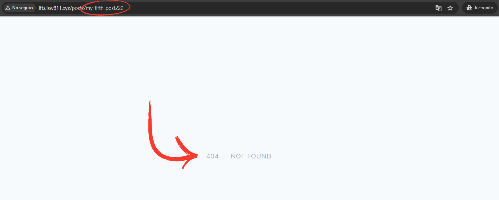

[< Volver al índice](/docs/readme.md)

# A Few Tweaks and Consideration

En este último capítulo de la sección sobre Blade, haremos algunos ajustes finales antes de pasar a trabajar con MySQL. Eliminaremos la restricción de la ruta `'posts/{post}'` y añadiremos un nuevo método `findOrFail()` en el modelo `Post` para manejar los casos en los que no se encuentra ningún post que coincida con el slug solicitado.

## Eliminar restricción de ruta

Dado que hemos cambiado la forma en que cada post se carga, podemos eliminar la restricción del endpoint `'posts/{post}'`.

```php
Route::get('posts/{post}', function ($slug) {
    return view('post', [
        'post' => Post::find($slug)
    ]);
});
```

Al eliminar la restricción e ingresar un slug no registrado, se presenta el error "Attempt to read property "title" on null (View: /home/vagrant/sites/lfts.isw811.xyz/resources/views/post.blade.php)". Esto se debe a que la vista está intentando acceder a propiedades de un valor nulo.

## Refactorizar método Post::find() y crear método Post::findOrFail()

Para manejar este problema, una opción es verificar si el post que se va a retornar es nulo y, si es así, lanzar una excepción `ModelNotFoundException` y esto se convertirá en un error `404`.

```php
public static function find($slug)
{
    $post = static::all()->firstWhere('slug', $slug);

    if (! $post) {
        throw new ModelNotFoundException();
    }

    return $post;
}
```

La opción anterior es válida, pero pueden existir casos en los que no se desea abortar y en estas situaciones es útil tener una función `Post::findOrFail()` separando las responsabilidades. Por lo que, los métodos `find()` y `findOrFail()` quedarían de la siguiente manera:

```php
public static function find($slug)
{
    return static::all()->firstWhere('slug', $slug);
}

// Lanzará una excepción si no se encuentra el post con el slug solicitado
public static function findOrFail($slug)
{
    $post = static::find($slug);

    if (!$post) {
        throw new ModelNotFoundException();
    }

    return $post;
}
```

## Actualizar endpoint

En el archivo de rutas `/routes/web.php`, actualizamos la ruta `'posts/{post}'` utilizando el método `Post::findOrFail()`.

```php
Route::get('posts/{post}', function ($slug) {
    return view('post', [
        'post' => Post::findOrFail($slug)
    ]);
});
```

Ahora, cada vez que se ingrese un slug no conocido, nos mostrará un error `404`.



Y al ingresar a un post si existente, la vista se cargará correctamente y con total normalidad.
