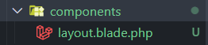

[< Volver al índice](/docs/readme.md)

# Blade Layouts Two Ways

En este capítulo, resolveremos el problema de la duplicidad de código en las vistas y la necesidad de realizar múltiples cambios en todos los archivos de vistas cuando se quiere agregar un nuevo script o link. Esta problemática surge al poseer una estructura HTML completa. Y esto se solucionará con dos formas de poder manejar los archivos "layout".

## Opción 1: Template inheritance

Para aplicar el template inheritance o herencia de plantillas, debemos crear un archivo `layout.blade.php` en `/resources/views`. Este archivo contendrá únicamente la estructura HTML envolvente. 

Resulta de la siguiente manera:

```html
<html lang="en">
    <head>
        <title>My blog</title>
        <link rel="stylesheet" href="/app.css" />
    </head>

    <body>
        @yield('content')
    </body>
</html>
```

La directiva `yield('content')` indica el lugar donde se insertará el contenido específico de cada vista y `'content'` es la llave por la cual podremos insertar todo el contenido que deseemos.

### Actualización en las vistas

Para usar el archivo `layout.blade.php` e insertar el contenido dentro de su directiva `yield`. Primero debemos heredar del archivo layout y con la directiva `@section ('content')` incrustamos el código correspondiente de la vista. 

La vista `posts.blade.php` quedaría de la siguiente forma:

```html
@extends ('layout') 

@section ('content') 
    @foreach ($posts as $post)
        <article class="{{ $loop->even ? 'mb-6' : 'foobar' }}">
            <h1>
                <a href="posts/{{ $post->slug }}"> {{ $post->title }} </a>
            </h1>
            <div>{{ $post->excerpt }}</div>
        </article>
    @endforeach 
@endsection
```

Y realizamos lo mismo con la vista `post.blade.php`:

```html
@extends ('layout') 

@section ('content')
    <article>
        <h1>{{ $post->title }}</h1>
        <div>{!! $post->body !!}</div>
    </article>
    <a href="/">Go back</a>
@endsection
```

Podemos verificar que la funcionalidad es exactamente la misma.

## Opción 2: Blade components

Los blade components o componentes de blade en su nivel más simple permiten envolver componentes HTML y son una opción realmente poderosa. 

Para hacer uso de esta, debemos crear la carpeta `components` en `/resources/views`. Cada archivo que añadamos a esta nueva carpeta se encontrará disponible como un componente de Blade. Por ejemplo, movamos el archivo `layout.blade.php`:



Ahora, el único cambio que debemos hacer en el componente `layout.blade.php` es utilizar la directiva `@yield`, vamos a imprimir el slot (slot por defecto de su componente) utilizando `{{ }}`.

```html
<!DOCTYPE html>
<html lang="en">
    <head>
        <title>My blog</title>
        <link rel="stylesheet" href="/app.css" />
    </head>
    <body>
        {{ $slot }}
    </body>
</html>
```

### Actualización de las vistas para utilizar componentes

En la vista `posts.blade.php` eliminamos las directivas de herencia de plantillas y en lugar de eso utilizamos el componente blade `layout`.

```html
<x-layout>
    @foreach ($posts as $post)
        <article class="{{ $loop->even ? 'mb-6' : 'foobar' }}">
            <h1>
                <a href="posts/{{ $post->slug }}">
                    {{ $post->title }}
                </a>
            </h1>
            <div>
                {{ $post->excerpt }}
            </div>
        </article>
    @endforeach
</x-layout>
```

Podemos enviarle el contenido directamente porque en el componente se está recibiendo el `slot`, de lo contrario tendríamos que utilizar `<x-slot name="content"></x-slot>`. Por último, actualizamos la vista `post.blade.php`:

```html
<x-layout>
    <article>
        <h1>{{ $post->title }}</h1>
        <div>{!! $post->body !!}</div>
    </article>
    <a href="/">Go back</a>
</x-layout>
```

### Componente button (extra)

Como ejercicio extra, creamos el componente `button`.

```html
<button {{ attributes }}>
    {{ $slot }}
</button>
```