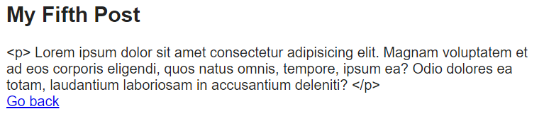

[< Volver al índice](/docs/readme.md)

# Blade: The Absolute Basics

En este capítulo, exploraremos algunos aspectos básicos del motor de plantillas de Laravel, Blade. Este nos permitirá tener una sintaxis más limpia y elegante dentro de las vistas.

## Usos básicos de Blade

Para poder hacer uso de Blade es necesario que las vistas tengan la extensión `.blade.php`. De esta manera, Blade compila las vistas a PHP vanilla (puro), y las vistas compiladas se almacenan en el directorio `/storage/framework/views`.

### Imprimir contenido plano

Para imprimir contenido en Blade, en lugar de utilizar las etiquetas de PHP `<?= ?>`, podemos realizar lo siguiente utilizando las llaves dobles `{{ }}`:

```php
{{ $post->title }}
```

Lo anterior se compilará a:

```php
<?php echo $post->title; ?>
```

### Imprimir contenido no escapado

Para poder imprimir el contenido HTML sin escapar, en lugar de utilizar las etiquetas de PHP `<?= ?>`, podemos realizar lo siguiente:

```php
{!! $post->body !!}
```

Lo anterior se compilará a:

```php
<?php echo $post->body; ?>
```

Si se imprimiera el contenido HTML con `{{ }}`, se vería de la siguiente forma:



### Incrustar código PHP

Para incrustar código PHP con Blade, debemos utilizar el símbolo `@`.

#### Ciclo foreach

En lugar de utilizar las etiquetas PHP `<?php ?>` para abrir y cerrar el ciclo `foreach`, utilizamos la siguiente sintaxis mucho más limpia:

```php
@foreach ($posts as $post)
    ...
@endforeach
```

#### Condición ternaria

Utilizando la variable `$loop`, la cual se genera por Blade en ciclos, podemos acceder a diferentes metadatos. Esto nos permite de forma condicional asignar una clase cuando es par o impar de la siguiente manera:

```html
<!-- Condición ternaria: -->
<article class="{{ $loop->even ? 'mb-6' : 'foobar' }}">...</article>
```

#### Condición

Para agregar una condición normal en Blade, únicamente realizamos lo siguiente:

```php
@if (true)

@endif
```

#### @unless

En Laravel existe `@unless`, lo cual es lo equivalente a `if(!condición)` y se puede incrustar de la siguiente forma:

```php
@unless ($condición)

@endunless
```

## Actualización de las vistas usando Blade

Se actualizaron las vistas `posts.blade.php` y `post.blade.php` para utilizar algunas de las características que nos puede proporcionar Blade.

En la vista `posts.blade.php` incrustamos código PHP utilizando `@` e imprimimos contenido con `{{ }}`:

```html
<!DOCTYPE html>
<html lang="en">
    <head>
        <title>My blog</title>
        <link rel="stylesheet" href="/app.css" />
    </head>
    <body>
        @foreach ($posts as $post)
            <article class="{{ $loop->even ? 'mb-6' : 'foobar' }}">
                <h1>
                    <a href="posts/{{ $post->slug }}"> {{ $post->title }} </a>
                </h1>
                <div>{{ $post->excerpt }}</div>
            </article>
        @endforeach
    </body>
</html>
```

En la vista `post.blade.php` utilizamos `{!! !!}` para imprimir contenido HTML y `{{ }}` para imprimir contenido plano:

```html
<!DOCTYPE html>
<html lang="en">
    <head>
        <title>My blog</title>
        <link rel="stylesheet" href="/app.css" />
    </head>
    <body>
        <article>
            <h1>{{ $post->title }}</h1>
            <div>{!! $post->body !!}</div>
        </article>
        <a href="/">Go back</a>
    </body>
</html>
```
