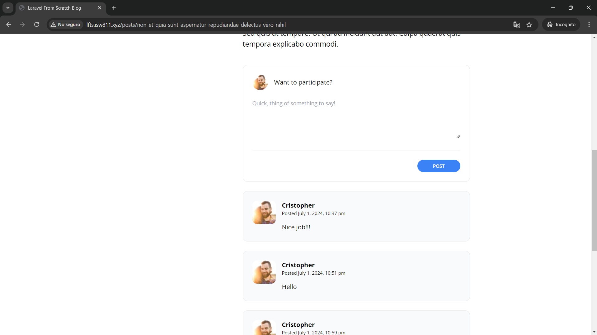
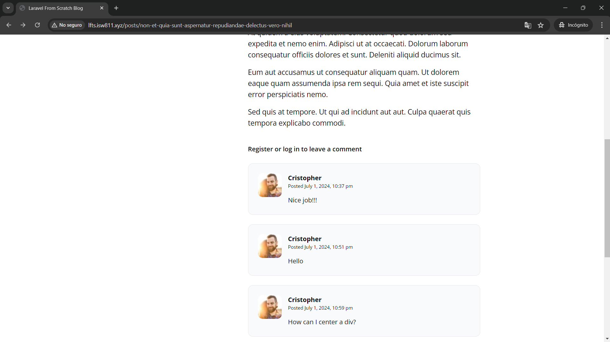
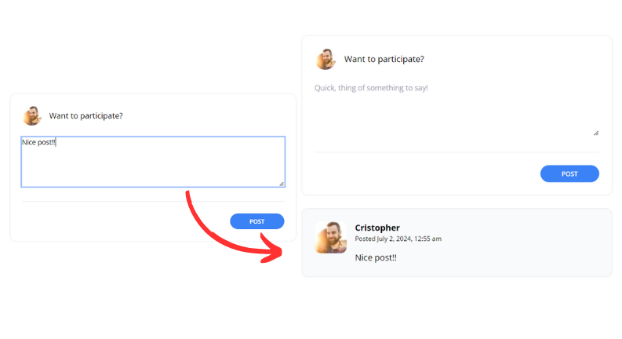

[< Volver al índice](/docs/readme.md)

# Activate the Comment Form

En el capítulo anterior nos encargamos de diseñar el formulario de comentarios. Ahora, haremos todo lo necesario para que este `form` trabaje y permita agregar un comentario en una publicación en específico.

## Recomendación de las siete acciones en un controlador

Antes de realizar los cambios necesarios, es importante saber cuáles son las siete acciones de tipo REST recomendables para manejar en un controlador:

1. `index`: Mostrar todos los recursos.
2. `show`: Mostrar un recurso en específico.
3. `create`: Mostrar el formulario para crear un nuevo ítem.
4. `store`: Persistir los datos de un nuevo registro cuando se envía el formulario anterior.
5. `edit`: Mostrar formulario para editar un ítem en específico.
6. `update`: Actualizar el registro existente con los nuevos datos cuando se envía el formulario anterior.
7. `destroy`: Eliminar un ítem en específico.

## Agregar endpoint

Primero, debemos agregar el endpoint al que apuntará el formulario de comentarios, y que dirigirá a la acción que permitirá añadir un nuevo comentario asociado a una publicación.

```php
Route::post('posts/{post:slug}/comments', [PostCommentsController::class, 'store']);
```

En mi caso, este lo añadí debajo del endpoint `'posts/{post:slug}'`. Y en esta nueva ruta, al recibir el `slug` con un wildcard, podremos diferenciar el post.

## Crear el controlador `PostCommentsController`

Posteriormente, creamos el nuevo controlador `PostCommentsController` ejecutando:

```bash
php artisan make:controller PostCommentsController
```

E importamos el nuevo controlador en el archivo de rutas `/routes/web.php` añadiendo:

```php
use App\Http\Controllers\PostCommentsController;
```

## Actualizar la acción del formulario de comentarios

Ahora, actualizamos el atributo `action` haciendo referencia al nuevo endpoint. La etiqueta `form` de la sección de comentarios quedaría así:

```html
<form action="/posts/{{ $post->slug }}/comments" method="post">
    <!-- Contenido del formulario iría por acá... -->
</form>
```

En donde está el comentario que indica "Contenido del formulario iría por acá..." ahí debería ir todo el contenido HTML y blade correspondiente. Esto se añade de así para hacer más entendible el cambio.

## Crear método `store()`

Continuamente, debemos crear el método `store` en `PostCommentsController`. Por lo que, este nuevo controlador quedará así:

```php
<?php

namespace App\Http\Controllers;

use App\Models\Post;
use Illuminate\Http\Request;

class PostCommentsController extends Controller
{
    public function store(Post $post)
    {
        // Validar:
        request()->validate([
            'body' => 'required'
        ]);

        // Agregar un comentario a la publicación dada:
        $post->comments()->create([
            'user_id' => request()->user()->id,
            'body' => request('body')
        ]);

        // Devolver a la página anterior:
        return back();
    }
}
```

En este punto, podríamos creer que ya está todo listo para poder agregar un nuevo comentario, pero al intentar hacerlo obtenemos el error "Add [user_id] to fillable property to allow mass assignment on [App\Models\Comment]." Esto se debe a la protección de la asignación en masa que brinda Laravel por defecto.

### Solucionar problemas por asignación en masa

Para solucionar este error, podríamos hacerlo dirigiéndonos al modelo Eloquent `/app/Models/Comment.php` y añadir la siguiente propiedad que nos permitirá ignorar los valores de la protección y, por ende, nos dejará ingresar todos los valores requeridos.

```php
protected $guarded = [];
```

Pero en este caso, lo solucionaremos con el `AppServiceProvider.php` ubicado en `/app/Providers`. Este nos permitirá dar soluciones muy genéricas en nuestra aplicación. Dicho esto, modificamos el método `boot` el cual resultará de la siguiente forma:

```php
public function boot()
{
    Model::unguard();
}
```

Recordar importar `Model` arriba de la clase con `use Illuminate\Database\Eloquent\Model;`.

Con `unguard()` podremos desactivar todas las restricciones de las asignaciones en masa a nivel de modelo. Ya que se aplica a `Model`, esto afectará a todos los modelos Eloquent. Además, el método `boot()` permite que cuando la aplicación inicie se realice lo que está dentro de él. **Con estos cambios elaborados, damos una solución general para todos los modelos en cuanto a las restricciones de las asignaciones en masa.**

### Eliminar propiedad `$guarded` de los modelos

Debido a la solución que implementamos en la [sección anterior](#solucionar-problemas-por-asignación-en-masa), en los modelos Eloquent `Post` y `User` eliminaremos la siguiente propiedad:

```php
protected $guarded = [];
```

En el caso del modelo `User`, se elimina el comentario asociado.

### Recomendación final sobre la solución

Una vez hecho esto, hemos solucionado de forma general las restricciones tan tediosas que nos da la asignación masiva. Como recomendación final, **nunca, pero realmente nunca**, debemos crear un registro de la siguiente forma con esta solución:

```php
Post::create(request()->all());
```

Únicamente se deben especificar cada columna para evitar muchos problemas.

## Ajustes finales

Antes de finalizar el capítulo, realizaremos algunos ajustes finales:

### 1. Formato de fecha para los comentarios

En el componente de vista `/resources/views/components/post-comment.blade.php`, en la etiqueta `p` en donde imprimimos la fecha, le añadiremos un formato más legible e interesante.

```html
<p class="text-xs">
    Posted
    <time>{{ $comment->created_at->format('F j, Y, g:i a') }}</time>
</p>
```

### 2. Solucionar que al no estar autenticado no pueda comentar

Actualmente, si no estamos autenticados e intentamos realizar un comentario, nos mostrará el error "Attempt to read property "id" on null". Esto se debe a que al intentar obtener el `id` de `request()->user()`, no hay nada porque no hay nadie con la sesión iniciada. Para solucionar este problema, únicamente mostraremos el formulario cuando solo haya un usuario autenticado; de lo contrario, se apreciará un mensaje.

```html
@auth
    <x-panel>
        <form action="/posts/{{ $post->slug }}/comments" method="post">
            @csrf
            <header class="flex items-center">
                id() }}"
                    alt=""
                    width="40"
                    height="40"
                    class="rounded-full"
                />
                <h2 class="ml-4">Want to participate?</h2>
            </header>
            <div class="mt-6">
                <textarea
                    name="body"
                    class="w-full text-sm focus:outline-none focus:ring"
                    rows="5"
                    placeholder="Quick, thing of something to say!"
                ></textarea>
            </div>
            <div class="flex justify-end mt-6 pt-6 border-t border-gray-200">
                <button
                    type="submit"
                    class="bg-blue-500 text-white uppercase font-semibold text-xs py-2 px-10 rounded-2xl hover:bg-blue-600"
                >
                    Post
                </button>
            </div>
        </form>
    </x-panel>
@else
    <p class="font-semibold">
        <a href="/register" class="hover:underline">Register</a> or
        <a href="/login" class="hover:underline">log in</a> to leave a comment
    </p>
@endauth
```

### 3. Ajustar dirección de avatars en el componente `post-comment.blade.php`

Finalmente, debemos pasar por parámetro al atributo `src` el identificador del usuario, en lugar del identificador del comentario.

```html
<div class="flex-shrink-0">
    user_id }}"
        alt=""
        width="60"
        height="60"
        class="rounded-xl"
    />
</div>
```

De esta forma, cuando un usuario tenga más de un comentario, se le mostrará el mismo avatar tanto en los comentarios como en el formulario.

## Resultado final

**Puntos finales a resaltar:**

-   Cuando el usuario ha iniciado sesión, se muestra el formulario y los comentarios registrados. Por ejemplo:



-   Cuando el usuario no está registrado o autenticado, se muestra un mensaje para que lo haga y los comentarios registrados. Por ejemplo:



-   Y se pueden agregar nuevos comentarios. Por ejemplo:


