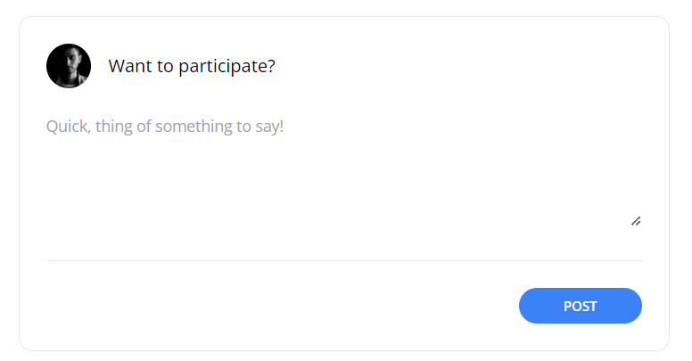
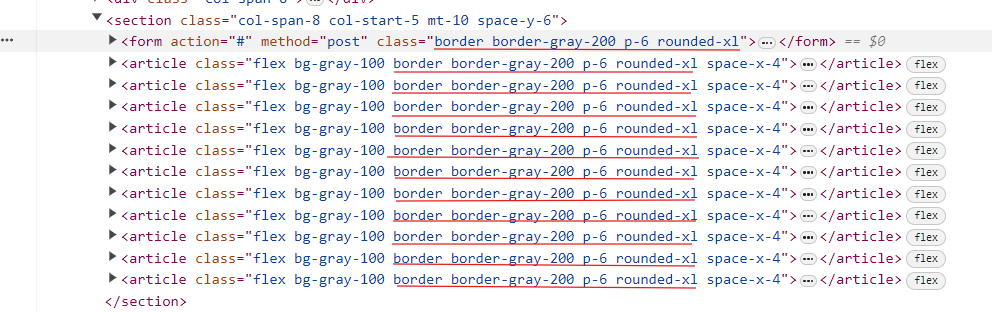
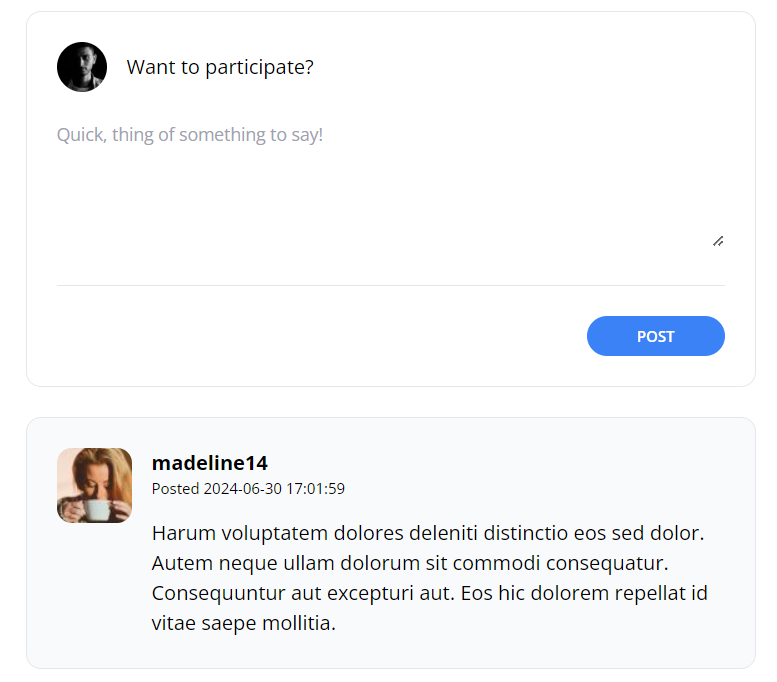

[< Volver al índice](/docs/readme.md)

# Design the Comment Form

En este episodio, implementaremos el diseño de un formulario sobre el área de los comentarios, el cual en el futuro permitirá a cada usuario autenticado comentar en una publicación específica.

## Crear diseño del formulario

Primero, crearemos el diseño del formulario, este es agregado en la sección de comentarios ubicada en el archivo de vista `/resources/views/posts/show.blade.php`. Este se coloca antes del ciclo `foreach` que muestra los comentarios y quedará de la siguiente forma:

```html
<section class="col-span-8 col-start-5 mt-10 space-y-6">
    <form action="#" method="post">
        @csrf
        <header class="flex items-center">
            id() }}"
                alt=""
                width="40"
                height="40"
                class="rounded-full"
            />
            <h2 class="ml-4">Want to participate?</h2>
        </header>
        <div class="mt-6">
            <textarea
                name="body"
                class="w-full text-sm focus:outline-none focus:ring"
                rows="5"
                placeholder="Quick, thing of something to say!"
            ></textarea>
        </div>
        <div class="flex justify-end mt-6 pt-6 border-t border-gray-200">
            <button
                type="submit"
                class="bg-blue-500 text-white uppercase font-semibold text-xs py-2 px-10 rounded-2xl hover:bg-blue-600"
            >
                Post
            </button>
        </div>
    </form>

    <!-- El foreach que carga los comentarios iría por acá... -->
</section>
```

### Resultado del diseño

El diseño del formulario implementado en la vista `posts/show.blade.php` se puede apreciar de la siguiente manera:



## Crear componente `panel`

Al inspeccionar la página de `posts/show.blade.php`, podremos ver que hay un patrón repetitivo con estos estilos: `border border-gray-200 p-6 rounded-xl`.

Página `http://lfts.isw811.xyz/posts/modi-dignissimos-vel-blanditiis-aut-iure` inspeccionada:



Podemos apreciar que tanto para las etiquetas `article` que generan el componente de comentarios como para el formulario que acabamos de agregar hay una duplicación de estilos, los cuales son bastante comunes en nuestro blog. Para solucionar esto, crearemos un nuevo componente:

Componente `/resources/views/components/panel.blade.php`:

```html
<div {{ $attributes(['class' => 'border border-gray-200 p-6 rounded-xl']) }}>
    {{ $slot }}
</div>
```

Este componente nos permitirá reutilizar los estilos duplicados, y se reciben atributos de tipo clase para adjuntarlos junto a los estilos del componente.

### Implementar nuevo componente

Ahora, para eliminar la duplicación de estilos, debemos realizar lo siguiente:

1. Implementación en `/resources/views/posts/show.blade.php` en el formulario creado con anterioridad:

    ```html
    <section class="col-span-8 col-start-5 mt-10 space-y-6">
        <x-panel>
            <form action="#" method="post">
                <!-- Contenido del form creado anteriormente... -->
            </form>
        </x-panel>

        <!-- El foreach que carga los comentarios iría por acá... -->
    </section>
    ```

    Lo que realizamos fue eliminar el atributo de clases del formulario y envolver el `form` con el nuevo componente `x-panel`.

2. Implementación en `/resources/views/components/post-comment.blade.php`:

    ```html
    @props(['comment'])

    <x-panel class="bg-gray-50">
        <article class="flex space-x-4">
            <div class="flex-shrink-0">
                id }}"
                    alt=""
                    width="60"
                    height="60"
                    class="rounded-xl"
                />
            </div>
            <div>
                <header class="mb-4">
                    <h3 class="font-bold">{{ $comment->author->username }}</h3>
                    <p class="text-xs">
                        Posted
                        <time>{{ $comment->created_at }}</time>
                    </p>
                </header>
                <p>{{ $comment->body }}</p>
            </div>
        </article>
    </x-panel>
    ```

    Con esto, eliminamos las clases duplicadas en el artículo y enviamos el color de fondo al contenedor del nuevo componente para que lo aplique junto a los estilos replicados.

Una vez finalizado esto, eliminaremos la duplicación de estilos y obtendremos un nuevo componente con un contenedor con unos estilos básicos y representativos de nuestro blog, el cual podremos utilizar para envolver diverso contenido. Cabe recalcar que esto se separo de esta manera debido a que estamos utilizando Tailwind y estamos intentado de utilizar una cantidad mínima de CSS tradicional.

## Resultado final

Finalmente, el resultado visual para el formulario será el mismo que se mostró anteriormente y el área de comentarios no tendrá gran cambio, únicamente el color de fondo un poco más claro.



**Aspectos que se pueden resaltar:**

-   Creación del diseño del formulario para ingresar nuevos comentarios, el cual no tiene funcionalidad aún.

-   Eliminar duplicidad de estilos en el formulario y el componente de comentarios.
