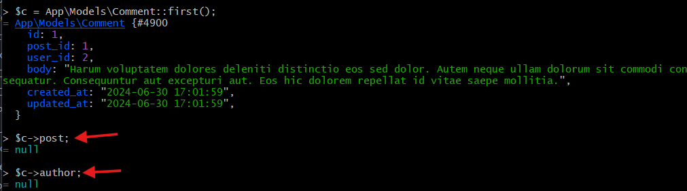
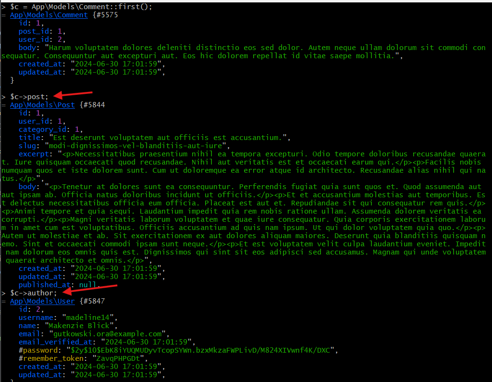
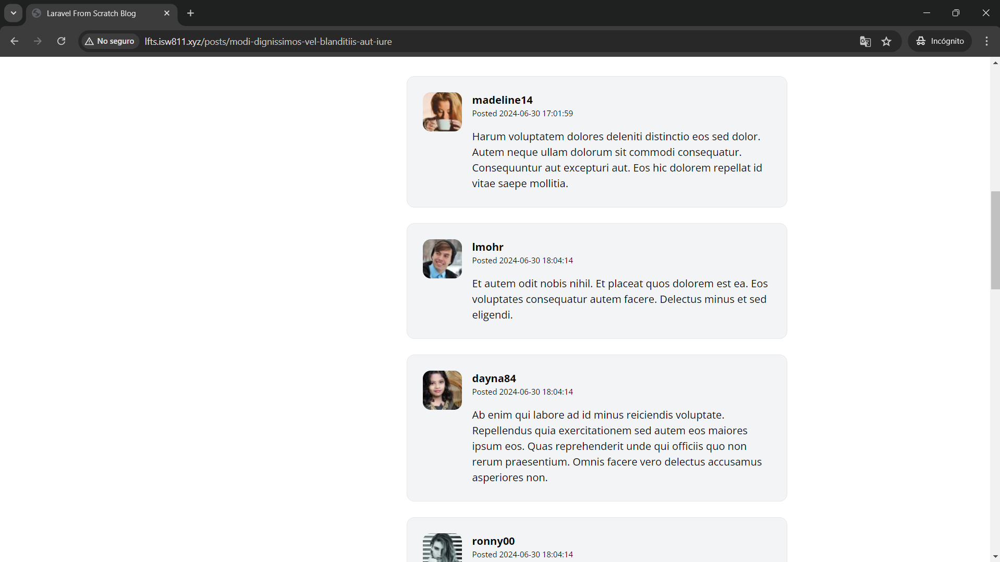

[< Volver al índice](/docs/readme.md)

# Make the Comments Section Dynamic

Para esta ocasión, añadiremos la funcionalidad requerida al `CommentFactory.php` creado en el capítulo anterior. Esto nos permitirá generar nuevos registros de comentarios. Con lo anterior finalizado, haremos que la sección de comentarios se cargue dinámicamente.

## Añadir funcionalidad al `CommentFactory.php`

Primero, en el archivo `/database/factories/CommentFactory.php` debemos definir una especie de modelo para un comentario. Pero antes de hacerlo, realicemos los pasos de la siguiente sección para evitar problemas con funciones obsoletas.

### Solucionar advertencias y errores por funciones o propiedades obsoletas

Para evitar advertencias y errores a raíz de funciones obsoletas en nuestros archivos de fábrica, realizaremos algunos ajustes:

1. En el archivo `/database/factories/CategoryFactory.php`, en el método `definition()` debemos añadir paréntesis a las propiedades de la clase abstracta `factory (faker)`. Esto se debe a que ahora estas propiedades son funciones.

    ```php
    public function definition()
    {
        return [
            'name' => $this->faker->unique()->word(),
            'slug' => $this->faker->unique()->slug()
        ];
    }
    ```

2. Realizamos lo mismo en `/database/factories/PostFactory.php` para los atributos `title` y `slug` del método `definition()`.

    ```php
    public function definition()
    {
        return [
            'user_id' => User::factory(),
            'category_id' => Category::factory(),
            // Cambios en title y slug:
            'title' => $this->faker->sentence(),
            'slug' => $this->faker->slug(),
            'excerpt' => '<p>' . implode('</p><p>',$this->faker->paragraphs(2)) . '</p>',
            'body' => '<p>' . implode('</p><p>',$this->faker->paragraphs(6)) . '</p>',
        ];
    }
    ```

3. Igualmente, en `/database/factories/PostFactory.php` para los valores `name`, `username` y `email`.

    ```php
    public function definition()
    {
        return [
            'name' => $this->faker->name(),
            'username' => $this->faker->unique()->userName(),
            'email' => $this->faker->unique()->safeEmail(),
            'email_verified_at' => now(),
            'password' => '$2y$10$92IXUNpkjO0rOQ5byMi.Ye4oKoEa3Ro9llC/.og/at2.uheWG/igi',
            'remember_token' => Str::random(10),
        ];
    }
    ```

### Definir el `CommentFactory.php`

De vuelta en el archivo `/database/factories/CommentFactory.php`, para que este pueda generar un nuevo comentario, en su método `definition()` debemos agregar lo siguiente:

```php
public function definition()
{
    return [
        'post_id' => Post::factory(),
        'user_id' => Post::factory(),
        'body' => $this->faker->paragraph()
    ];
}
```

Es muy importante no olvidar importar los modelos `Post` y `User` como en el siguiente ejemplo:

```php
use App\Models\Post;
use App\Models\User;
```

Estos cambios nos permitirán generar un nuevo comentario para una nueva publicación, asignando correctamente los identificadores de `post_id` y `user_id`. El contenido del comentario será generado aleatoriamente con la clase `faker`, igual que en los otros archivos de fábrica.

### Probar en tinker

Para comprobar la nueva funcionalidad, desde nuestra máquina virtual `webserver` y en la raíz de nuestro proyecto, podemos acceder a `Tinker` y crear un nuevo comentario ejecutando:

```php
App\Models\Comment::factory()->create();
```

Si obtenemos este nuevo comentario y probamos sus relaciones, podríamos apreciar un comportamiento similar al que se va a presentar a continuación:



Al comprobar sus relaciones con la publicación y el autor, podemos ver que obtenemos un valor nulo.

## Crear relaciones

Para representar correctamente las relaciones existentes entre comentarios, publicaciones y usuarios, realizamos los siguientes pasos:

1. En el archivo del modelo Eloquent `Post.php`, añadimos la relación que un post tiene muchos comentarios:

    ```php
    public function comments()
    {
        return $this->hasMany(Comment::class);
    }
    ```

2. En el caso del archivo del modelo Eloquent `Comment.php`, los comentarios pertenecen tanto al autor como a la publicación, por lo que estas dos relaciones las representamos de la siguiente manera:

    ```php
    public function post()
    {
        return $this->belongsTo(Post::class);
    }

    public function author()
    {
        return $this->belongsTo(User::class, 'user_id');
    }
    ```

    En el caso de `author`, especificamos la columna debido a que si no lo hacemos, Laravel lo interpretaría como `author_id`.

3. Ahora, si volvemos a ingresar a `Tinker` y probamos las relaciones, podríamos ver un resultado similar al siguiente:

    

## Mostrar comentarios de forma dinámica

Para mostrar de manera dinámica los comentarios de cada publicación, realizamos los siguientes ajustes en el archivo de vista `/resources/views/posts/show.blade.php`, específicamente en la sección añadida en el episodio 52:

```html
<section class="col-span-8 col-start-5 mt-10 space-y-6">
    @foreach ($post->comments as $comment)
    <x-post-comment :comment="$comment" />
    @endforeach
</section>
```

Para recordar un poco, esta sección se encuentra posterior al contenedor en donde se imprime el título y el cuerpo de la publicación. Otro punto de interés es que le enviamos como una propiedad el comentario al componente.

### Modificar componente

Adaptaremos el componente para que reciba la propiedad (comentario) y que a partir de esta pueda mostrar todos los valores que corresponden. Por esto, el componente de blade `/resources/views/components/post-comment.blade.php` quedaría de la siguiente forma:

```html
@props(['comment'])

<article
    class="flex bg-gray-100 border border-gray-200 p-6 rounded-xl space-x-4"
>
    <div class="flex-shrink-0">
        id }}"
            alt=""
            width="60"
            height="60"
            class="rounded-xl"
        />
    </div>
    <div>
        <header class="mb-4">
            <h3 class="font-bold">{{ $comment->author->username }}</h3>
            <p class="text-xs">
                Posted
                <time>{{ $comment->created_at }}</time>
            </p>
        </header>
        <p>{{ $comment->body }}</p>
    </div>
</article>
```

**Dos puntos interesantes de este cambio:**

-   Con el parámetro de búsqueda `?u={{ $comment->id }}` añadido al `src` de la etiqueta imagen, aseguramos que se muestra una imagen diferente para cada comentario.

-   Se imprimen los valores de la propiedad `comment`, los cuales son enviados desde donde se llame el componente.

Por último, accedemos a `Tinker` y agregaremos una serie de comentarios forzándolos a una publicación:

```php
App\Models\Comment::factory(10)->create(['post_id' => 1]);
```

## Resultado final

Como resultado final, podemos apreciar los nuevos comentarios que agregamos forzados en la publicación con el identificador uno, los cuales se cargan de forma dinámica en dicho post:


