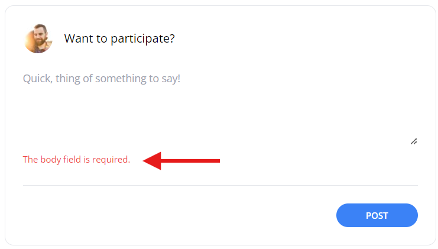

[< Volver al índice](/docs/readme.md)

# Some Light Chapter Clean Up

Para finalizar la sección de comentarios, en este episodio, realizaremos una pequeña limpieza de lo que hemos ensuciado mediante el desarrollo de esta parte de `Comments`.

## Limpiar formulario de comentarios

### 1. Mostrar mensajes de validación

Actualmente, validamos el campo `body` cuando se envía a guardar un comentario. Sin embargo, cuando falla esta validación, el usuario se redirecciona a la página específica, pero no se le muestra un mensaje de error. Para solucionar esto, agregamos la directiva `@error` en la parte inferior del `textarea` para mostrar la validación del lado del servidor y también añadimos el atributo `required` a la etiqueta `textarea` para realizar la validación del lado del browser (cliente).

El contenedor del `textarea` del formulario de comentarios ubicado en la vista `/resources/views/posts/show.blade.php` resultará de la siguiente manera:

```html
<div class="mt-6">
    <textarea
        name="body"
        class="w-full text-sm focus:outline-none focus:ring"
        rows="5"
        placeholder="Quick, thing of something to say!"
        required
    ></textarea>
    <!-- Directiva @error para mostrar el mensaje de error genérico que brinda las validaciones de Laravel: -->
    @error('body')
        <span class="text-xs text-red-500">{{ $message }}</span>
    @enderror
</div>
```

**Mensaje de validación del lado del cliente:**


**Mensaje de validación del lado del servidor:**



### 2. Extraer formulario de comentarios en un archivo parcial de vista

Con el fin de separar un poco las responsabilidades y mejorar la organización del código, crearemos un nuevo archivo parcial `/resources/views/posts/_add-comment-form.blade.php` e incluiremos todo lo relacionado con el formulario de comentarios en este nuevo fichero, resultando así:

```html
@auth
    <x-panel>
        <form method="POST" action="/posts/{{ $post->slug }}/comments">
            @csrf

            <header class="flex items-center">
                id() }}"
                    alt=""
                    width="40"
                    height="40"
                    class="rounded-full"
                />

                <h2 class="ml-4">Want to participate?</h2>
            </header>

            <div class="mt-6">
                <textarea
                    name="body"
                    class="w-full text-sm focus:outline-none focus:ring"
                    rows="5"
                    placeholder="Quick, thing of something to say!"
                    required
                ></textarea>

                @error('body')
                <span class="text-xs text-red-500">{{ $message }}</span>
                @enderror
            </div>

            <div class="flex justify-end mt-6 pt-6 border-t border-gray-200">
                <button
                    type="submit"
                    class="bg-blue-500 text-white uppercase font-semibold text-xs py-2 px-10 rounded-2xl hover:bg-blue-600"
                >
                    Post
                </button>
            </div>
        </form>
    </x-panel>
@else
    <p class="font-semibold">
        <a href="/register" class="hover:underline">Register</a> or
        <a href="/login" class="hover:underline">log in</a> to leave a comment.
    </p>
@endauth
```

Y en la sección en donde localizaba anteriormente el formulario de comentarios en la vista `posts/show.blade.php`, solo debemos incluir el nuevo archivo parcial. Esta sección quedará de la siguiente forma:

```html
<section class="col-span-8 col-start-5 mt-10 space-y-6">
    @include ('posts._add-comment-form') 
    
    @foreach ($post->comments as $comment)
        <x-post-comment :comment="$comment" />
    @endforeach
</section>
```

### 3. Extraer botón de tipo `submit` del formulario de comentarios en un componente

Por último, extraeremos en un nuevo componente `/resources/views/components/submit-button.blade.php` el botón de tipo `submit`. Para esto, en el nuevo archivo de componente agregamos lo siguiente:

```html
<button
    type="submit"
    class="bg-blue-500 text-white uppercase font-semibold text-xs py-2 px-10 rounded-2xl hover:bg-blue-600"
>
    {{ $slot }}
</button>
```

Una vez realizado esto, podríamos remplazar el botón de tipo `submit` del formulario de comentarios, ubicado en el archivo parcial `posts/_add-comment-form.blade.php`.

El contenedor donde estaba el botón quedará así:

```html
<div class="flex justify-end mt-6 pt-6 border-t border-gray-200">
    <x-submit-button>Post</x-submit-button>
</div>
```

## Resultado final

**Aspectos finales destacables:**

-   El resultado visual es exactamente el mismo. Debido a que la limpieza se realizó internamente, entonces se siguen manteniendo los mismos resultados.
-   Extrajimos código de vista a archivos parciales y componentes, para aumentar la división de responsabilidades y hacer mucho más modular nuestro código de vista.
-   Se formateó el código de las vistas.
-   Se añadieron mensajes de error de validaciones tanto del lado del cliente como del servidor.
