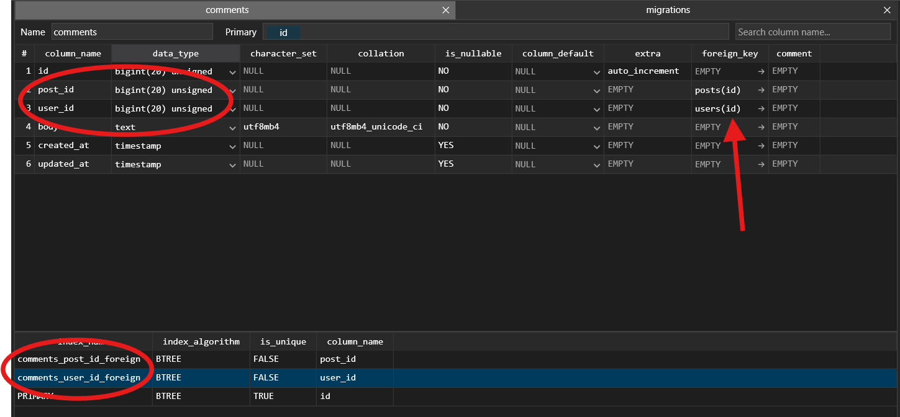

[< Volver al índice](/docs/readme.md)

# Table Consistency and Foreign Key Constraints

En este episodio, para los comentarios crearemos el modelo Eloquent, controlador, fábrica y realizaremos la migración , la cual creará la tabla `comments` en nuestra base de datos. Para el desarrollo del aspecto de la migración, tendremos en cuenta las llaves foráneas debido a las relaciones que tendrán los comentarios con los modelos `User` y `Post`.

## Crear modelo Eloquent, factory y controlador para `Comment`

Primero, crearemos el modelo eloquent, una fábrica, un controlador y un archivo de migración para `Comment`. Para realizar esto, en la máquina virtual, nos ubicamos en la raíz del proyecto y ejecutamos el siguiente comando:

```bash
php artisan make:model Comment -mfc
```

Cada parámetro indica el archivo que creará este comando, lo cual podemos entenderlo así:

-   `m`: Crear archivo de migración `/database/migrations/2024_06_28_053430_create_comments_table.php`.

-   `f`: Crear archivo de fábrica `/database/factories/CommentFactory.php`.

-   `c`: Crear archivo de controlador `/app/Http/Controllers/CommentController.php`.

-   Y el comando por sí solo crea el modelo Eloquent `/app/Models/Comment.php`.

### Añadir alias a comandos

Utilizar alias es una forma de acortar nuestro trabajo en la consola. En nuestro caso, utilizamos mucho `php artisan`, por ello lo convertiremos en un alias `art`. Lo anterior se puede lograr ejecutando:

```bash
alias art="php artisan"
```

Ahora, cada vez que queramos realizar alguna acción que inicie con `php artisan`, la podemos realizar utilizando `art`. Por ejemplo:

```bash
art migrate
```

Y al final, esto para la consola de comandos se verá traducido como `php artisan migrate`. Además, se implementó un alias para esta orden ejecutada anteriormente.

```bash
alias migrate="php artisan migrate"
```

### Modificar archivo de migración

Consecuentemente, modificaremos el archivo de migración `2024_06_28_053430_create_comments_table.php`:

```php
public function up()
{
    Schema::create('comments', function (Blueprint $table) {
        $table->id();
        $table->foreignId('post_id')->constrained()->cascadeOnDelete();
        $table->foreignId('user_id')->constrained()->cascadeOnDelete();
        $table->text('body');
        $table->timestamps();
    });
}
```

**Puntos importantes de resaltar:**

-   Si utilizáramos `$table->unsignedBigInteger('post_id');` tendríamos un serio problema, ya que realmente esto no es una llave foránea, si la implementamos como esta, solo sería una referencia a la columna de identificadores de la tabla de publicaciones, la cual puede dar errores de consistencia.

-   Por otro lado, al utilizar `$table->foreign('post_id')->references('id')->on('posts')->cascadeOnDelete();`, en este caso si es una llave foránea y garantiza que si un post es eliminado, los comentarios asociados también se eliminan, evitando referencias a publicaciones inexistentes.

-   El mismo concepto aplica para `$table->foreignId('user_id')->constrained()->cascadeOnDelete();` con respecto a los usuarios. Esta es una forma más verbosa de realizar los dos puntos anteriores.

-   Si quisiéramos deshabilitar la eliminación en cascada, nada más deberíamos eliminar `cascadeOnDelete()`.

### Realizar migración

Ejecutando el comando de migración con nuestro nuevo alias `migrate`, al ingresar al TablePlus, podremos ver que se genera la tabla Comments en nuestra base de datos con la siguiente estructura :



En esta imagen, se recalca la generación de las claves foráneas.

### Añadir eliminación en cascada a la llave foránea en la tabla `posts`

Aplicando los nuevos conocimientos obtenidos y con el fin de asegurar la consistencia de datos, añadiremos la eliminación en cascada a la columna `user_id` en la tabla `posts`. Para ello, modificamos el archivo de migración correspondiente `/database/migrations/2024_06_17_045210_create_posts_table.php`:

```php
public function up()
{
    Schema::create('posts', function (Blueprint $table) {
        $table->id();
        // Cambios en la siguiente línea:
        $table->foreignId('user_id')->constrained()->cascadeOnDelete();
        $table->foreignId('category_id');
        $table->string('title');
        $table->string('slug')->unique();
        $table->text('excerpt');
        $table->text('body');
        $table->timestamps();
        $table->timestamp('published_at')->nullable();
    });
}
```

### Resultado final

Con los cambios realizados en este episodio, logramos los siguientes puntos:

-   Mantener una consistencia de datos, gracias a las llaves foráneas y la eliminación en cascada, permitiendo evitar referencias a registros inexistentes, tanto para comentarios como para las publicaciones.

-   Seguimos implementando la técnica de "code first" para realizar los cambios en la base de datos.

-   En este capítulo, creamos el controlador y el modelo. Sin embargo, en ellos no realizamos ninguna implementación. Esto se llevará a cabo en pasos futuros.

-   Creamos una nueva tabla `Comments` en nuestra base de datos para guardar comentarios de las publicaciones. Esta tiene sus relaciones con las tablas `users` y `posts` a través de llaves foráneas.
