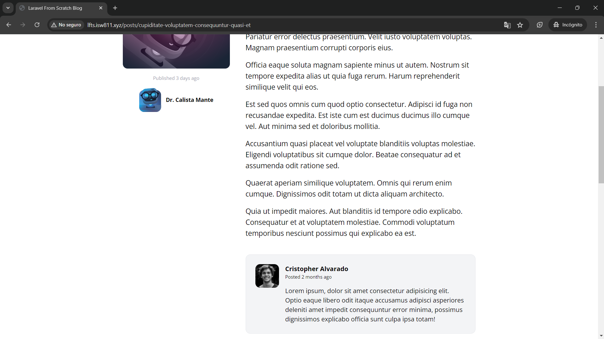

[< Volver al índice](/docs/readme.md)

# Write the Markup for a Post Comment

En este episodio, empezaremos con la sección de comentarios, así que empezaremos con los preparativos para poder realizar comentarios en las publicaciones. Por esto, en este capítulo vamos a crear el _"base markup"_ (HTML y estilizado) para un comentario.

## Crear componente para los comentarios

Inicialmente, escribiremos el HTML y los estilos para mostrar los comentarios. El código resultante de lo elaborado será el siguiente:

```html
<article
    class="flex bg-gray-100 border border-gray-200 p-6 rounded-xl space-x-4"
>
    <div class="flex-shrink-0">
        
    </div>
    <div>
        <header class="mb-4">
            <h3 class="font-bold">Cristopher Alvarado</h3>
            <p class="text-xs">
                Posted
                <time>2 months ago</time>
            </p>
        </header>
        <p>
            Lorem ipsum, dolor sit amet consectetur adipisicing elit. Optio
            eaque libero odit itaque accusamus adipisci asperiores deleniti amet
            impedit consequuntur error minima, possimus dignissimos explicabo
            officia sunt culpa ipsa totam!
        </p>
    </div>
</article>
```

Posteriormente, crearemos un nuevo componente `/resources/views/components/post-comment.blade.php`; en este nuevo archivo incluiremos todo el código HTML anteriormente creado.

**Algunos puntos destacables de este nuevo componente:**

-   Utilizamos `https://i.pravatar.cc/60` para obtener imágenes de usuario, ya que actualmente no manejamos ningún tipo de imagen para usuarios en la base de datos ni en algún directorio.
-   El diseño es muy similar a lo que asociamos con una carta o tarjeta.
-   En el siguiente episodio haremos dinámica la muestra de datos en este componente. Por el momento, mostramos los datos que han sido ingresados directamente en el código.

## Crear sección para los componente en `posts/show.blade.php`

Además, debemos añadir la sección en donde se mostrarán los comentarios. Esto será en el archivo `/resources/views/posts/show.blade.php`, esta es la vista donde se muestran las publicaciones seleccionadas, la cual resultará así:

```html
<x-layout>
    <section class="px-6 py-8">
        <main class="max-w-6xl mx-auto mt-10 lg:mt-20 space-y-6">
                <div class="col-span-4 lg:text-center lg:pt-14 mb-10">
                    <!-- Contenedor para mostrar ilustración, fecha y autor... -->
                </div>

                <div class="col-span-8">
                    <!-- Contenedor para mostrar SVG de retorno a los posts, título y body del post seleccionado -->
                </div>

                <!-- Sección añadida: -->
                <section class="col-span-8 col-start-5 mt-10 space-y-6">
                    <x-post-comment />
                    <x-post-comment />
                    <x-post-comment />
                    <x-post-comment />
                </section>
            </article>
        </main>
    </section>
</x-layout>
```

**Algunos puntos importantes de este cambio:**

-   En donde añadí `<!-- "Indicación" -->` va el contenido HTML y Blade referente a lo que dice cada indicación HTML.
-   En la nueva sección, hemos añadido cuatro comentarios, los cuales serán iguales por ahora.

## Resultado final

En este episodio, se trabajó la parte del diseño y construcción de la sección, donde se van a mostrar los comentarios. El resultado visual se podría apreciar de la siguiente manera:



Finalmente, tendríamos la base para poder mostrar los comentarios publicados para cada post.
