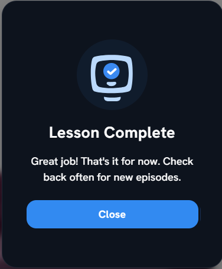

[< Volver al índice](/docs/readme.md)

# Goodbye and Next Steps

Con este episodio, se finaliza el curso de _Laravel From Scratch_, en donde el instructor Jeffrey Way menciona que _"Todas las cosas buenas deben llegar a su fin, incluida esta larguísima serie"_ y además se indican los siguientes pasos que se pueden llegar a dar.

## Próximos pasos

Algunas ideas de los próximos pasos se pueden encontrar en el repositorio de Github del proyecto, específicamente en el [readme](https://github.com/JeffreyWay/Laravel-From-Scratch-Blog-Project?tab=readme-ov-file#further-ideas). Todas estas son futuras ideas que serán un gran ejercicio para poder practicar lo comprendido y aprender mucho más de Laravel.

## Vista general de lo que hemos aprendido

Se ha aprendido una gran cantidad de temas y conceptos en Laravel, entre algunos de ellos podemos encontrar:

-   Controladores
-   Rutas
-   Autorización
-   Blade y componentes de Blade
-   Validación
-   Eloquent y relaciones de Eloquent
-   Queues
-   Eventos
-   Compilar assets con Laravel
-   Comandos de Artisan
-   HTTP Tests

Este vistazo general se debe a que podamos apreciar que todo toma su tiempo y da su resultado, así que a seguir programando y aprendiendo.

## Conclusión personal

Este fue un curso y proyecto de bastante provecho, ya que aprendí una cantidad considerable de nuevos conceptos y cómo realizar sus implementaciones. Además, me ayudó a reforzar sobre temas que ya había olvidado y me dio conocimientos básicos de Laravel. En relación con el curso, he pagado por cursos peores, es muy bueno y que sea gratis es un gran recurso para personas que están aprendiendo, como es mi caso.
