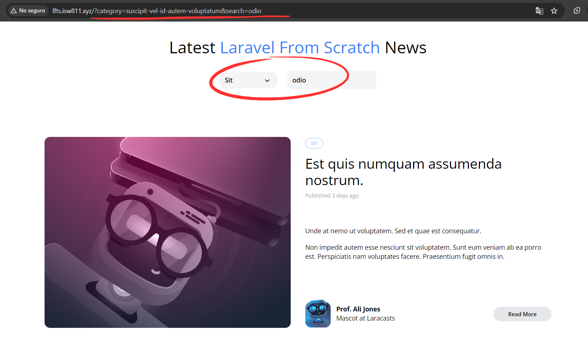

[< Volver al índice](/docs/readme.md)

# Advanced Eloquent Query Constraints

En este capítulo 39, seguiremos modificando el alcance de la consulta `filter()` en nuestro modelo Eloquent `Post`. Modificaremos este método de tal forma que nos permita realizar el filtrado por categoría y por texto de búsqueda, permitiéndonos combinar este par de filtros de manera eficiente.

El comportamiento de filtrado deseado se puede ver reflejado con la siguiente consulta SQL:

```SQL
SELECT
    *
FROM
    posts
WHERE
    EXISTS(
        SELECT
            *
        FROM
            categories
        WHERE
            categories.id = posts.category_id
            AND categories.slug = 'quis-dolorem-quia-eos'
    );
```

## Implementación en el modelo `Post`

Primero, intentaremos replicar la anterior consulta SQL en el método `filter()` del modelo Eloquent `Post`.

Inicialmente, intentamos con esta implementación:

```php
$query->when($filters['category'] ?? false, fn ($query, $category) => $query
    ->whereExists(
        fn ($query) =>
        $query->from('categories')
            ->where('categories.id', 'posts.category_id')
            ->where('categories.slug', $category)
    ));
```

Sin embargo, no cumple con lo deseado, ya que no identifica bien la columna `'posts.category_id'`, tomándola como una cadena de texto. Por lo que, el método `filter()` con la implementación solucionada resultaría así:

```php
public function scopeFilter($query, array $filters)
{
    $query->when($filters['search'] ?? false, fn ($query, $search) => $query
        ->where('title', 'like', '%' . $search . '%')
        ->orWhere('body', 'like', '%' . $search . '%'));

    $query->when(
        $filters['category'] ?? false,
        fn ($query, $category) =>
        $query->whereHas(
                'category',
                fn ($query) =>
                $query->where('slug', $category)
            )
    );
}
```

Para este punto, podríamos manejar la búsqueda y las categorías juntas, y eliminar la necesidad de tener una ruta encargada de manejar las categorías. Pero para que esto funcione, tenemos que realizar otros cambios más.

## Modificaciones en la Vista y Controlador

### Archivo `_post-header.blade.php`

Con el fin de lograr lo mencionado anteriormente, en el archivo `/resources/views/_post-header.blade.php` añadimos lo siguiente al componente donde se mostrarán las categorías:

```html
@foreach ($categories as $category)
<x-dropdown-item
    href="/?category={{ $category->slug }}"
    :active='request()->is("categories/{$category->slug}") '
>
    {{ ucwords( $category->name )}}
</x-dropdown-item>
@endforeach
```

Esto nos permitirá manejar la selección de categorías mediante "query strings".

### Controlador `PostController`

En el `PostController`, en el método `index()`, debemos modificar dos puntos importantes: añadir que reciba el parámetro `'category'` en la función `request()` y agregar un nuevo valor para retornar para poder manejar la categoría actual.

```php
public function index()
{
    return view('posts', [
        'posts' => Post::latest()->filter(request(['search', 'category']))->get(),
        'categories' => Category::all(),
        'currentCategory' => Category::firstWhere('slug', request('category'))
    ]);
}
```

### Eliminar endpoint de categorías

Realizado todo lo anterior, podemos eliminar la ruta de categorías. Por lo que, el archivo `/routes/web.php` resultaría con los siguientes tres endpoints: 

```php
Route::get('/', [PostController::class, 'index'])->name('home');

Route::get('posts/{post:slug}', [PostController::class, 'show']);

Route::get('authors/{author:username}', function (User $author) {
    return view('posts', [
        'posts' => $author->posts,
        'categories' => Category::all()
    ]);
});
```

## Resultado final

Con estas modificaciones, tendremos una muy poderosa combinación de filtrado para las publicaciones.



Hay que tener en cuenta que no se implementó la funcionalidad con el `input` de búsqueda y el `dropdown` de categorías, para combinar ambas funcionalidades hay que modificar la URL manualmente.