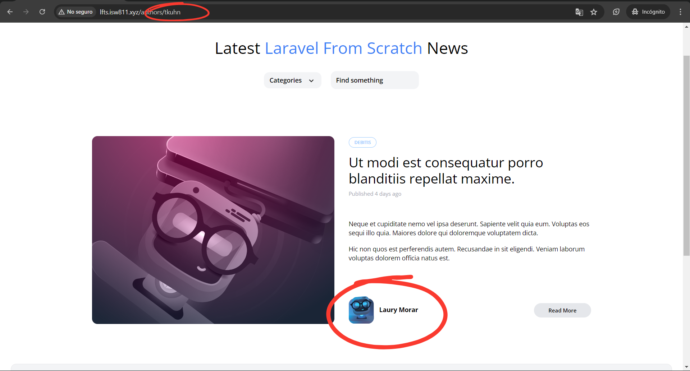
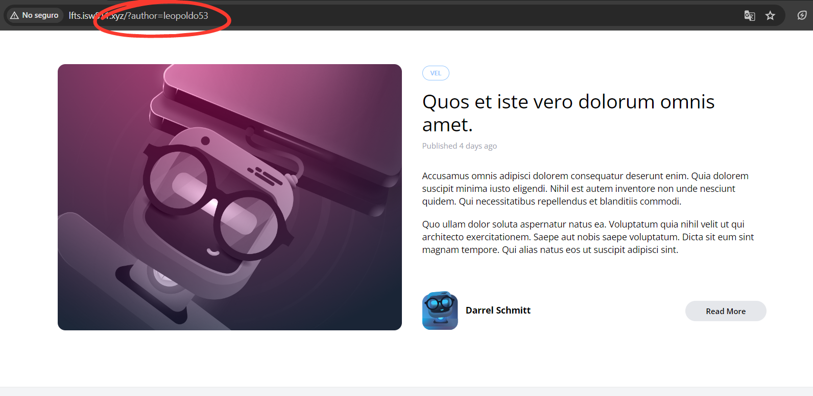

[< Volver al índice](/docs/readme.md)

# Author Filtering

En este episodio, implementaremos el filtrado de publicaciones según su respectivo autor. Aunque ya tuviéramos una ruta configurada (`'authors/{author:username}'`) para manejar esta, haremos los ajustes para realizar esta funcionalidad junto con el filtrado de categorías y búsqueda.

## Filtrado por ruta

### Actualizar componente `post-card`

Para que el filtrado por autor funcione correctamente, primero debemos añadir un enlace para seleccionar los autores desde la vista principal. Así que en el contenedor encargado de imprimir el autor en los componentes `post-card` y `post-featured-card.blade.php` le añadiremos un enlace para que pueda referenciar la ruta, lo que debemos agregar resultaría así:

```html
<div class="ml-3">
    <h5 class="font-bold">
        <a href="/authors/{{ $post->author->username }}">
            {{ $post->author->name }}
        </a>
    </h5>
</div>
```

Este contenedor se ubica en el footer de los componentes.

### Solucionar error de referencia

Debido a la convención que utilizamos para las vistas, nos muestra el error `View [posts] not found`, para solucionar este problema, debemos actualizar la ruta `'authors/{author:username}'` en `web.php`.

```php
Route::get('authors/{author:username}', function (User $author) {
    return view('posts.index', [
        'posts' => $author->posts
    ]);
});
```

Ahora, podemos cargar los posts por autor correctamente, por ejemplo:



## Añadir a filtro de autores al método `scopeFilter`

Para añadir el filtrado por autor al filtro de publicaciones, es bastante sencillo. Para ello, nos ubicamos en `/app/Models/Post.php` y añadimos lo siguiente al método `scopeFilter()`:

```php
$query->when($filters['author'] ?? false, fn ($query, $author) => $query
    ->whereHas(
        'author',
        fn ($query) =>
        $query->where('username', $author)
    ));
```

Y en el controlador `PostController`, añadimos el filtro de autores en el método `index()` para que pueda manejar el nuevo filtrado:

```php
public function index()
{
    return view('posts.index', [
        'posts' => Post::latest()->filter(request(['search', 'category', 'author']))->get()
    ]);
}
```

Esto lo podemos probar añadiendo a la URL la consulta de búsqueda del autor, por ejemplo: `http://lfts.isw811.xyz/?authors=tkuhn`.

Para que lo anterior funcione sin problemas, en los componentes `post-card.blade.php`, `post-featured-card.blade.php` y la vista `posts/show.blade.php`, debemos corregir la sección donde se imprime el autor, con lo siguiente:

```html
<div class="ml-3">
    <h5 class="font-bold">
        <a href="/?author={{ $post->author->username }}">
            {{ $post->author->name }}
        </a>
    </h5>
</div>
```

### Eliminar ruta `'authors/{author:username}'`

Debido a que hemos integrado el filtrado por autor a `Posts`, podemos eliminar la ruta dedicada al filtro de autores en el archivo `/routes/web.php`. Esto quedaría así:

```php
<?php

use App\Http\Controllers\PostController;
use Illuminate\Support\Facades\Route;

Route::get('/', [PostController::class, 'index'])->name('home');
Route::get('posts/{post:slug}', [PostController::class, 'show']);

```

## Resultado final

Ahora, tenemos los tres tipos de filtros ubicados en `/app/Models/Post.php`, implementados de una forma mucho más limpia y eficiente. Por otro lado, podemos apreciar cómo el filtrado de autores se realiza por "query string".


