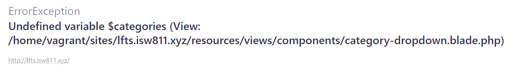
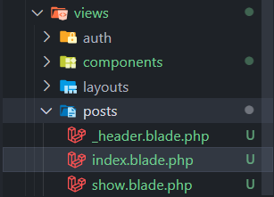

[< Volver al índice](/docs/readme.md)

# Extract a Category Dropdown Blade Component

En este nivel en nuestro proyecto, podremos notar que existen referencias para obtener las categorías en el área de rutas y en el controlador `PostController`, por lo que esto es una oportunidad para extraer la sección de categorías con el dropdown ubicado en `/resources/views/_post-header.blade.php` y crear una clase dedicada a pasar todos los datos necesarios, algo similar a un modelo de vista.

## Crear componente `category-dropdown`

Inicialmente, lo que haremos es crear el componente desde donde extraeremos el código del dropdown, para ello seguiremos los pasos presentados a continuación:

Primero, en el archivo de vista `_post-header.blade.php` en la sección de categorías, lo modificamos de la siguiente forma:

```html
<!-- Category: -->
<div class="relative lg:inline-flex bg-gray-100 rounded-xl">
    <x-category-dropdown />
</div>
```

Segundo, crearemos el componente `CategoryDropdown` con el siguiente comando:

```bash
php artisan make:component CategoryDropdown
```

Tercero, agregaremos el contenido eliminado de la sección `Category` en `_post-header.blade.php` al nuevo componente `CategoryDropdown`:

```html
<x-dropdown>
    <x-slot name="trigger">
        <button
            class="py-2 pl-3 pr-9 text-sm font-semibold w-32 text-left flex lg:inline-flex"
        >
            {{ isset($currentCategory) ? ucwords($currentCategory->name)
            :'Categories' }}
            <x-icon
                name="down-arrow"
                class="absolute pointer-events-none"
                style="right: 12px;"
            />
        </button>
    </x-slot>
    <x-dropdown-item href="/" :active="request()->routeIs('home')"
        >All</x-dropdown-item
    >
    @foreach ($categories as $category)
    <x-dropdown-item
        href="/?category={{ $category->slug }}"
        :active='request()->is("categories/{$category->slug}") '
    >
        {{ ucwords( $category->name )}}
    </x-dropdown-item>
    @endforeach
</x-dropdown>
```

Por último, el comando ejecutado anteriormente nos va a crear una clase PHP en la ubicación `/app/View/Components/CategoryDropdown.php`. En este archivo es que manejaremos las categorías.

## Modificar `CategoryDropdown.php`

Inicialmente, si no modificamos el nuevo archivo similar al modelo de vista, nos dará el siguiente error:



Este error se debe a que ahora Laravel delega la responsabilidad de enviar a la vista las categorías mediante la nueva clase, por lo que `CategoryDropdown` resultaría así:

```php
class CategoryDropdown extends Component
{
    /**
     * Get the view / contents that represent the component.
     *
     */
    public function render()
    {
        return view('components.category-dropdown', [
            'categories' => Category::all(),
            'currentCategory' => Category::firstWhere('slug', request('category'))
        ]);
    }
}
```

Esta clase la podemos interpretar como un componente de hoja o un modelo de vista, donde su funcionalidad es pasar las categorías y la categoría actual a las vistas.

## Adaptar ruta `'authors/{author:username}'` y `PostController`

Ahora, no es necesario enviar todas las categorías y la categoría seleccionada desde este endpoint, por lo cual podemos eliminar lo mencionado.

```php
Route::get('authors/{author:username}', function (User $author) {
    return view('posts', [
        'posts' => $author->posts
    ]);
});
```

Y en el `PostController` ocurre exactamente lo mismo. Por lo que su método `index()`, resultaría de la siguiente manera:

```php
public function index()
{
    return view('posts', [
        'posts' => Post::latest()->filter(request(['search', 'category']))->get()
    ]);
}
```

## Limpieza final

Es muy importante que cada vista se encuentre en un directorio que la represente y con los nombres de los métodos del controlador, en nuestro caso algo así:



Podemos apreciar, que renombramos y movimos los archivos para seguir esta convención:

-   `posts.blade.php` a `posts/index.blade.php`
-   `post.blade.php` a `posts/show.blade.php`
-   `\_post-header.blade.php` a `posts/\_header.blade.php`

Ahora, debemos corregir las referencias de las vistas en el controlador `PostController`.

```php
class PostController extends Controller
{
    public function index()
    {
        return view('posts.index', [
            'posts' => Post::latest()->filter(request(['search', 'category']))->get()
        ]);
    }

    public function show(Post $post)
    {
        return view('post.show', [
            'post' => $post
        ]);
    }
}
```

Por último, la referencia en `/resources/views/posts/index.blade.php` hacia el header, la vamos a corregir.

```php
@include ('posts._header')
```

## Resultado final

Nuevamente, las modificaciones realizadas en este episodio son buenas prácticas que aportan mucho a un proyecto y desarrollador. Aunque visualmente no hay grandes cambios, internamente hemos separado las responsabilidades y limpiado el código.
