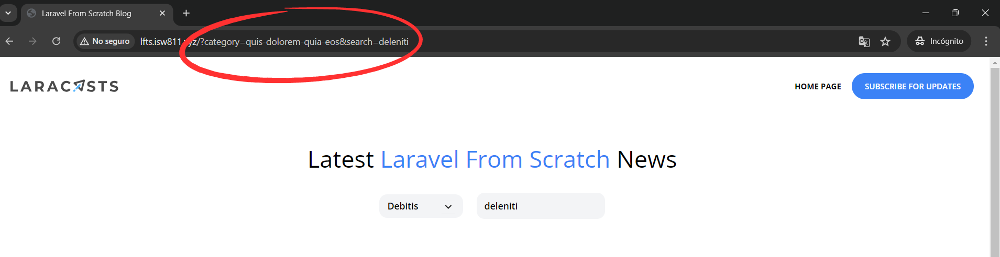

[< Volver al índice](/docs/readme.md)

# Merge Category and Search Queries

En este episodio, nos ocuparemos de realizar la tarea de combinar los filtros de categoría y por búsqueda, permitiéndonos buscar posts dentro de una categoría determinada. Aunque esto es posible en el backend, en el frontend no se ve reflejado.

## Solucionar filtrado de categoría y búsqueda

Para dar solución cuando elijamos una categoría y posteriormente realicemos una búsqueda, es necesario modificar el archivo de vista del header (`_header.blade.php`) en la sección de búsqueda:

```html
<!-- Search -->
<div
    class="relative flex lg:inline-flex items-center bg-gray-100 rounded-xl px-3 py-2"
>
    <form method="GET" action="/">
        @if (request('category'))
            <input
                type="hidden"
                name="category"
                value="{{ request('category') }}"
            />
        @endif
        <input
            type="text"
            name="search"
            placeholder="Find something"
            class="bg-transparent placeholder-black font-semibold text-sm"
            value="{{ request('search') }}"
        />
    </form>
</div>
```

Este cambio permite validar si hay una categoría seleccionada en el query string. Si existe, se añade en el `input` de tipo oculto. De esta forma, cuando se seleccione primero una categoría y luego se haga una búsqueda, ambos parámetros se enviarán al controlador y por ende al filtrado correspondiente en el modelo.

## Solucionar filtrado de búsqueda y luego categoría

Ahora, contrario a lo anterior, para permitir que una búsqueda persista al seleccionar una categoría después (realizar búsqueda y seleccionar categoría), debemos modificar los enlaces de las categorías a mostrar en el componente `category-dropdown.blade.php`:

```html
@foreach ($categories as $category)
    <x-dropdown-item
        href="/?category={{ $category->slug }}&{{ http_build_query(request()->except('category')) }}"
        :active='request()->is("categories/{$category->slug}") '
    >
        {{ ucwords( $category->name )}}
    </x-dropdown-item>
@endforeach
```

Al atributo `href` se le incluye esto: `&{{ http_build_query(request()->except('category')) }}`. En donde, primordialmente obtenemos todo el query string a excepción de los valores de categoría para evitar la duplicación de categorías seleccionadas. Al aplicar `except`, nos retorna un array con los valores, pero necesitamos que sea un string. Para solucionar esto, utilizamos la siguiente función:

-   `http_build_query()`: Recibe un array y lo convierte en una cadena de texto. Por ejemplo, en nuestro caso recibirá valores similares a `[search => 'nemo']`, lo cual lo convertirá en `search=nemo`.

## Resultado final

Independientemente del orden en el que se apliquen los filtros de categorías o búsqueda, obtendremos un resultado como el siguiente:



Finalmente, hemos solucionado a nivel de frontend la combinación de los filtros de categorías y búsqueda, permitiéndonos combinar los parámetros de cadena de consulta de estos dos filtrados correctamente.
