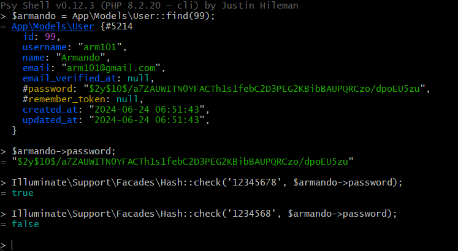

[< Volver al índice](/docs/readme.md)

# Automatic Password Hashing With Mutators

Para esta ocasión, solucionaremos el problema detectado en el episodio anterior, donde las contraseñas se guardaban en la base de datos como texto plano. Por lo que utilizaremos los mutadores de Eloquent, estos nos permitirán que las contraseñas siempre sean un hash antes de ser almacenadas.

## Generar hash con la contraseña

Para encriptar la contraseña y almacenarla como un hash es bastante sencillo, podemos modificar el método `store()` del `RegisterController` de la siguiente manera:

```php
public function store()
{
    $attributes = request()->validate([
        'name' => 'required|max:255',
        'username' => 'required|max:255|min:3',
        'email' => 'required|email|max:255',
        'password' => 'required|min:7|max:255'
    ]);

    $attributes['password'] = bcrypt($attributes['password']); // Esto de por acá

    User::create($attributes);

    return redirect('/');
}
```

Al añadir esta línea, nos aseguramos de que al registrar un nuevo usuario, este tendrá la contraseña encriptada con el método de encriptación `bcrypt`.

### ¿Cómo comparar contraseñas encriptadas?

Para poder verificar si una contraseña ingresada en texto plano coincide con una contraseña encriptada, utilizamos la función `Illuminate\Support\Facades\Hash::check()`, por ejemplo, probemos esta funcionalidad manualmente en Tinker :



## Utilizar Eloquent Mutator

Inicialmente, debemos eliminar la línea de código de encriptación `$attributes['password'] = bcrypt($attributes['password']);` del `RegisterController`.

Una vez realizado esto, para utilizar los mutadores de Eloquent en el modelo `User` debemos añadir lo siguiente debajo de la propiedad `$casts`:

```php
public function setPasswordAttribute($password)
{
    $this->attributes['password'] = bcrypt($password);
}
```

Es muy importante seguir la convención de nombres para que el mutador funcione correctamente, donde primero va la palabra `set`, luego el nombre del `atributo` y finalmente la palabra `Attribute`. Dentro del mutador, realizamos los cambios que queremos que se apliquen al atributo del array deseado; estos cambios se van a ejecutar siempre antes de que se guarde un nuevo registro en la base de datos.

## Resultado final

Ahora, con los mutadores, cada vez que se guarde un usuario, la contraseña será encriptada antes de ser guardada de manera automática. Veamos esto en la base de datos con TablePlus, después de registrar un usuario nuevo:


Gracias a estos cambios, hemos implementado una funcionalidad de encriptación de contraseñas de forma muy sencilla, mejorando la seguridad de nuestro blog.
