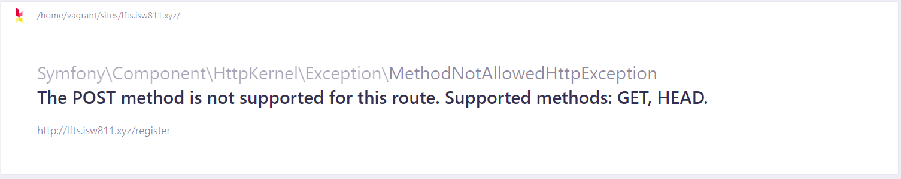
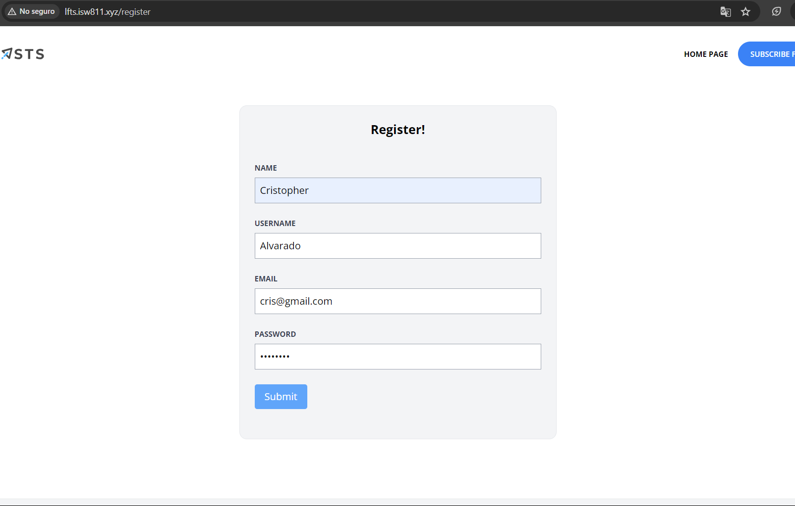
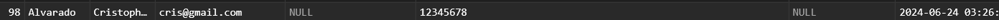

[< Volver al índice](/docs/readme.md)

# Build a Register User Page

En este episodio empezaremos a trabajar con la autenticación de usuarios y manipulación de formularios. Por lo que, añadiremos una nueva ruta que nos dirija al formulario de registro que crearemos en este capítulo, lo que permitirá registrar nuevos usuarios en nuestro blog.

## Añadir endpoint `register`

Inicialmente, agregaremos una nueva ruta en el archivo `/routes/web.php` que nos permita ingresar al formulario de registro:

```php
Route::get('register', [RegisterController::class, 'create']);
```

## Crear `RegisterController`

Anteriormente, en el archivo de rutas estamos realizando una referencia a `RegisterController`, pero para que esto funcione debemos crear este controlador. Para eso, nos ubicamos en nuestra máquina virtual y lo generamos ejecutando el siguiente comando:

```bash
php artisan make:controller RegisterController
```

Recuerda importar el nuevo controlador en el archivo `/routes/web.php`.

```php
use App\Http\Controllers\RegisterController;
```

### Crear acción `create()` en el nuevo controlador

En el `RegisterController` debemos añadir la acción de crear en donde retornaremos la vista donde se registran los usuarios, tal que así:

```php
public function create()
{
    return view('register.create');
}
```

## Crear el directorio y la vista para registro

Siguiendo la convención utilizada a lo largo de este curso, crearemos la carpeta `/resources/views/register` (nombre general) y el archivo de vista `create.blade.php` (nombre de acción). Al nuevo archivo debemos añadirle el componente layout (incluye el header y footer) y una sección con estilos de espaciado:

```html
<x-layout>
    <section class="px-6 py-8">
        <h1>hello world</h1>
    </section>
</x-layout>
```

Si ingresamos a `http://lfts.isw811.xyz/register`, podremos apreciar que ya se incluyó el header, el footer por defecto y un título con el mensaje "hello world".

### Crear y estilizar el formulario

Una vez realizado lo anterior, podemos iniciar con crear y darle estilos a nuestro formulario en el archivo de vista `create.blade.php`:

```html
<x-layout>
    <section class="px-6 py-8">
        <main
            class="max-w-lg mx-auto mt-10 bg-gray-100 border border-gray-200 p-6 rounded-xl"
        >
            <h1 class="text-center font-bold text-xl">Register!</h1>

            <form method="POST" action="/register" class="mt-10">
                <div class="mb-6">
                    <label
                        class="block mb-2 uppercase font-bold text-xs text-gray-700"
                        for="name"
                    >
                        Name
                    </label>

                    <input
                        class="border border-gray-400 p-2 w-full"
                        type="text"
                        name="name"
                        id="name"
                        required
                    />
                </div>

                <div class="mb-6">
                    <label
                        class="block mb-2 uppercase font-bold text-xs text-gray-700"
                        for="username"
                    >
                        Username
                    </label>

                    <input
                        class="border border-gray-400 p-2 w-full"
                        type="text"
                        name="username"
                        id="username"
                        required
                    />
                </div>

                <div class="mb-6">
                    <label
                        class="block mb-2 uppercase font-bold text-xs text-gray-700"
                        for="email"
                    >
                        Email
                    </label>

                    <input
                        class="border border-gray-400 p-2 w-full"
                        type="email"
                        name="email"
                        id="email"
                        required
                    />
                </div>

                <div class="mb-6">
                    <label
                        class="block mb-2 uppercase font-bold text-xs text-gray-700"
                        for="password"
                    >
                        Password
                    </label>

                    <input
                        class="border border-gray-400 p-2 w-full"
                        type="password"
                        name="password"
                        id="password"
                        required
                    />
                </div>

                <div class="mb-6">
                    <button
                        type="submit"
                        class="bg-blue-400 text-white rounded py-2 px-4 hover:bg-blue-500"
                    >
                        Submit
                    </button>
                </div>
            </form>
        </main>
    </section>
</x-layout>
```

#### Puntos destacables:

-   El form apunta al endpoint `/register` con un método `POST`; en otras palabras, cuando se realice un submit del `form`, a esa ruta se enviarán los datos recolectados de los inputs.
-   Se crearon cuatro inputs correspondientes a los valores que deseamos almacenar en la base de datos y un botón que nos permitirá enviar la información y registrar al nuevo usuario.
-   Se utilizaron unos snippets de código HTML y clases de Tailwind CSS para generar los inputs y darle estilos.

## Crear endpoint tipo POST y acción `store()`

### Crear endpoint `register` de tipo POST

Para poder enviar la información debemos añadir una ruta POST `register`, de lo contrario nos mostrará el siguiente error:



Este error, la mayoría de veces, nos indica que no existe una ruta apropiada para lo que deseamos. Por lo que en el archivo `/routes/web.php` añadimos el siguiente endpoint:

```php
Route::post('register', [RegisterController::class, 'store']);
```

### Controlar CSRF y crear acción `store` en el `RegisterController`

Para manejar el envío del formulario, crearemos el método `store()`. Pero primero, debemos manejar la protección CSRF (Cross-site request forgery), la cual Laravel implementa automáticamente para protegerse de ataques de este tipo, en donde resumidamente lo que hacen es enviar solicitudes donde estén falsificando una solicitud de un sitio a otro. Si no manejamos esta protección, obtendremos el error `419 | PAGE EXPIRED`. Para añadir soporte CSRF en el formulario, añadimos `@csrf` dentro de la etiqueta `<form>`:

```html
<form method="POST" action="/register" class="mt-10">
    @csrf
    <!-- Los demás inputs seguirían aca... -->
</form>
```

Al renderizar la página, esto genera un input oculto con un token único, el cual Laravel comprueba automáticamente y de esta forma se protege la aplicación de solicitudes falsificadas.

Ahora volvamos con el método `store()`, el cual resultará en el `RegisterController` de la siguiente forma:

```php
public function store()
{
    $attributes = request()->validate([
        'name' => 'required|max:255',
        'username' => 'required|max:255|min:3',
        'email' => 'required|email|max:255',
        'password' => 'required|min:7|max:255'
    ]);

    User::create($attributes);

    return redirect('/');
}
```

En este método realizamos las validaciones de la consistencia y coherencia de los datos. Si no pasan la validación automáticamente, Laravel redirige al formulario de registro. Consiguientemente, se crea el usuario con los datos validados y se redirecciona a la página principal.

Aunque aún existe un problema, en los atributos declarados como rellenables no está el `username`, para solucionar esto remplazamos la declaración de la variable `fillable` por lo siguiente:

```php
protected $guarded = [];
```

Con esto nos aseguramos de que todos los atributos sean rellenables.

## Resultado final

Finalizado todos los pasos, podremos registrar un usuario y redirigir a la página principal correctamente. Por ejemplo:

1. Primero, se realiza el registro del usuario:

    

2. Luego, al presionar `submit`, nos redirige a la página principal:

3. Por último, podemos verificar en TablePlus la creación del nuevo usuario:

    

    Podemos apreciar un gran error, las contraseñas están siendo ingresadas en texto plano; esto será solucionado en el siguiente capítulo.

Por lo que, hemos creado un formulario para registrar a los usuarios de nuestro blog exitosamente.
