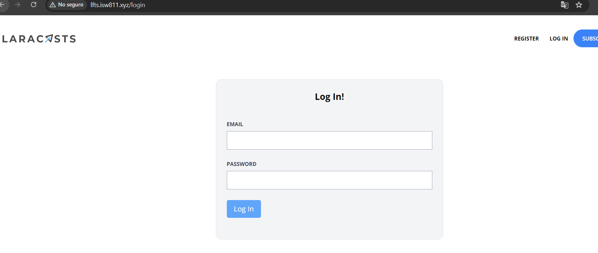
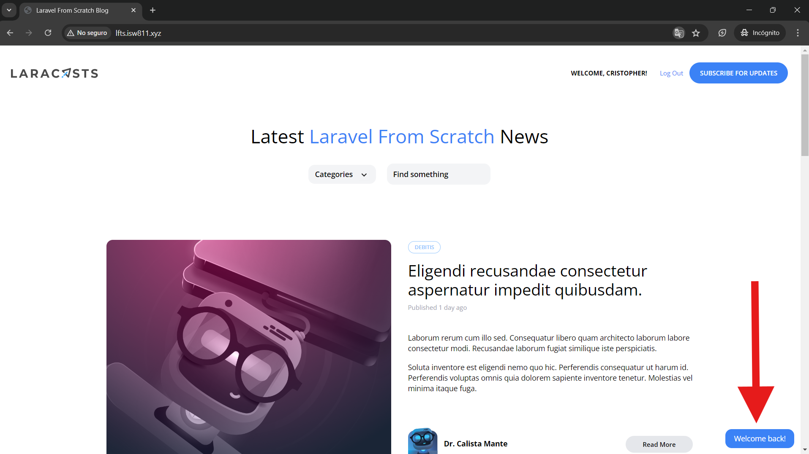

[< Volver al índice](/docs/readme.md)

# Build the Log In Page

En el episodio anterior, agregamos un enlace para dirigirnos a la vista de inicio sesión, sin embargo, esta página no ha sido creada aún. Por lo que, en el presente capítulo, implementaremos la página de inicio de sesión y su funcionalidad.

## Añadir ruta `GET` para el login

Primero, debemos añadir la ruta que nos permita acceder a la vista del inicio de sesión. Para ello, en el archivo `web.php`, añadimos el siguiente endpoint:

```php
Route::get('login', [SessionsController::class, 'create'])->middleware('guest');
```

En donde esta ruta valida que únicamente usuarios que no hayan iniciado sesión puedan ingresar a esta sección con `->middleware('guest')`. Además, ejecutará la acción `create` del controlador de sesiones.

## Añadir acción `create()` al controlador de sesiones

Posteriormente, añadiremos el método `create()` del `SessionsController`; este nos permitirá retornar el archivo de vista del inicio de sesión. El método resultará así:

```php
public function create()
{
    return view('sessions.create');
}
```

## Crear directorio y archivo de vista para el inicio de sesión

Luego, debemos crear el directorio `sessions` en la ubicación `/resources/views/`. En esta nueva carpeta crearemos el archivo de vista para el login, llamado `create.blade.php`.

Para el nuevo archivo de vista `/resources/views/sessions/create.blade.php`, debemos añadirle un formulario con entradas para el correo electrónico, contraseña y un botón de envío:

```html
<x-layout>
    <section class="px-6 py-8">
        <main
            class="max-w-lg mx-auto mt-10 bg-gray-100 border border-gray-200 p-6 rounded-xl"
        >
            <h1 class="text-center font-bold text-xl">Log In!</h1>
            <form method="POST" action="/login" class="mt-10">
                @csrf

                <div class="mb-6">
                    <label
                        class="block mb-2 uppercase font-bold text-xs text-gray-700"
                        for="email"
                    >
                        Email
                    </label>

                    <input
                        class="border border-gray-400 p-2 w-full"
                        type="email"
                        name="email"
                        id="email"
                        value="{{ old('email') }}"
                        required
                    />

                    @error('email')
                    <p class="text-red-500 text-xs mt-2">{{ $message }}</p>
                    @enderror
                </div>

                <div class="mb-6">
                    <label
                        class="block mb-2 uppercase font-bold text-xs text-gray-700"
                        for="password"
                    >
                        Password
                    </label>

                    <input
                        class="border border-gray-400 p-2 w-full"
                        type="password"
                        name="password"
                        id="password"
                        required
                    />

                    @error('password')
                    <p class="text-red-500 text-xs mt-1">{{ $message }}</p>
                    @enderror
                </div>

                <div class="mb-6">
                    <button
                        type="submit"
                        class="bg-blue-400 text-white rounded py-2 px-4 hover:bg-blue-500"
                    >
                        Log In
                    </button>
                </div>
            </form>
        </main>
    </section>
</x-layout>
```

### Crear ruta POST `/login`

En el formulario anterior podemos apreciar que la acción apunta hacia un endpoint `/login` de tipo POST, por ello debemos crear esta ruta y añadirla en nuestro archivo de rutas `web.php`.

```php
Route::post('login', [SessionsController::class, 'store'])->middleware('guest');
```

Cada vez que el formulario sea enviado, apuntará a esta ruta y se ejecutará el método `store()` del controlador de sesiones.

## Agregar acción `store()` al controlador de sesiones

Ahora, debemos agregar la acción `store()` en `SessionsController`. Esta acción se encargará de autenticar al usuario basado en las credenciales proporcionadas, validar la solicitud en términos generales y, si las credenciales son correctas, redirigir a la página principal con un mensaje de éxito.

```php
public function store()
{
    // Validar la solicitud en términos generales:
    $attributes = request()->validate([
        'email' => 'required|email',
        'password' => 'required'
    ]);

    // Intentar iniciar sesión basado en las credenciales otorgadas:
    if (auth()->attempt($attributes)) {
        // Evitar ataque de session fixation:
        session()->regenerate();
        // Retornar al usuario a la página principal con mensaje de éxito:
        return redirect('/')->with('success', 'Welcome back!');
    }

    // Si la autenticación falla:
    throw ValidationException::withMessages([
        'email' => 'Your provided credentials could not be verified.'
    ]);
}
```

A través de este método, se permitirá o no a los usuarios iniciar sesión correctamente, regenerar la sesión para evitar ataques de reparación de sesión (session fixation) y recibir un mensaje de error si las credenciales son incorrectas.

## Resultado final

Hagamos un repaso de los puntos realizados en este episodio.

1. Creamos una vista con un formulario que nos permitirá iniciar sesión:



2. Internamente, generamos el nuevo endpoint y acción para poder manejar el inicio de sesión de una manera básica, pero correcta.

3. Al iniciar sesión incorrectamente, se nos mostrará un mensaje de error.

4. Al iniciar sesión correctamente, nos mostrará un mensaje temporal de 4 segundos confirmando la acción.



Finalmente, hemos implementado la funcionalidad del inicio de sesión por completo.
