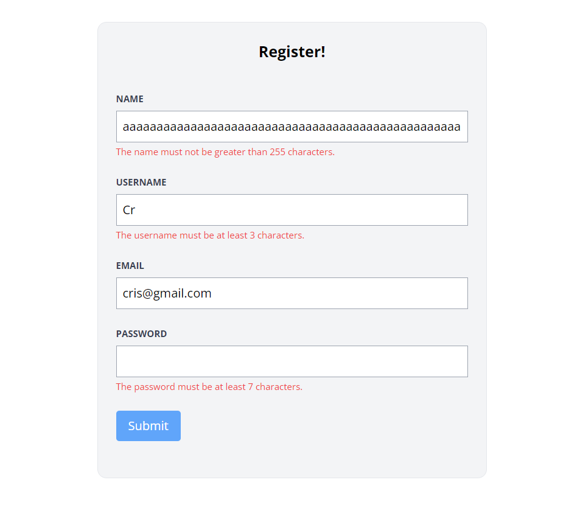
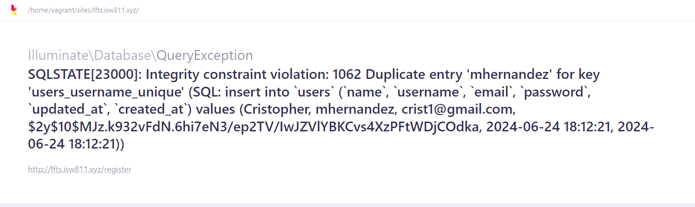

[< Volver al índice](/docs/readme.md)

# Failed Validation and Old Input Data

En este episodio, implementaremos la funcionalidad para proporcionar mensajes al usuario cada vez que falle la validación de datos de entrada, utilizando `@error` de Blade. También aprenderemos a cómo recuperar los datos de entrada antiguos con `old()`.

## Añadir mensajes de error de validación

Para cada `<input>`, es necesario agregar un comentario que se muestre cada vez que la validación falle. Esto es tan sencillo como agregar lo siguiente para cada atributo:

```html
@error ('name')
    <p class="text-red-500 text-xs mt-1">{{ $message }}</p>
@enderror
```

En el ejemplo anterior, podemos apreciar las directivas para indicar `error('nombre-input')` y `@enderror` que se utilizan para envolver el mensaje de error. Además, imprimimos la variable `{{ $message }}`, la cual corresponde al mensaje de validación específico para esa entrada.

## Obtener los valores de los inputs antiguos

Al momento de que la validación falle y retorne a la vista de registro, podemos apreciar que se pierden todos los valores que el usuario haya ingresado anteriormente, lo que es un comportamiento indeseado. Para solucionar esto, a cada `<input>` le debemos añadir un atributo `value` y acceder a una sesión de datos flash en donde podemos encontrar los valores de la última solicitud, por ejemplo:

```html
<input
    class="border border-gray-400 p-2 w-full"
    type="text"
    name="name"
    id="name"
    value="{{ old('name') }}"
    required
/>
```

Básicamente, lo que hace es obtener el nombre antiguo de la última solicitud.

## Aplicar los cambios a todos los `<input>`

Ya observamos cómo mostrar un mensaje de error de verificación y cómo obtener los datos de la última solicitud, por lo que ahora aplicaremos todos estos cambios al formulario de registro ubicado en `/resources/views/register/create.blade.php`.

```html
<form method="POST" action="/register" class="mt-10">
    @csrf

    <div class="mb-6">
        <label
            class="block mb-2 uppercase font-bold text-xs text-gray-700"
            for="name"
        >
            Name
        </label>

        <input
            class="border border-gray-400 p-2 w-full"
            type="text"
            name="name"
            id="name"
            value="{{ old('name') }}"
            required
        />
        @error ('name')
            <p class="text-red-500 text-xs mt-1">{{ $message }}</p>
        @enderror
    </div>

    <div class="mb-6">
        <label
            class="block mb-2 uppercase font-bold text-xs text-gray-700"
            for="username"
        >
            Username
        </label>

        <input
            class="border border-gray-400 p-2 w-full"
            type="text"
            name="username"
            id="username"
            value="{{ old('username') }}"
            required
        />
        @error ('username')
            <p class="text-red-500 text-xs mt-1">{{ $message }}</p>
        @enderror
    </div>

    <div class="mb-6">
        <label
            class="block mb-2 uppercase font-bold text-xs text-gray-700"
            for="email"
        >
            Email
        </label>

        <input
            class="border border-gray-400 p-2 w-full"
            type="email"
            name="email"
            id="email"
            value="{{ old('email') }}"
            required
        />
        @error ('email')
            <p class="text-red-500 text-xs mt-1">{{ $message }}</p>
        @enderror
    </div>

    <div class="mb-6">
        <label
            class="block mb-2 uppercase font-bold text-xs text-gray-700"
            for="password"
        >
            Password
        </label>
        <!-- Buena práctica no incluir la contraseña del request anterior  -->
        <input
            class="border border-gray-400 p-2 w-full"
            type="password"
            name="password"
            id="password"
            required
        />
        @error ('password')
            <p class="text-red-500 text-xs mt-1">{{ $message }}</p>
        @enderror
    </div>

    <div class="mb-6">
        <button
            type="submit"
            class="bg-blue-400 text-white rounded py-2 px-4 hover:bg-blue-500"
        >
            Submit
        </button>
    </div>
</form>
```

Hemos añadido a todas las entradas que vuelvan al valor que tenían en el último request, a excepción de la contraseña, y hemos agregado un comentario de error de verificación debajo de cada `<input>`.

**Al momento de fallar alguna verificación, esto se podría apreciar de la siguiente manera:**



## Añadir validaciones de integridad de datos

Actualmente, hemos añadido una funcionalidad bastante interesante a nivel de vista del formulario. Pero a nivel de integridad de datos existe un problema, si se intenta registrar un usuario con username o email existentes, debido a que estas dos columnas en la base de datos tienen una llave única, Laravel nos mostrará un error similar al siguiente:



Para solucionar lo anterior, debemos adaptar el método `store()` del `RegisterController`:

```php
public function store()
{
    $attributes = request()->validate([
        'name' => 'required|max:255',
        'username' => 'required|min:3|max:255|unique:users,username',
        'email' => 'required|email|max:255|unique:users,email',
        'password' => 'required|min:7|max:255'
    ]);

    // equivalente a validación de username: 'username' => ['required', 'min:3', 'max:255', Rule::unique('users', 'username')],

    User::create($attributes);

    return redirect('/');
}
```

Con `'unique:users,columna'`, Laravel validará antes de que se registre un nuevo usuario en la tabla `users` en la columna indicada que no exista el mismo valor ingresado.

## Mostrar los errores debajo del botón de enviar

Por último, existe otra opción en la que los errores de verificación se muestran debajo del botón `submit`:

```html
@if ($errors->any())
    <ul>
        @foreach ($errors->all() as $error)
        <p class="text-red-500 text-xs mt-1">{{ $error }}</p>
        @endforeach
    </ul>
@endif
```

Por lo que, si añadimos este bloque de código después del botón de envío, podemos mostrar todos los errores de validación juntos. **Esta funcionalidad no se va a utilizar, pero es una opción disponible**.
