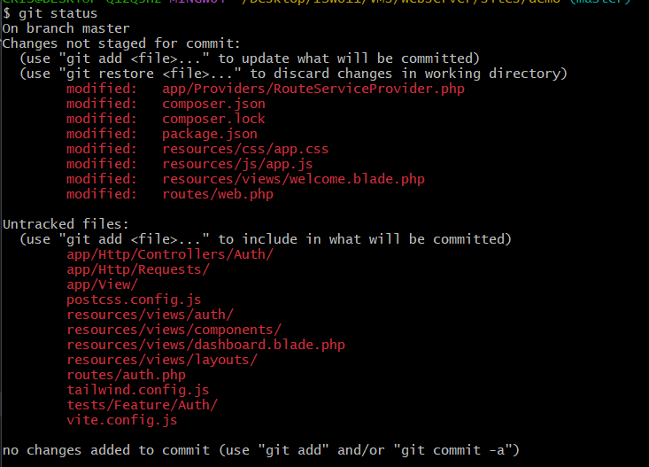
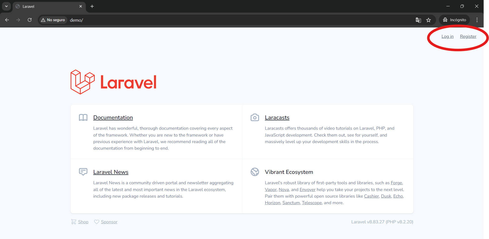

[< Volver al índice](/docs/readme.md)

# Laravel Breeze Quick Peek

Para cerrar la sección de _Forms and Authentication_, en este episodio, revisaremos un paquete de autenticación llamado Laravel Breeze. En donde, para probar Breeze, crearemos un nuevo proyecto `demo`.

## Refactorizar método `store()` del controlador de sesiones

Antes de dar un vistazo a Breeze, vamos a refactorizar la acción `store()` del `SessionsController`, para darle mayor orden y legibilidad:

```php
public function store()
{
    $attributes = request()->validate([
        'email' => 'required|email',
        'password' => 'required'
    ]);

    if (!auth()->attempt($attributes)) {
        throw ValidationException::withMessages([
            'email' => 'Your provided credentials could not be verified.'
        ]);
    }

    session()->regenerate();
    return redirect('/')->with('success', 'Welcome back!');
}
```

Este enfoque sigue un "camino feliz" (happy path), donde las operaciones exitosas (regeneración de la sesión y redirigir) están en el final, el manejo de errores o excepciones se encuentran anidados en una condición en la parte superior. Como resultado, obtenemos una forma más legible de organizar el método.

## Nuevo Proyecto `demo`

Para probar la funcionalidad de Laravel Breeze, debemos de crear un nuevo proyecto. Para ello, ejecutamos el siguiente comando, ubicados en la dirección de crafteo de la máquina virtual `webserver`:

Comando utilizado por el instructor para crear un nuevo proyecto:

```bash
code laravel new demo
```

Comando utilizado, en nuestro caso, para crear un proyecto con Composer:

```bash
cd /vagrant/sites/
composer create-project laravel/laravel:8.6.12 demo
```

### Instalar Laravel Breeze

Ahora, para instalar Laravel Breeze en el nuevo proyecto. En la raíz del proyecto `demo` y en la máquina virtual `webserver`, ejecutamos:

```bash
cd /vagrant/sites/demo
composer require laravel/breeze --dev
```

Y para inicializar Breeze en el proyecto, ejecutamos la orden:

```bash
php artisan breeze:install
```

Esto lo que permite es realizar algunos cambios a nivel interno del proyecto necesarios para que Laravel Breeze funcione. En la imagen presentada a continuación podemos observar los distintos archivos que llega a modificar y agregar:



Para finalizar la instalación, instalemos las dependencias ejecutando:

```bash
npm install && npm run dev
```

El comando anterior instalará las dependencias y añadirá los assets (archivos JS y CSS) necesarios. Esto puede tardar un poco.

### Conexión de base de datos para el nuevo proyecto

Debido a que no tenemos una base de datos, simularemos una. Para esto creamos el archivo `/database/database.sqlite` y lo configuramos en el archivo `.env` para realizar su uso:

```yaml
DB_CONNECTION=sqlite
DB_HOST=127.0.0.1
DB_PORT=3306
DB_DATABASE=/home/vagrant/sites/demo/database/database.sqlite
DB_USERNAME=root
DB_PASSWORD=
```

Para que podamos utilizar la base de datos en este nuevo proyecto, debemos realizar las migraciones, ejecutando:

```bash
php artisan migrate
```

## Resultado final

Finalmente, hemos configurado un proyecto inicializado con Laravel Breeze. Básicamente, Breeze incluye formularios, controladores, modelos, vistas y otras funcionalidades predeterminadas relacionadas con los procesos de autenticación, lo que nos facilita a nosotros como desarrolladores únicamente ajustar el proyecto según nuestras necesidades. Por ejemplo:



En este caso, Breeze nos proporciona vistas para el registro e inicio de sesión predefinidas y funcionales. Por lo que, si deseamos utilizar Laravel Breeze, es recomendable que sea desde el inicio de un proyecto. Ya que en nuestro contexto no tiene sentido, porque hemos implementado gran parte de estas funcionalidades manualmente.

En conclusión, Laravel Breeze es una herramienta muy eficiente y rápida para tener un sistema de autenticación predeterminado en un proyecto.