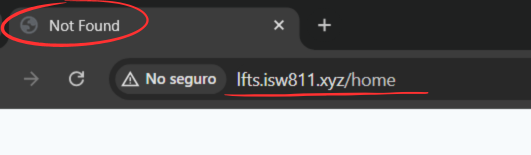
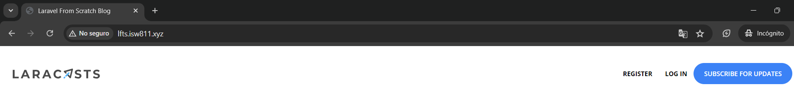
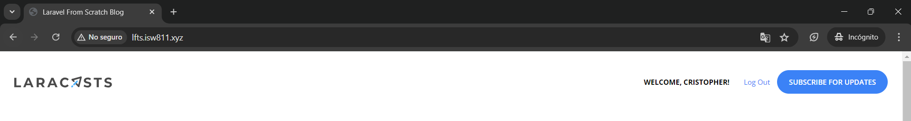
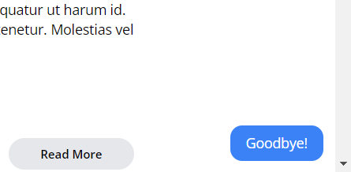

[< Volver al índice](/docs/readme.md)

# Login and Logout

En este episodio, implementaremos la funcionalidad de cierre de sesión y parte del inicio de sesión como usuario. Para esto, vamos a utilizar la función helper `auth()`.

## Añadir enlace que dirija a la vista de registro

Primero, remplazaremos el enlace que actualmente dirige a la página principal para que ahora dirija a la página de registro, por lo que la sección en donde estaba este enlace resultará de la siguiente forma:

```html
<div class="mt-8 md:mt-0">
    <!-- El siguiente enlace fue el modificado:  -->
    <a href="/register" class="text-xs font-bold uppercase">Register</a>

    <a
        href="#"
        class="bg-blue-500 ml-3 rounded-full text-xs font-semibold text-white uppercase py-3 px-5"
    >
        Subscribe for Updates
    </a>
</div>
```

Con esto, tenemos una forma fácil de acceder a la página de registro, sin tener que escribir la dirección específica en la URL.

## Implementar funcionalidad de inicio y cierre de sesión

Para iniciar sesión automáticamente después de crear un usuario, añadimos `auth()->login($user);` en el método `store()` del `RegisterController`:

```php
public function store()
{
    $attributes = request()->validate([
        'name' => 'required|max:255',
        'username' => 'required|min:3|max:255|unique:users,username',
        'email' => 'required|email|max:255|unique:users,email',
        'password' => 'required|min:7|max:255'
    ]);

    $user = User::create($attributes);

    auth()->login($user); // Inicio de sesión acá

    return redirect('/')->with('success', 'Your account has been created.');
}
```

Esto hará que el usuario, al registrarse, automáticamente inicie sesión. Sin embargo, para complementar esta funcionalidad existen otros puntos importantes que acatar.

### Añadir middleware a las rutas de registro

A las dos rutas para el registro, le vamos a agregar `->middleware('guest');`, esto lo que permite es que sólo usuarios que no hayan iniciado sesión puedan ingresar a estas funcionalidades o vistas.

```php
Route::get('register', [RegisterController::class, 'create'])->middleware('guest');
Route::post('register', [RegisterController::class, 'store'])->middleware('guest');
```

Al comprobar esta funcionalidad, encontramos un ligero problema. Por ejemplo, si se registra un usuario, automáticamente este iniciará sesión. Si este intenta ingresar nuevamente a la vista de registro, debería ser redirigido a la vista principal, pero ocurre lo siguiente:



Podemos apreciar que intenta redirigir a la página Home, pero no la encuentra y nos da un código de error 404. Para solucionar esto, nos posicionamos en `/app/Providers/RouteServiceProvider.php` y actualizamos el valor de la constante `HOME` de la siguiente manera:

```php
public const HOME = '/';
```

### Mostrar enlaces condicionalmente y agregar formulario para cerrar sesión en `layout`

Nuevamente, en el navbar del archivo de vista `/resources/views/components/layout.blade.php` modificamos el contenedor que se encuentra después del logo para mostrar diferentes opciones según el estado de la sesión `auth`:

```html
<div class="mt-8 md:mt-0 flex items-center">
    @auth
    <span class="text-xs font-bold uppercase"
        >Welcome, {{ auth()->user()->name }}!</span
    >
    <form
        action="/logout"
        method="POST"
        class="text-xs font-semibold text-blue-500 ml-6"
    >
        @csrf
        <button type="submit">Log Out</button>
    </form>
    @else
    <a href="/register" class="text-xs font-bold uppercase">Register</a>
    @endauth
    <a
        href="#"
        class="bg-blue-500 ml-3 rounded-full text-xs font-semibold text-white uppercase py-3 px-5"
    >
        Subscribe for Updates
    </a>
</div>
```

Resumidamente, se renderiza condicionalmente. Cuando exista un usuario que haya iniciado sesión, entrará a la directiva `@auth` y mostrará un mensaje de bienvenida y un formulario que permitirá cerrar sesión. En caso de que no se haya iniciado sesión y sea un `guest`, únicamente se mostrará el enlace para registrarse.

### Crear ruta para cerrar sesión

Ahora, crearemos la ruta la cual nos permitirá cerrar sesión, esta la añadiremos en `web.php`:

```php
Route::post('logout', [SessionsController::class, 'destroy'])->middleware('auth');
```

### Crear controlador `SessionsController`

Anteriormente, agregamos una nueva ruta, pero esta referencia a un controlador que no existe, por ello lo creamos ejecutando el siguiente comando:

```bash
php artisan make:controller SessionsController
```

En el archivo `web.php`, importamos este nuevo controlador para evitar errores de referencia con lo siguiente:

```php
use App\Http\Controllers\SessionsController;
```

#### Añadimos la acción `destroy`

En el controlador `SessionsController`, añadiremos el método para poder cerrar sesión:

```php
public function destroy()
{
    auth()->logout();

    return redirect('/')->with('success', 'Goodbye!');
}
```

Con este método, podremos cerrar sesión y mostrar un mensaje de despedida.

### Añadir enlace para iniciar sesión

Por último, añadimos un enlace para poder iniciar sesión, este lo agregaremos en el mismo nivel que el de registrarse. Algo así:

```html
@else
<a href="/register" class="text-xs font-bold uppercase">Register</a>
<!-- Enlace agregado: -->
<a href="/login" class="ml-6 text-xs font-bold uppercase">Log In</a>
@endauth
```

Si ingresamos a este nuevo enlace, nos mostrará un error `404 | NOT FOUND`, debido a que no existe la ruta y vista para poder realizar el inicio de sesión. **Esto se llevará a cabo en el siguiente episodio.**

## Resultado final

Hemos implementado varias funcionalidades y realizado cambios en las vistas:

1. Al ingresar sin haber iniciado sesión, se muestran enlaces para ir a la vista de registro y iniciar sesión:



2. Al registrarse y por ende iniciar sesión, se muestra el siguiente mensaje de bienvenida y un botón dentro de un formulario para cerrar sesión:x



3. Al cerrar sesión, se muestra un mensaje de despedida:



En donde, el control sobre si ha iniciado sesión o no, lo llevamos a cabo implementado los middlewares en las rutas.
