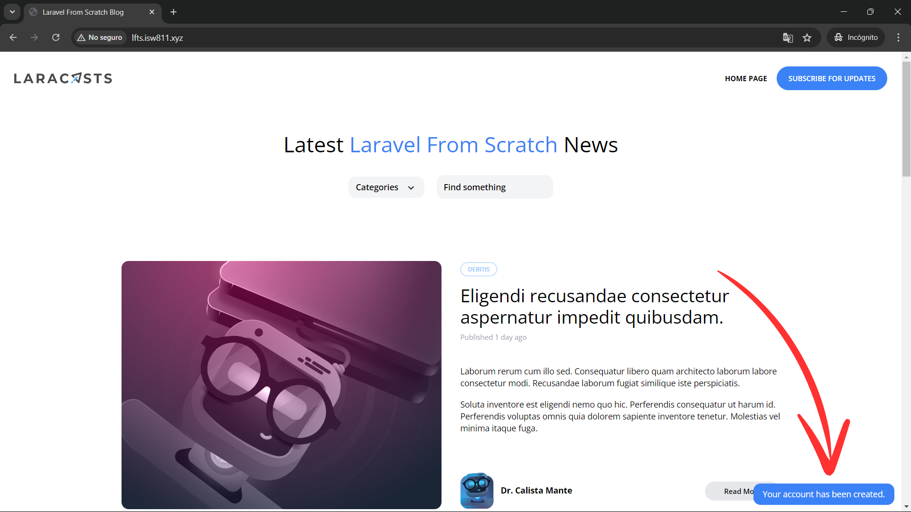

[< Volver al índice](/docs/readme.md)

# Show a Success Flash Message

En esta oportunidad, implementaremos un mensaje flash único que se mostrará al usuario después de que se registre en nuestro blog. Esto se debe a que, actualmente, sólo se redirige al usuario a la página principal.

## Crear sesión flash

Lo primero que debemos hacer es definir una sesión de tan solo un uso. Para esto, la podemos crear agregando la siguiente línea de código en el método `store()` del `RegisterController`:

```php
public function store()
{
    $attributes = request()->validate([
        'name' => 'required|max:255',
        'username' => 'required|min:3|max:255|unique:users,username',
        'email' => 'required|email|max:255|unique:users,email',
        'password' => 'required|min:7|max:255'
    ]);

    User::create($attributes);

    session()->flash('success', 'Your account has been created.'); // Esta línea de código de por acá

    return redirect('/');
}
```

Con esto, cuando se redirecciona a la vista principal, podremos acceder a este mensaje de éxito mediante `session('success')`. Pero únicamente la vez que se redirige, posteriormente, al refrescar o volver a acceder a esta vista por otro método, no lo tendremos disponible.

## Mostrar mensaje flash

Para mostrar el mensaje flash, podemos extraer el siguiente bloque de código en el nuevo componente `/resources/views/components/flash.blade.php`:

```html
@if (session()->has('success'))
    <div
        x-data="{ show: true }"
        x-init="setTimeout(() => show = false, 4000)"
        x-show="show"
        class="fixed bg-blue-500 text-white py-2 px-4 rounded-xl bottom-3 right-3 text-sm"
    >
        <p>{{ session('success') }}</p>
    </div>
@endif
```

En este componente realizamos tres cosas importantes:

-   Validamos si existe una sesión flash con un valor llamado `'success'` y si es así, este se imprimirá.
-   Evitamos que el mensaje se quede para siempre. Para esto utilizamos la biblioteca de JavaScript Alpine.js, en donde agregamos un temporizador de 4 segundos y cuando este finalice, el mensaje desaparecerá automáticamente.
-   Nuevamente, aislamos el código JavaScript en un componente.

### Incluir componente `x-flash` en `layout`

Para poder apreciar el nuevo componente con el mensaje de la sesión flash cada vez que se registre un usuario, debemos añadirlo al archivo `/resources/views/components/layout.blade.php`. insertamos `<x-flash />` después del cierre de la etiqueta `</ section>` pero antes de la etiqueta de cierre del `body`, algo así:

```html
<body style="font-family: Open Sans, sans-serif">
    <section class="px-6 py-8">
        <!-- Contenido del header, imprimir slot y contenido del footer... -->
    </section>
    <!-- Nuevo componente agregado: -->
    <x-flash />
</body>
```

## Refactorizar el envío de la sesión flash

Existe otra forma más sencilla para crear y enviar la sesión flash a la vista, la cual sería utilizando la función `with()` adjuntada al `redirect`.

Método `store()` del `RegisterController`:

```php
public function store()
{
    $attributes = request()->validate([
        'name' => 'required|max:255',
        'username' => 'required|min:3|max:255|unique:users,username',
        'email' => 'required|email|max:255|unique:users,email',
        'password' => 'required|min:7|max:255'
    ]);

    User::create($attributes);

    return redirect('/')->with('success', 'Your account has been created.');
}
```

Esto permite redirigir y crear la sesión flash en una sola línea de código, resultando mucho más limpio y simple.

## Resultado final

Ahora, al registrarse un nuevo usuario, podremos apreciar el mensaje de éxito por cuatro segundos en la parte inferior derecha de la pantalla.



Finalmente, cada vez que se registre un usuario y se redirecciona a la vista principal, este podrá observar el mensaje que le indica que la acción que acaba de realizar en nuestro blog fue exitosa.
