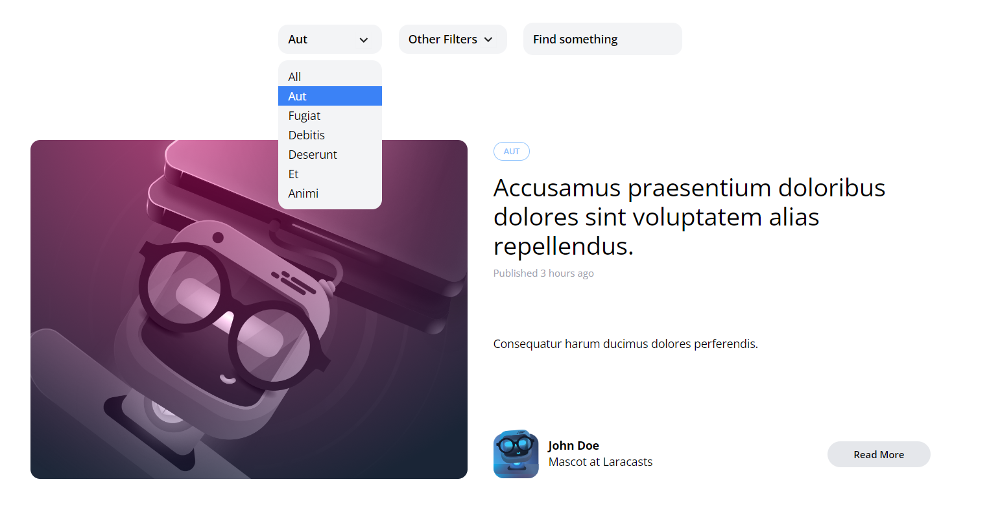

[< Volver al índice](/docs/readme.md)

# A Small JavaScript Dropdown Detour

En el episodio 34, arreglaremos el menú desplegable de categorías para que funcione correctamente. Para solucionar esto, utilizaremos una muy buena biblioteca de JavaScript que se llama Alpine.js.

## Cargar información de manera dinámica en el menú desplegable

Para poder cargar las categorías guardadas en la base de datos en el menú desplegable, realizamos lo siguiente:

Modificar endpoint `/`:

```php
Route::get('/', function () {
    return view('posts', [
        'posts' => Post::latest()->get(),
        'categories' => Category::all()
    ]);
});
```

Modificar el contenedor donde se encuentra el dropdown de categorías en el archivo de vista del `_post-header.blade.php`.

```html
<!--  Category -->
<div class="relative flex lg:inline-flex items-center bg-gray-100 rounded-xl">
    <select
        class="flex-1 appearance-none bg-transparent py-2 pl-3 pr-9 text-sm font-semibold"
    >
        <option value="category" disabled selected>Category</option>
        @foreach ($categories as $category)
        <option value="$category->slug">{{ $category->name }}</option>
        @endforeach
    </select>

    <svg
        class="transform -rotate-90 absolute pointer-events-none"
        style="right: 12px;"
        width="22"
        height="22"
        viewBox="0 0 22 22"
    >
        <g fill="none" fill-rule="evenodd">
            <path
                stroke="#000"
                stroke-opacity=".012"
                stroke-width=".5"
                d="M21 1v20.16H.84V1z"
            ></path>
            <path
                fill="#222"
                d="M13.854 7.224l-3.847 3.856 3.847 3.856-1.184 1.184-5.04-5.04 5.04-5.04z"
            ></path>
        </g>
    </svg>
</div>
```

## Crear otro menú desplegable

### Obtener CDN Alpine.js

Primero, obtendremos el CDN de la biblioteca [Alpine.js](https://github.com/alpinejs/alpine) que nos ayudará con la construcción del menú desplegable.

Este CDN lo incluiremos en el `head` o en la parte superior debajo de la etiqueta HTML `title` de nuestro archivo `/resources/views/components/layout.blade.php`.

```html
<script
    src="https://cdn.jsdelivr.net/gh/alpinejs/alpine@v2.x.x/dist/alpine.min.js"
    defer
></script>
```

### Construir estructura del nuevo menú desplegable

El menú anterior no cumple con lo deseado, por ello crearemos uno adecuado en el archivo de vista `_post-header.blade.php`. La estructura inicial quedaría así:

```html
<div class="relative lg:inline-flex bg-gray-100 rounded-xl">
    <div x-data="{show: false}" @click.away="show = false">
        <button
            @click="show = ! show"
            class="py-2 pl-3 pr-9 text-sm font-semibold w-32 text-left flex lg:inline-flex"
        >
            Categories
            <svg
                class="transform -rotate-90 absolute pointer-events-none"
                style="right: 12px;"
                width="22"
                height="22"
                viewBox="0 0 22 22"
            >
                <g fill="none" fill-rule="evenodd">
                    <path
                        stroke="#000"
                        stroke-opacity=".012"
                        stroke-width=".5"
                        d="M21 1v20.16H.84V1z"
                    ></path>
                    <path
                        fill="#222"
                        d="M13.854 7.224l-3.847 3.856 3.847 3.856-1.184 1.184-5.04-5.04 5.04-5.04z"
                    ></path>
                </g>
            </svg>
        </button>
        <!-- Parte dinámica: -->
        <div
            x-show="show"
            class="py-2 absolute bg-gray-100 mt-2 rounded-xl w-full z-50"
            style="display: none;"
        >
            <a
                href="#"
                class="block text-left px-3 text-sm leading-6 hover:bg-blue-500 focus:bg-blue-500 hover:text-white focus:text-white"
                >One</a
            >
            <a
                href="#"
                class="block text-left px-3 text-sm leading-6 hover:bg-blue-500 focus:bg-blue-500 hover:text-white focus:text-white"
                >Two</a
            >
            <a
                href="#"
                class="block text-left px-3 text-sm leading-6 hover:bg-blue-500 focus:bg-blue-500 hover:text-white focus:text-white"
                >Three</a
            >
        </div>
    </div>
</div>
```

En este punto, con la ayuda de Alpine.js, hemos añadido un poco de dinamismo y también se han agregado algunos estilos para que se vea acorde al diseño que tiene el blog.

### Añadir parte dinámica

Para cargar el menú de categorías de forma dinámica en cada vista, debemos asegurarnos de que las rutas envíen las categorías y la categoría actual si está seleccionada (esto únicamente en caso del endpoint `'categories/{category:slug}'`).

Modificar las rutas `'categories/{category:slug}'` y `'authors/{author:username}'`:

```php
Route::get('categories/{category:slug}', function (Category $category) {
    return view('posts', [
        'posts' => $category->posts,
        'currentCategory' => $slug
        'categories' => Category::all()
    ]);
});

Route::get('authors/{author:username}', function (User $author) {
    return view('posts', [
        'posts' => $author->posts,

        'categories' => Category::all()
    ]);
});
```

Posteriormente, actualizaremos el bloque de código señalado anteriormente (Parte dinámica) en `_post-header.blade.php` para que cargue las categorías dinámicamente y, cuando ingresemos a la página para ver las publicaciones por categorías, podremos ver la categoría seleccionada:

```html
<!-- Parte dinámica: -->
<div
    x-show="show"
    class="py-2 absolute bg-gray-100 mt-2 rounded-xl w-full z-50"
    style="display: none;"
>
    <a
        href="/"
        class="block text-left px-3 text-sm leading-6 hover:bg-blue-500 focus:bg-blue-500 hover:text-white focus:text-white"
    >
        All
    </a>
    @foreach ($categories as $category)
    <a
        href="/categories/{{ $category->slug }}"
        class="block text-left px-3 text-sm leading-6 hover:bg-blue-500 focus:bg-blue-500 hover:text-white focus:text-white
                     {{ isset($currentCategory) && $currentCategory->is($category) ? 'bg-blue-500 text-white' : ''}}"
    >
        {{ ucwords( $category->name )}}
    </a>
    @endforeach
</div>
```

Para este punto, tendríamos un menú desplegable en condiciones, pero con algunos detalles en código. Cuando seleccionemos una categoría específica, nos llevará a la página de esa categoría y el menú mostrará correctamente la categoría seleccionada.


