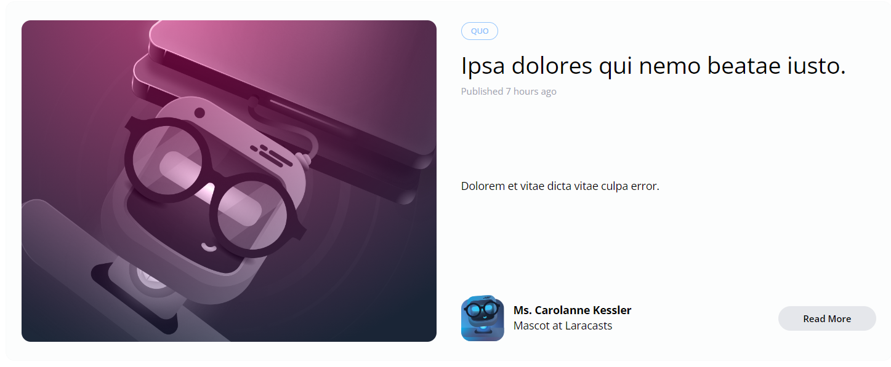
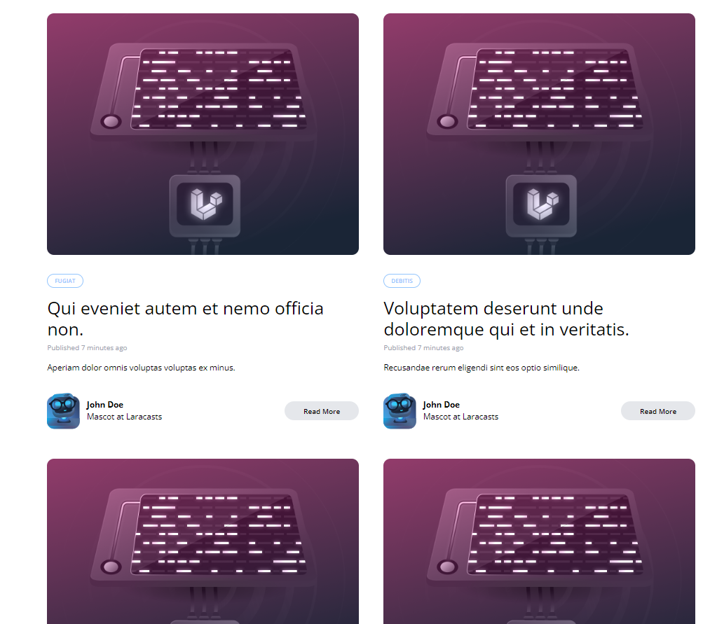
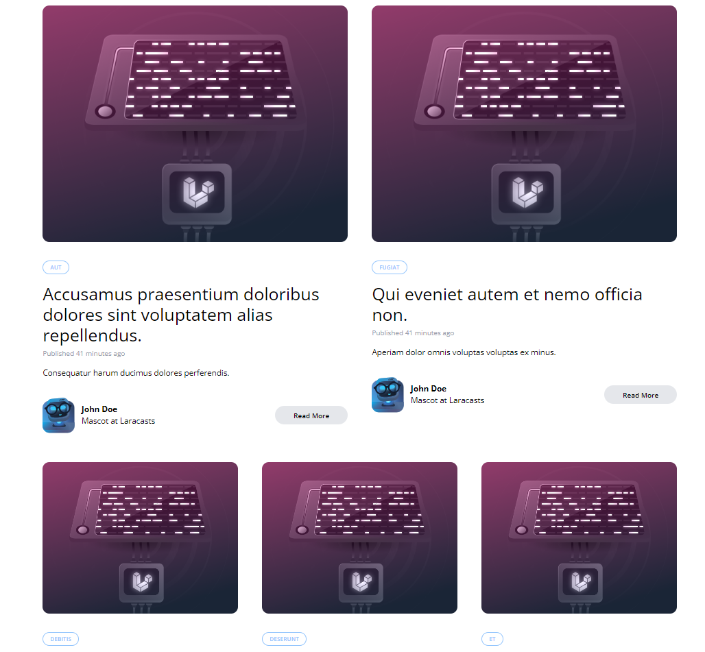

[< Volver al índice](/docs/readme.md)

# Blade Components and CSS Grids

En este episodio, continuaremos con el diseño del blog, haciendo énfasis en los CSS Grids (cuadrículas CSS) y añadiendo dinamismo a los componentes Blade añadidos en el capítulo anterior.

## Actualizar el componente `post-featured-card.blade.php`

Para mostrar la información del primer post de la colección al componente, le debemos enviar el post como parámetro de la siguiente forma:

```html
<x-post-featured-card :post="$posts[0]" />
```

En el componente `post-featured-card.blade.php`, añadimos la declaración del prop en la parte superior para recibir el post en el componente Blade:

```php
@props(['post'])
```

Y ajustamos e imprimimos los valores de la colección `post` en las etiquetas para que muestre la información de nuestra base de datos.

```html
@props(['post'])

<article
    class="transition-colors duration-300 hover:bg-gray-100 border border-black border-opacity-0 hover:border-opacity-5 rounded-xl"
>
    <div class="py-6 px-5 lg:flex">
        <div class="flex-1 lg:mr-8">
            <!-- TODO -->
            
        </div>

        <div class="flex-1 flex flex-col justify-between">
            <header class="mt-8 lg:mt-0">
                <div class="space-x-2">
                    <a
                        href="categories/{{ $post->category->slug }}"
                        class="px-3 py-1 border border-blue-300 rounded-full text-blue-300 text-xs uppercase font-semibold"
                        style="font-size: 10px"
                    >
                        {{ $post->category->name }}
                    </a>
                </div>

                <div class="mt-4">
                    <h1 class="text-3xl">
                        <a href="posts/{{ $post->slug }}">{{ $post->title }}</a>
                    </h1>

                    <span class="mt-2 block text-gray-400 text-xs">
                        Published
                        <time>{{ $post->created_at->diffForHumans() }}</time>
                    </span>
                </div>
            </header>

            <div class="text-sm mt-2">
                <p>{{ $post->excerpt }}</p>
            </div>

            <footer class="flex justify-between items-center mt-8">
                <div class="flex items-center text-sm">
                    
                    <div class="ml-3">
                        <h5 class="font-bold">{{ $post->author->name }}</h5>
                        <h6>Mascot at Laracasts</h6>
                    </div>
                </div>

                <div class="hidden lg:block">
                    <a
                        href="posts/{{ $post->slug }}"
                        class="transition-colors duration-300 text-xs font-semibold bg-gray-200 hover:bg-gray-300 rounded-full py-2 px-8"
                        >Read More</a
                    >
                </div>
            </footer>
        </div>
    </div>
</article>
```

Con los cambios anteriores, la carta destacada ahora se verá algo similar a lo siguiente:



## Actualizar el Componente el componente `post-card.blade.php`

Inicialmente, actualizamos el componente `post-card` para que pueda recibir un prop `post` y mostrar la información en relación a esta propiedad:

```html
@props(['post'])
<article
    class="transition-colors duration-300 hover:bg-gray-100 border border-black border-opacity-0 hover:border-opacity-5 rounded-xl"
>
    <div class="py-6 px-5">
        <div>
            <!-- TODO -->
            
        </div>

        <div class="mt-8 flex flex-col justify-between">
            <header>
                <div class="space-x-2">
                    <a
                        href="categories/{{ $post->category->slug }}"
                        class="px-3 py-1 border border-blue-300 rounded-full text-blue-300 text-xs uppercase font-semibold"
                        style="font-size: 10px"
                    >
                        {{ $post->category->name }}
                    </a>
                </div>

                <div class="mt-4">
                    <h1 class="text-3xl">
                        <a href="posts/{{ $post->slug }}">
                            {{ $post->title }}
                        </a>
                    </h1>

                    <span class="mt-2 block text-gray-400 text-xs">
                        Published
                        <time>{{ $post->created_at->diffForHumans() }}</time>
                    </span>
                </div>
            </header>

            <div class="text-sm mt-4">
                <p>{{ $post->excerpt }}</p>
            </div>

            <footer class="flex justify-between items-center mt-8">
                <div class="flex items-center text-sm">
                    
                    <div class="ml-3">
                        <h5 class="font-bold">{{ $post->author->name }}</h5>
                        <h6>Mascot at Laracasts</h6>
                    </div>
                </div>

                <div>
                    <a
                        href="#"
                        class="transition-colors duration-300 text-xs font-semibold bg-gray-200 hover:bg-gray-300 rounded-full py-2 px-8"
                        >Read More</a
                    >
                </div>
            </footer>
        </div>
    </div>
</article>
```

Este cambio es muy similar al que realizamos con el componente de la tarjeta destacada. Ahora, en la vista de `posts` actualizamos para controlar si no existen publicaciones, mostrar un mensaje de error y, si solo existe un post, mostrará únicamente la tarjeta destaca, controlando que no se muestre el contenedor de la sección vacía.

```html
<x-layout>
    @include ('_post-header')

    <main class="max-w-6xl mx-auto mt-6 lg:mt-20 space-y-6">
        @if ($posts->count())
        <x-post-featured-card :post="$posts[0]" />
        @if ($posts->count() > 1)
        <div class="lg:grid lg:grid-cols-2">
            @foreach ($posts->skip(1) as $post)
            <x-post-card :post="$post" />
            @endforeach
        </div>
        @endif @else
        <p class="text-center">No posts yet. Please check back later.</p>
        @endif
    </main>
</x-layout>
```

### Solucionar problema de columnas

Actualmente, todos los posts debajo del principal se están mostrando en dos columnas.



Pero el comportamiento deseado es que primero se muestre el post principal, posteriormente en dos columnas y el resto en tres columnas. Para lograr esto, realizamos lo siguiente en la vista `posts.blade.php`:

```html
<main class="max-w-6xl mx-auto mt-6 lg:mt-20 space-y-6">
    @if ($posts->count())
    <x-post-featured-card :post="$posts[0]" />
    @if ($posts->count() > 1)
    <div class="lg:grid lg:grid-cols-6">
        @foreach ($posts->skip(1) as $post)
        <x-post-card
            :post="$post"
            class="{{ $loop->iteration < 3 ? 'col-span-3' : 'col-span-2'}}"
        />
        @endforeach
    </div>
    @endif @else
    <p class="text-center">No posts yet. Please check back later.</p>
    @endif
</main>
```

En donde, se cambió la clase del contenedor para obtener 6 columnas. Y enviamos la clase `col-span-3` para los primeros dos posts y `col-span-2` para el resto y, por ende, obtener el comportamiento deseado. Ahora, en el componente `post-card` debemos recibir el atributo `class` en la etiqueta `article`.

```html
<article {{ $attributes->
    merge (['class' => 'transition-colors duration-300 hover:bg-gray-100 border
    border-black border-opacity-0 hover:border-opacity-5 rounded-xl']) }}> ...
</article>
```

En este caso imprimimos el atributo `class` y le unimos las clases que ya tenía, la etiqueta `article`.

## Crear un nuevo componente para mostrar los posts

Por último, debido a que el comportamiento de mostrar los posts lo queremos replicar en diferentes ocasiones y vistas, crearemos un nuevo componente con esto:

Componente `posts-grid`:

```html
@props(['posts']) @if ($posts->count())
<x-post-featured-card :post="$posts[0]" />
@if ($posts->count() > 1)
<div class="lg:grid lg:grid-cols-6">
    @foreach ($posts->skip(1) as $post)
    <x-post-card
        :post="$post"
        class="{{ $loop->iteration < 3 ? 'col-span-3' : 'col-span-2'}}"
    />
    @endforeach
</div>
@endif @else
<p class="text-center">No posts yet. Please check back later.</p>
@endif
```

Y la vista de los `posts` quedaría de la siguiente manera:

```html
<x-layout>
    @include ('_post-header')

    <main class="max-w-6xl mx-auto mt-6 lg:mt-20 space-y-6">
        <x-posts-grid :posts="$posts" />
    </main>
</x-layout>
```

## Resultado visual

El resultado visual es básicamente el mismo, pero internamente hemos añadido dinamismo en la carga de cada publicación.


