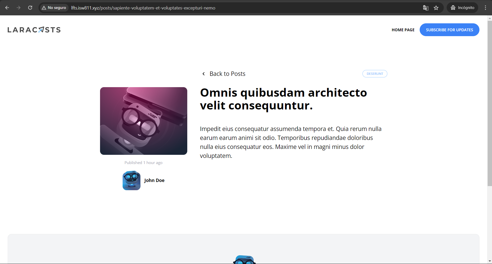

[< Volver al índice](/docs/readme.md)

# Convert the Blog Post Page

Actualmente, la página principal se encuentra en un buen estado, pero hemos dejado de lado un poco la página para mostrar un post en específico. En este capítulo, pasaremos a mejorar, convertir y poner en funcionamiento la vista `post.blade.php`.

## Migrar y modificar el nuevo contenido a la vista de `post.blade.php`

Primero, debemos migrar el contenido del archivo `post.html` del proyecto del [repositorio del diseño predefinido del instructor](https://github.com/laracasts/Laravel-From-Scratch-HTML-CSS) a nuestra vista `post.blade.php`.  Recordemos que el contenido debemos copiarlo dentro de la etiqueta de nuestro componente llamada `x-layout`.

### Crear nuevo componente para el enlace de categoría

Debido a que necesitamos el mismo enlace, tanto en la vista de los `posts` como en la vista de los `post`. Creemos el siguiente componente:

Componente `/resources/views/components/category-button.blade.php`:

```html
@props(['category'])

<a
    href="categories/{{ $category->slug }}"
    class="px-3 py-1 border border-blue-300 rounded-full text-blue-300 text-xs uppercase font-semibold"
    style="font-size: 10px"
>
    {{ $category->name }}
</a>
```

Este componente recibe un objeto `category` y lo gestiona. Este lo añadimos al componente `post-card.blade.php` y en la vista `post.blade.php`.

### Resultado de la vista de `post.blade.php`

En la vista de `post.blade.php`, eliminamos las secciones innecesarias (head, nav, header, footer), mostramos el contenido de forma dinámica y utilizamos el componente que creamos anteriormente. Por lo cual, su código quedaría de la siguiente manera

```html
<x-layout>
    <section class="px-6 py-8">
        <main class="max-w-6xl mx-auto mt-10 lg:mt-20 space-y-6">
            <article class="max-w-4xl mx-auto lg:grid lg:grid-cols-12 gap-x-10">
                <div class="col-span-4 lg:text-center lg:pt-14 mb-10">
                    

                    <p class="mt-4 block text-gray-400 text-xs">
                        Published
                        <time>{{ $post->created_at->diffForHumans() }}</time>
                    </p>

                    <div
                        class="flex items-center lg:justify-center text-sm mt-4"
                    >
                        
                        <div class="ml-3 text-left">
                            <h5 class="font-bold">{{ $post->author->name }}</h5>
                        </div>
                    </div>
                </div>

                <div class="col-span-8">
                    <div class="hidden lg:flex justify-between mb-6">
                        <a
                            href="/"
                            class="transition-colors duration-300 relative inline-flex items-center text-lg hover:text-blue-500"
                        >
                            <svg
                                width="22"
                                height="22"
                                viewBox="0 0 22 22"
                                class="mr-2"
                            >
                                <g fill="none" fill-rule="evenodd">
                                    <path
                                        stroke="#000"
                                        stroke-opacity=".012"
                                        stroke-width=".5"
                                        d="M21 1v20.16H.84V1z"
                                    ></path>
                                    <path
                                        class="fill-current"
                                        d="M13.854 7.224l-3.847 3.856 3.847 3.856-1.184 1.184-5.04-5.04 5.04-5.04z"
                                    ></path>
                                </g>
                            </svg>

                            Back to Posts
                        </a>

                        <div class="space-x-2">
                            <x-category-button :category="$post->category" />
                        </div>
                    </div>

                    <h1 class="font-bold text-3xl lg:text-4xl mb-10">
                        {{ $post->title }}
                    </h1>

                    <div class="space-y-4 lg:text-lg leading-loose">
                        {{ $post->body }}
                    </div>
                </div>
            </article>
        </main>
    </section>
</x-layout>
```

### Resultado visual

Ahora, al acceder a cualquier post podremos observar la información que corresponde de una manera más atractiva y coherente con el nuevo diseño del blog. Por ejemplo:


