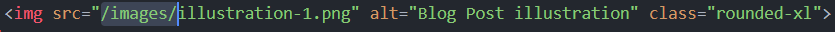
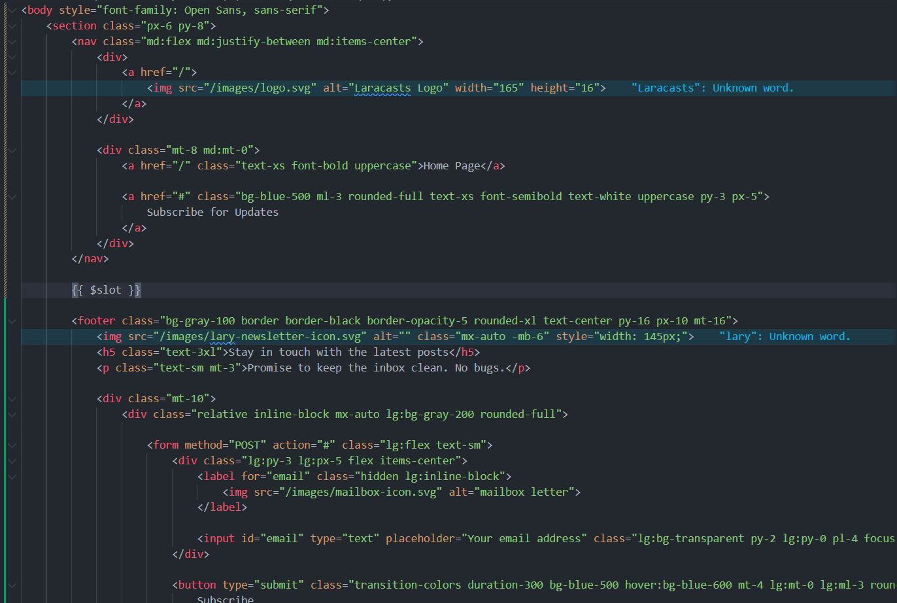
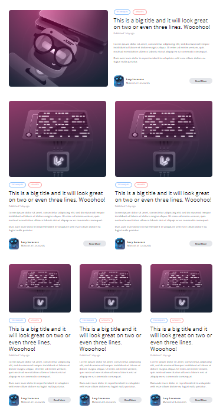

[< Volver al índice](/docs/readme.md)

# Convert the HTML and CSS to Blade

En este episodio, trabajaremos en el diseño del blog. Para ello, descargaremos el diseño previamente creado por el instructor del curso desde GitHub y comenzaremos a migrarlo a nuestra aplicación. En el proceso, crearemos algunos componentes Blade para ir limpiando la estructura.

## Descargar diseño

Para descargar el diseño, accedemos al [repositorio con el diseño previamente creado](https://github.com/laracasts/Laravel-From-Scratch-HTML-CSS) y descargamos el archivo ZIP. Una vez descargado, extraemos todo su contenido para poder tener acceso a la carpeta de este proyecto.

## Migrar diseño y componentes

1. Inicialmente, migraremos la carpeta `images` de la carpeta extraída del archivo ZIP al directorio `/public` de nuestro proyecto.

2. Luego copiaremos todo el contenido del archivo `index.html` a `/resources/views/components/layout.blade.php`.

    En el componente `layout.blade.php`, cambiamos todas las ocurrencias en el atributo `src` de la etiqueta `img` de HTML, quedando de la siguiente forma:

    

3. Posteriormente, en el componente `layout.blade.php`, únicamente dejaremos el `nav`, el `footer` y en medio de estas imprimiremos el `$slot`. Esto resultó así:

    

4. Todas esas secciones que fueron eliminadas con anterioridad, las añadiremos a la vista `posts.blade.php` dentro del componente `x-layout`. Por lo que, en un futuro únicamente deberemos actualizar las secciones con nuestra información.

5. Creamos el componente `post-card.blade.php`, con el siguiente contenido:

    ```html
    <article
        class="transition-colors duration-300 hover:bg-gray-100 border border-black border-opacity-0 hover:border-opacity-5 rounded-xl"
    >
        <div class="py-6 px-5">
            <div>
                
            </div>

            <div class="mt-8 flex flex-col justify-between">
                <header>
                    <div class="space-x-2">
                        <a
                            href="#"
                            class="px-3 py-1 border border-blue-300 rounded-full text-blue-300 text-xs uppercase font-semibold"
                            style="font-size: 10px"
                            >Techniques</a
                        >
                        <a
                            href="#"
                            class="px-3 py-1 border border-red-300 rounded-full text-red-300 text-xs uppercase font-semibold"
                            style="font-size: 10px"
                            >Updates</a
                        >
                    </div>

                    <div class="mt-4">
                        <h1 class="text-3xl">
                            This is a big title and it will look great on two or
                            even three lines. Wooohoo!
                        </h1>

                        <span class="mt-2 block text-gray-400 text-xs">
                            Published <time>1 day ago</time>
                        </span>
                    </div>
                </header>

                <div class="text-sm mt-4">
                    <p>
                        Lorem ipsum dolor sit amet, consectetur adipiscing elit,
                        sed do eiusmod tempor incididunt ut labore et dolore
                        magna aliqua. Ut enim ad minim veniam, quis nostrud
                        exercitation ullamco laboris nisi ut aliquip ex ea
                        commodo consequat.
                    </p>

                    <p class="mt-4">
                        Duis aute irure dolor in reprehenderit in voluptate
                        velit esse cillum dolore eu fugiat nulla pariatur.
                    </p>
                </div>

                <footer class="flex justify-between items-center mt-8">
                    <div class="flex items-center text-sm">
                        
                        <div class="ml-3">
                            <h5 class="font-bold">Lary Laracore</h5>
                            <h6>Mascot at Laracasts</h6>
                        </div>
                    </div>

                    <div>
                        <a
                            href="#"
                            class="transition-colors duration-300 text-xs font-semibold bg-gray-200 hover:bg-gray-300 rounded-full py-2 px-8"
                            >Read More</a
                        >
                    </div>
                </footer>
            </div>
        </div>
    </article>
    ```

6. Ahora, incluiremos el nuevo componente `post-card.blade.php` en la vista `posts.blade.php`, dentro del siguiente contenedor:

    ```html
    <div class="lg:grid lg:grid-cols-3">
        <x-post-card />
        <x-post-card />
        <x-post-card />
    </div>
    ```

    En un futuro, la información enviada a estas cartas será dinámica, aunque por el momento podemos apreciar que con estos cambios, el resultado se ve exactamente igual y a nivel de código se ve simplificado.

7. Si apreciamos la sección superior, tiene exactamente el mismo diseño. La actualizaremos utilizando nuestro componente `x-post-card`:

    ```html
    <div class="lg:grid lg:grid-cols-2">
        <x-post-card />
        <x-post-card />
    </div>
    ```

8. Por detalles de CSS, crearemos un nuevo componente con la carta de publicación destacada. Esta se llamará `post-featured-card` y tendrá el siguiente contenido:

    ```html
    <article
        class="transition-colors duration-300 hover:bg-gray-100 border border-black border-opacity-0 hover:border-opacity-5 rounded-xl"
    >
        <div class="py-6 px-5 lg:flex">
            <div class="flex-1 lg:mr-8">
                
            </div>

            <div class="flex-1 flex flex-col justify-between">
                <header class="mt-8 lg:mt-0">
                    <div class="space-x-2">
                        <a
                            href="#"
                            class="px-3 py-1 border border-blue-300 rounded-full text-blue-300 text-xs uppercase font-semibold"
                            style="font-size: 10px"
                            >Techniques</a
                        >

                        <a
                            href="#"
                            class="px-3 py-1 border border-red-300 rounded-full text-red-300 text-xs uppercase font-semibold"
                            style="font-size: 10px"
                            >Updates</a
                        >
                    </div>

                    <div class="mt-4">
                        <h1 class="text-3xl">
                            This is a big title and it will look great on two or
                            even three lines. Wooohoo!
                        </h1>

                        <span class="mt-2 block text-gray-400 text-xs">
                            Published <time>1 day ago</time>
                        </span>
                    </div>
                </header>

                <div class="text-sm mt-2">
                    <p>
                        Lorem ipsum dolor sit amet, consectetur adipiscing elit,
                        sed do eiusmod tempor incididunt ut labore et dolore
                        magna aliqua. Ut enim ad minim veniam, quis nostrud
                        exercitation ullamco laboris nisi ut aliquip ex ea
                        commodo consequat.
                    </p>

                    <p class="mt-4">
                        Duis aute irure dolor in reprehenderit in voluptate
                        velit esse cillum dolore eu fugiat nulla pariatur.
                    </p>
                </div>

                <footer class="flex justify-between items-center mt-8">
                    <div class="flex items-center text-sm">
                        
                        <div class="ml-3">
                            <h5 class="font-bold">Lary Laracore</h5>
                            <h6>Mascot at Laracasts</h6>
                        </div>
                    </div>

                    <div class="hidden lg:block">
                        <a
                            href="#"
                            class="transition-colors duration-300 text-xs font-semibold bg-gray-200 hover:bg-gray-300 rounded-full py-2 px-8"
                            >Read More</a
                        >
                    </div>
                </footer>
            </div>
        </div>
    </article>
    ```

9. Por último, movamos todo el contenido del header que está en la vista `posts.blade.php` a una nueva vista llamada `_post-header.blade.php`.

## Resultado final

Añadiendo el nuevo componente y la nueva vista al `main`, el archivo de vista `posts.blade.php` nos quedaría así:

```html
<x-layout>
    @include ('_post-header')

    <main class="max-w-6xl mx-auto mt-6 lg:mt-20 space-y-6">
        <x-post-featured-card />

        <div class="lg:grid lg:grid-cols-2">
            <x-post-card />
            <x-post-card />
        </div>

        <div class="lg:grid lg:grid-cols-3">
            <x-post-card />
            <x-post-card />
            <x-post-card />
        </div>
    </main>
</x-layout>
```

Por lo que, limpiamos bastante el diseño haciendo uso de componentes y vistas.

## Resultado visual

Todos los pasos anteriores visualmente no harán muchos cambios, únicamente cargarán las mismas cartas en la sección de dos y tres columnas. Lo cual se verá así:


