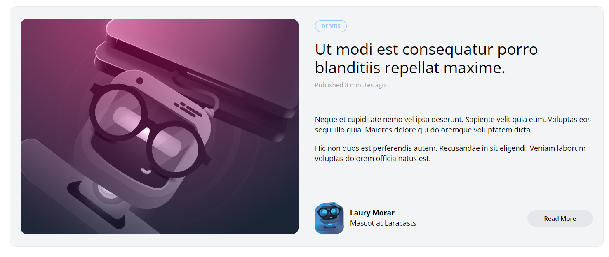
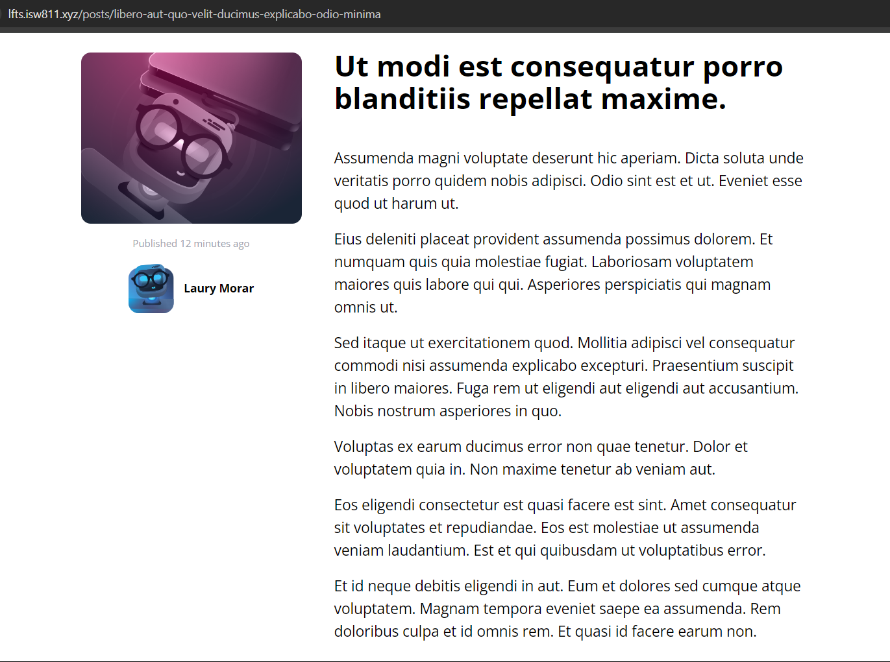

[< Volver al índice](/docs/readme.md)

# Quick Tweaks and Clean-Up

Este es el último episodio de la sección _Integrate the Design_. Por lo que en este capítulo, nos dedicaremos a elaborar una pequeña limpieza rápida de algunos aspectos importantes para mejorar el diseño.

## Menú desplegable

Primero, ajustaremos una altura máxima al `dropdown`, ya que si añadimos muchas categorías, su tamaño sería demasiado grande y no cabría en la pantalla. Esto lo solucionamos modificando el componente `dropdown.blade.php`:

```php
@props(['trigger'])

<div x-data="{show: false}" @click.away="show = false">
    <!-- Trigger -->
     <div @click="show = ! show">
        {{ $trigger }}
     </div>

    <!-- Links -->
    <div x-show="show" class="py-2 absolute bg-gray-100 mt-2 rounded-xl w-full z-50 overflow-auto max-h-52" style="display: none;">
        {{ $slot }}
    </div>
</div>
```

Con estos cambios en el estilo, el área de links del menú despegable tendrá un tamaño máximo y se le generará una barra de scroll cuando sea necesario.

## En el archivo `_post-header.blade.php`

En este archivo, eliminaremos el subtítulo y el párrafo innecesarios que se encuentran encima del menú desplegable de las categorías:

```html
<h2 class="inline-flex mt-2">
    By Lary Laracore
    
</h2>

<p class="text-sm mt-14">
    Another year. Another update. We're refreshing the popular Laravel series
    with new content. I'm going to keep you guys up to speed with what's going
    on!
</p>
```

Otro cambio en este archivo es comentar la sección `Other Filters`, ya que en este momento es innecesaria.

```html
<!-- Other Filters -->
<!-- <div class="relative flex lg:inline-flex items-center bg-gray-100 rounded-xl">
    <select class="flex-1 appearance-none bg-transparent py-2 pl-3 pr-9 text-sm font-semibold">
        <option value="category" disabled selected>Other Filters
        </option>
        <option value="foo">Foo
        </option>
        <option value="bar">Bar
        </option>
    </select>

    <svg class="transform -rotate-90 absolute pointer-events-none" style="right: 12px;" width="22" height="22" viewBox="0 0 22 22">
        <g fill="none" fill-rule="evenodd">
            <path stroke="#000" stroke-opacity=".012" stroke-width=".5" d="M21 1v20.16H.84V1z">
            </path>
            <path fill="#222" d="M13.854 7.224l-3.847 3.856 3.847 3.856-1.184 1.184-5.04-5.04 5.04-5.04z"></path>
        </g>
    </svg>
</div> -->
```

## Actualizar `PostFactory`

Ahora, queremos que nuestros textos en las publicaciones no sean tan cortos, para ello le indicaremos lo siguiente al método `definition()` del archivo `PostFactory`:

```php
public function definition()
{
    return [
        'user_id' => User::factory(),
        'category_id' => Category::factory(),
        'title' => $this->faker->sentence,
        'slug' => $this->faker->slug,
        'excerpt' => '<p>' . implode('</p><p>',$this->faker->paragraphs(2)) . '</p>',
        'body' => '<p>' . implode('</p><p>',$this->faker->paragraphs(6)) . '</p>',
    ];
}
```

Con estos cambios, podremos envolver el excerpt (2 párrafos) y el body (6 párrafos) con etiquetas `p` HTML para cada párrafo que se inserte.

## Refrescar base de datos y crear nuevos registros

Para ingresar nuestros nuevos registros con los textos actualizados, debemos refrescar la base de datos.

```bash
php artisan migrate:fresh
```

Luego, en Tinker generamos los nuevos registros con textos más largos:

```php
App\Models\Post::factory(30)->create()
```

## Actualizar componentes

Ahora, debemos actualizar los componentes `post-card.blade.php` y` post-featured-card.blade.php`, específicamente la parte en donde imprimimos el excerpt para no escapar su salida:

```html
<div class="text-sm mt-2 space-y-4">{!! $post->excerpt !!}</div>
```

También, le añadimos un espaciado.

## Resultado visual

Finalmente, el texto de los posts se verá así:



Y un post en específico se verá así:


