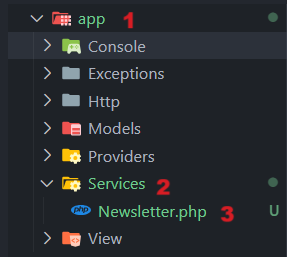

[< Volver al índice](/docs/readme.md)

# Extract a Newsletter Service

En este episodio, el código ubicado de la ruta `newsletter` en el archivo `/routes/web.php` lo extraeremos a una clase de servicio, y lo refactorizamos para simplificarlo y separar un poco las responsabilidades.

**Pasos para el episodio _Extract a Newsletter Service_:**

## 1. Crear directorio y clase para el servicio

Primero, dentro del directorio `/app` crearemos la carpeta `Services` y posteriormente una clase llamada `Newsletter.php`, en el siguiente orden:



En nuestro caso, debemos añadir el siguiente código a la clase del servicio `Newsletter` para que sea funcional:

```php
<?php

namespace App\Services;

class Newsletter
{
}
```

Las clases de servicio son una forma bastante común de implementar funcionalidades que interactúan con servicios de terceros, como es en nuestro caso con el Newsletter que se comunica con la API Mailchimp. Por esto, todas las acciones que tengan que comunicarse con esta API se harán en esta clase de servicio.

## 2. Añadir ID al archivo `.env` y agregarlo al archivo de configuración

Ahora, con el fin de evitar incrustar el identificador de la lista directamente al agregar un nuevo miembro, añadiremos un nuevo valor en nuestro archivo de entorno y lo referenciamos en el archivo de configuración de servicios `/config/services.php`.

Inicialmente, añadimos un nuevo valor en nuestro archivo de entorno para manejar el identificador de la lista de los subscriptores:

```yaml
MAILCHIMP_LIST_SUBSCRIBERS=identificador
```

Luego, en el array de Mailchimp añadiremos un array llamado `lists` para poder manejar todos los aspectos relacionados con las listas, resultando así:

```php
'mailchimp' => [
    'key' => env('MAILCHIMP_KEY'),
    'lists' => [
        'subscribers' => env('MAILCHIMP_LIST_SUBSCRIBERS')
    ]
]
```

Dentro del arreglo `lists` añadimos una propiedad `subscribers` para hacer referencia a qué es la lista de miembros a suscribirse y le asignamos el correspondiente ID obtenido del archivo `.env`.

## 3. Añadir método para suscribirse y obtener el cliente en el servicio `Newsletter`

Para evitar la repetición y separar las responsabilidades, podemos crear un método en nuestro nuevo servicio `Newsletter` que retorne al cliente de Mailchimp:

```php
protected function client()
{
    return (new ApiClient())->setConfig([
        'apiKey' => config('services.mailchimp.key'),
        'server' => 'us13'
    ]);
}
```

Una vez realizados los pasos anteriores, crearemos un método para suscribir a nuevos miembros:

```php
public function subscribe(string $email, string $list = null)
{
    $list ??= config('services.mailchimp.lists.subscribers');

    return $this->client()->lists->addListMember($list, [
        "email_address" => $email,
        "status" => "subscribed",
    ]);
}
```

**Puntos interesantes de estas implementaciones:**

-   En el método `client`, refactorizamos el obtener el cliente.

-   En el método `subscribe`, utilizamos el null assignment operator `??=` para que cuando no se envíe algún ID de una lista en específico, se tome la lista máster.

-   En el método `subscribe`, logramos simplificar el proceso de tomar la instancia de `ApiClient` debido a que importamos esto en el archivo: `use MailchimpMarketing\ApiClient;`.

-   En el método `subscribe`, recibimos por parámetros del método un correo electrónico para poder registrar a diferentes usuarios.

-   En el método `subscribe`, utilizamos la función `client` para obtener el cliente de Mailchimp y poder añadir el nuevo miembro a la lista deseada.

## 4. Mantener la consistencia con las demás rutas en `/routes/web.php`

Para mantener la consistencia con las demás rutas, modificaremos el endpoint `newsletter` de la siguiente forma:

```php
// Se debe importar esto en la parte de arriba del archivo:
use App\Http\Controllers\NewsletterController;

Route::post('newsletter', NewsletterController::class);
```

Podemos apreciar que al referenciar al controlador no indicamos ninguna acción. Esto se debe a que este implicará una única acción llamada `__invoke()`, por lo que Laravel mágicamente podrá entender que debe ejecutar este único método. Una vez dicho esto, creemos este nuevo controlador con:

```bash
php artisan make:controller NewsletterController
```

Finalmente, el controlador resultará de la siguiente manera:

```php
<?php

namespace App\Http\Controllers;

use App\Services\Newsletter;
use Exception;
use Illuminate\Validation\ValidationException;

class NewsletterController extends Controller
{
    public function __invoke(Newsletter $newsletter)
    {
        request()->validate(['email' => 'required|email']);

        try {
            $newsletter->subscribe(request('email'));
        } catch (Exception $e) {
            throw ValidationException::withMessages([
                'email' => 'This email could not be added to our newsletter list.'.
            ]);
        }

        return redirect('/')
            ->with('success', 'You are now signed up for our newsletter!');
    }
}
```

**Puntos interesantes de esta implementación:**

-   Con nombrar al método `__invoke`, este se invocará inmediatamente cuando se referencia el controlador.

-   Reutilizamos todo el código sobrante del endpoint `newsletter` y lo movimos para esta acción del nuevo controlador.

## Resultado final

En este capítulo, logramos refactorizar el código que teníamos en la ruta `newsletter` en un servicio y en un controlador, con estos cambios logramos mantener la consistencia con los demás endpoints. Añadiendo más modularidad y separación de responsabilidades en nuestro código. Visualmente, para un usuario normal, la funcionalidad será la misma, pero internamente se ha realizado una limpieza llena de buenas prácticas.
