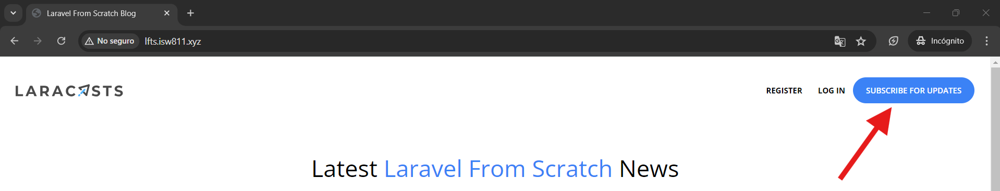
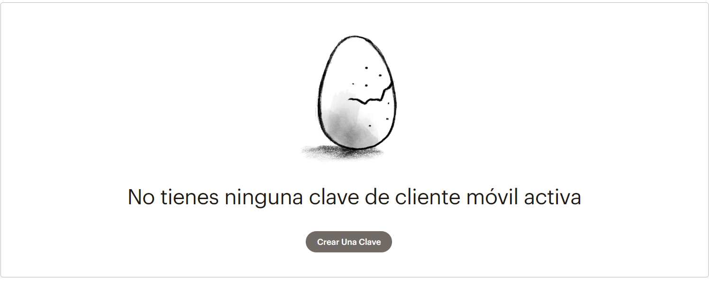
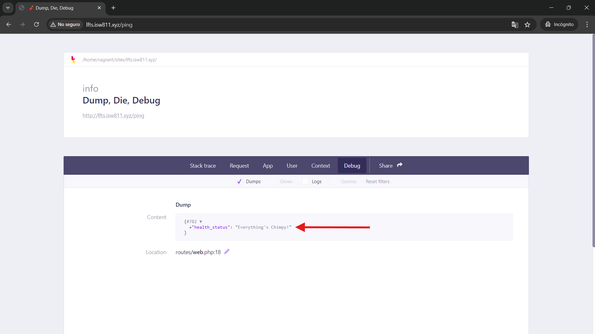
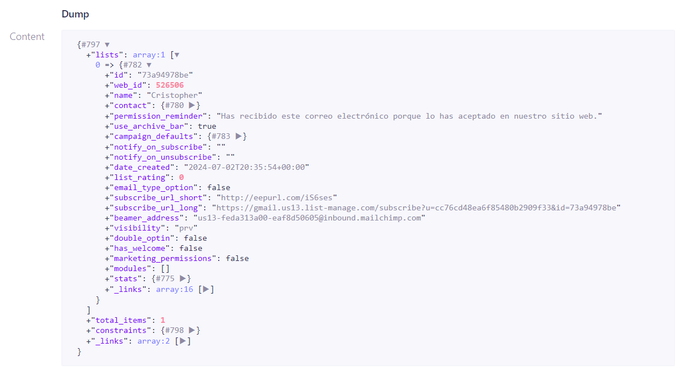
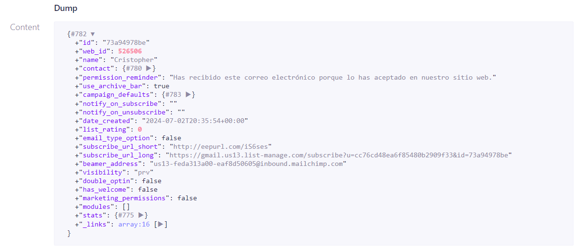
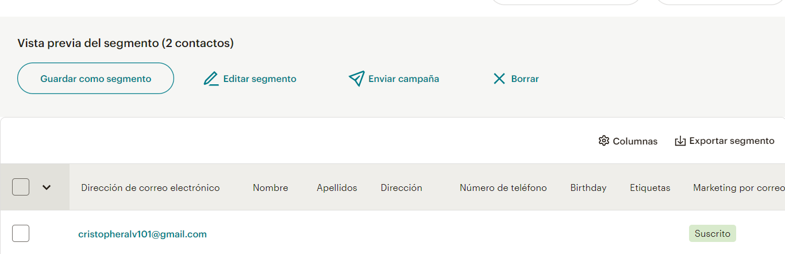

[< Volver al índice](/docs/readme.md)

# Mailchimp API Tinkering

Para iniciar con esta nueva sección llamada **"Newsletters and APIs"**, inicialmente haremos un cambio menor en el componente `layout.blade.php` y luego dedicaremos todo el episodio para conocer la API de Mailchimp. Esta API nos permitirá suscribir a usuarios a nuestro blog y enviarles información relevante. Además, veremos cómo instalar la biblioteca del cliente para PHP y realizaremos algunas llamadas a la API, comprendiendo algunos conceptos esenciales de este proceso de solicitudes.

## Presionar botón "Suscribe For Updates" y dirigir a la sección de suscribirse

Queremos que al presionar el botón de suscripción en el navbar, el usuario sea dirigido a la sección de suscripción en el footer. El botón mencionado es el que presentaremos a continuación.



Para lograr esto, realizaremos los siguientes cambios en el archivo `/resources/views/components/layout.blade.php`:

1. Añadir un atributo `id` a la etiqueta `footer`:

    ```html
    <footer
        id="newsletter"
        class="bg-gray-100 border border-black border-opacity-5 rounded-xl text-center py-16 px-10 mt-16"
    >
        <!-- Contenido del footer iría por acá... -->
    </footer>
    ```

    El comentario "Contenido del footer iría por acá..." indica donde debería de ir todo el contenido, lo hago de esta manera para hacer más claro que el único cambio realizado, el cual fue añadir el atributo `id`.

2. Añadir el id recién agregado al footer en el enlace de suscribirse en el atributo `href`, ubicado en el navbar:

    ```html
    <a
        href="#newsletter"
        class="bg-blue-500 ml-3 rounded-full text-xs font-semibold text-white uppercase py-3 px-5"
    >
        Subscribe for Updates
    </a>
    ```

Una vez realizados estos dos pasos, al presionar el botón de suscribirse, nos dirigirá al footer en donde se encuentra el formulario para suscribirse, el cual aún no está en funcionamiento.

### Añadir CSS para hacer la transición suave

La funcionalidad de redirección al pie de página puede ser un poco brusca. Para que esta transición sea un poco más suave, en la etiqueta `style` del componente `layout.blade.php`, añadimos el siguiente código CSS:

```css
html {
    scroll-behavior: smooth;
}
```

## Mailchimp API

Mailchimp nos permitirá simular características de la vida real. Para poder utilizar esta herramienta, realicemos los siguientes pasos:

1. Nos registramos con nuestros datos personales, ingresando un correo electrónico, nombre de usuario y contraseña.

2. Debemos confirmar nuestro registro a través de un enlace que nos envían vía email.

3. Luego de activar la cuenta, pasamos a dar alguna información básica de lo que vamos a realizar con Mailchimp, algunos datos personales y seleccionamos "continuar con el plan gratis".

Con estos tres pasos realizados, podremos empezar a utilizar esta herramienta. Por ejemplo, si nos dirigimos a la sección de público e ingresamos a la opción panel de público, esta área será donde administraremos nuestros contactos y podremos generar campañas.

### Obtener llave de API

Para obtener la llave de la API, sigamos estos pasos:

1. Hacer clic en el círculo en el que se muestre nuestro avatar.

2. Presionar en la opción "Perfil".

3. Al ingresar al perfil, seleccionar "Extras" y luego "Claves API".

4. Al ingresar a la sección de "Claves API" seleccionamos la siguiente opción:

    

5. Posteriormente, le damos un nombre a esta nueva llave y la copiamos (Importante no perder la llave, ya que si es así, hay que crear otra).

6. Finalizamos el proceso.

Y así tendremos una llave API para poder comunicarnos con Mailchimp.

### Añadir clave API al archivo `.env`

Es necesario añadir esta llave que nos generó Mailchimp a nuestro archivo `.env`, para esto añadimos un nuevo parámetro al final del fichero.

```yaml
MAILCHIMP_KEY=valor-de-la-llave
```

### Configurar servicio de Mailchimp

Para configurar Mailchimp nos ubicamos en `/config/services.php`, este es un buen lugar para manejar los servicios de terceros de nuestra aplicación y en donde podremos configurar nuestro nuevo servicio. Por lo que, posterior a las configuraciones de mailgun, postmark y ses, ingresamos la siguiente configuración:

```php
'mailchimp' => [
    'key' => env('MAILCHIMP_KEY')
]
```

Esto nos permitirá acceder a la configuración de Mailchimp con:

-   `config('services.mailchimp')`: Obtener el array de Mailchimp.

-   `config('services.mailchimp.key')`: Obtiene la llave de Mailchimp del archivo de entorno.

### Usar la API de Mailchimp

Para saber cómo hacer uso de esta API, nos podemos dirigir a la [guía de inicio rápido](https://mailchimp.com/developer/marketing/guides/quick-start/). Esta nos indica tres puntos esenciales para poder utilizar la Mailchimp API: crear una cuenta (listo), generar clave API (listo) e instalar la biblioteca de cliente para su lenguaje de programación (no lista).

Así que para utilizar Mailchimp API, sigamos los siguientes pasos:

#### 1. Instalar la biblioteca de cliente

Ya que no hemos instalado la biblioteca del cliente para PHP, seleccionamos la opción de nuestro lenguaje y nos mostrará un comando para instalar la biblioteca con composer:

```bash
composer require mailchimp/marketing
```

Este comando lo vamos a ejecutar en nuestra ruta de crafteo en la máquina virtual.

#### 2. Realizar nuestra primera llamada al API

Al tener instalada la biblioteca necesaria, podremos realizar nuestra primera llamada a la API. En donde, debemos obtener nuestro prefijo de servidor. Este se ubica en la URL cuando iniciamos sesión `https://us13.admin.mailchimp.com/`, específicamente es la parte que empieza con `us`.

Ya que tengamos este valor, podremos crear un nuevo endpoint temporal en nuestro archivo `/routes/web.php` para realizar una solicitud sencilla al punto de conexión de Mailchimp:

```php
Route::get('ping', function () {
    $mailchimp = new \MailchimpMarketing\ApiClient();

    $mailchimp->setConfig([
        'apiKey' => config('services.mailchimp.key'),
        'server' => 'us13'
    ]);

    $response = $mailchimp->ping->get();
    ddd($response);
});
```

Al ingresar a la URL `http://lfts.isw811.xyz/ping`, deberíamos ver lo que se presenta en la imagen:



Y como todo es correcto, podemos apreciar la respuesta en JSON, mencionando que todo está "Chimpy", haciendo referencia que el estado del servicio API de Mailchimp está bien y además sabemos que todo está configurado correctamente, ya que la solicitud se efectuó bien.

### Próximos pasos

En los próximos pasos de la guía de inicio rápido nos indican que podemos crear nuevas audiencias, por ello, nos vamos a las [referencias de documentación de las listas](https://mailchimp.com/developer/marketing/api/lists/) y acá podremos apreciar las diferentes acciones que podemos realizar con listas (sinónimo de audiencias).

#### Ejemplos de acciones con listas

-   En el archivo `/routes/web.php` del endpoint temporal que añadimos, cambiamos esta línea de código `$response = $mailchimp->ping->get();` por:

    ```php
    $response = $mailchimp->lists->getAllLists();
    ```

    Obtendríamos toda la información sobre todas las listas de la cuenta, en nuestro caso únicamente tendríamos lo siguiente:

    

-   En el archivo `/routes/web.php` del endpoint temporal que añadimos, cambiamos esta línea de código `$response = $mailchimp->ping->get();` por:

    ```php
    $response = $mailchimp->lists->getList("73a94978be");
    ```

    En esta ocasión, le enviamos el identificador de una lista en específico. Por lo que, ahora no obtendremos una colección como en el ejemplo anterior, resultará solo la información de la lista solicitada.

    

#### Ejemplos de acciones con miembros (Members)

Al igual que en la [sección anterior](#ejemplos-de-acciones-con-listas), podemos probar algunas [acciones](https://mailchimp.com/developer/marketing/api/list-members/) en relación con los miembros.

-   En el archivo `/routes/web.php` del endpoint temporal que añadimos, cambiamos esta línea de código `$response = $mailchimp->ping->get();` por:

    ```php
    $mailchimp->lists->getListMembersInfo("73a94978be");
    ```

    En esta situación obtendremos una colección similar al primer ejemplo, pero en este casos se consiguen los miembros que conforman esa lista en específico.

### Añadir miembros

Algo que sí genera más interés es poder añadir miembros, lo cual es el comportamiento que deseamos que ocurra cuando los usuarios se suscriban a nuestro blog. Por lo que, siguiendo la [documentación para añadir miembros](https://mailchimp.com/developer/marketing/api/list-members/add-member-to-list/), realicemos estos cambios en nuestro endpoint temporal:

```php
Route::get('ping', function () {
    $mailchimp = new \MailchimpMarketing\ApiClient();

    $mailchimp->setConfig([
        'apiKey' => config('services.mailchimp.key'),
        'server' => 'us13'
    ]);

    $response = $mailchimp->lists->addListMember("73a94978be", [
        "email_address" => "cristopheralv101@gmail.com",
        "status" => "subscribed",
    ]);
    ddd($response);
});
```

La respuesta a esto será toda la información del nuevo miembro, el cual ha sido agregado a la lista por defecto. Y esto lo podemos comprobar en nuestro panel de audiencia.



## Resultado final

Como resultado final, tendremos la API de Mailchimp configurada y lista para su uso, la cual nos permitirá gestionar los miembros y crear campañas para informar a nuestros suscriptores sobre novedades y lanzamientos del blog.
