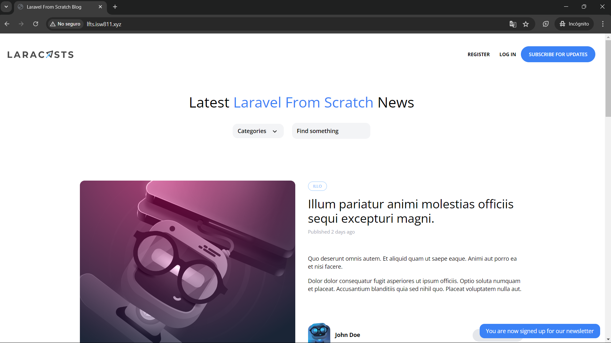
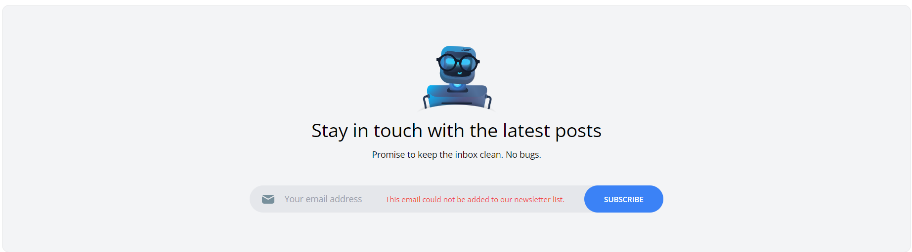

[< Volver al índice](/docs/readme.md)

# Make the Newsletter Form Work

En este episodio, implementaremos la funcionalidad para hacer que el formulario de suscripción a nuestro blog o boletín informativo funcione. Esto lo haremos a base de lo que aprendimos en el [capítulo anterior](../newsletters-and-apis/mailchimp-api-tinkering.md).

## Refactorizar el endpoint temporal

En el capítulo anterior, creamos un endpoint temporal. Ahora haremos algunos cambios para poder añadir miembros a nuestra lista del newsletter. Por esto, el endpoint resultará de la siguiente forma:

```php
Route::post('newsletter', function () {
    request()->validate([
        'email' => 'required|email'
    ]);

    $mailchimp = new \MailchimpMarketing\ApiClient();

    $mailchimp->setConfig([
        'apiKey' => config('services.mailchimp.key'),
        'server' => 'us13'
    ]);
    try {
        $response = $mailchimp->lists->addListMember("73a94978be", [
            "email_address" => request('email'),
            "status" => "subscribed",
        ]);
    } catch (\Exception $e) {
        throw \Illuminate\Validation\ValidationException::withMessages([
            'email' => 'This email could not be added to our newsletter list.'
        ]);
    }

    return redirect('/')
        ->with('success', 'You are now signed up for our newsletter');
});
```

**Puntos destacables de la nueva implementación de la ruta `'newsletter'`:**

-   Utilizamos una ruta sumamente sencilla: `newsletter`.

-   Añadimos las validaciones necesarias para asegurar que el correo electrónico sea requerido y tenga el formato necesario.

-   Reutilizamos los aspectos de configuración utilizados en el episodio anterior, relacionados con Mailchimp; estos se pueden apreciar en la variable `$mailchimp`.

-   Agregamos un bloque `try-catch` para manejar errores cuando la API no acepte algún correo electrónico, por razones como que sea un email no admitido o repetido. Con esto podremos retornar a una excepción con un mensaje preestablecido, el cual podría mostrar una directiva `@error` en la vista.

-   En caso de suscribirse exitosamente al newsletter, se redirecciona a la página principal con un mensaje de éxito. Este permitirá mostrar un mensaje que confirmará la acción realizada.

## Cambios en el formulario para suscribirse al newsletter

En el archivo `/resources/views/components/layout.blade.php`, específicamente en el formulario para suscribirse al newsletter del blog, debemos realizar los cambios representados en estos puntos:

-   Cambiar la acción del formulario, la cual apunte al endpoint en donde se suscriben los miembros.

-   Añadir la directiva de blade `@csrf` para evitar vulnerabilidades de _Cross-Site Request Forgery_.

-   Al input del correo electrónico, añadirle el atributo `name` correspondiente.

-   Añadir la directiva de blade `@error` para poder mostrar el mensaje de error correspondiente en una etiqueta `span`.

-   Agregar un `div` en el que incluiremos el input `email` y la directiva `@error` para que el mensaje de error se muestre de manera separada.

Estos puntos implementados en el formulario ubicado en el `footer` del componente `layout.blade.php` se verán así:

```html
<form method="POST" action="/newsletter" class="lg:flex text-sm">
    @csrf
    <div class="lg:py-3 lg:px-5 flex items-center">
        <label for="email" class="hidden lg:inline-block">
            
        </label>

        <div>
            <input
                id="email"
                name="email"
                type="text"
                placeholder="Your email address"
                class="lg:bg-transparent py-2 lg:py-0 pl-4 focus-within:outline-none"
            />
            @error('email')
            <span class="text-xs text-red-500">{{ $message }}</span>
            @enderror
        </div>
    </div>

    <button
        type="submit"
        class="transition-colors duration-300 bg-blue-500 hover:bg-blue-600 mt-4 lg:mt-0 lg:ml-3 rounded-full text-xs font-semibold text-white uppercase py-3 px-8"
    >
        Subscribe
    </button>
</form>
```

## Resultado final

Con todos estos cambios implementados, el formulario de suscripción al newsletter esta funcionando correctamente, presentando los siguientes comportamientos:

**Al suscribirse correctamente al boletín informativo, mostrará un mensaje de confirmación. Por ejemplo:**



**Y al intentar suscribirse con un correo no permitido, se advertirá con un mensaje explicativo. Por ejemplo, al ingresar un email ya registrado:**



Además, en el dashboard de audiencias podremos ver y controlar los correos electrónicos suscritos.
