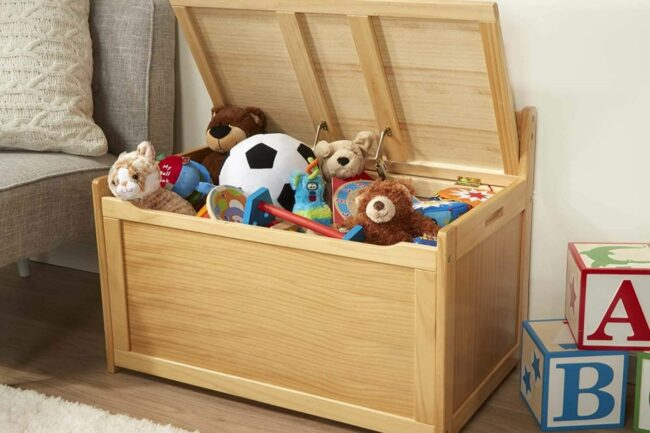
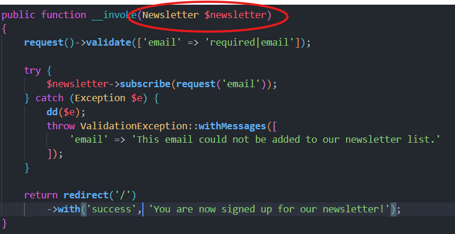
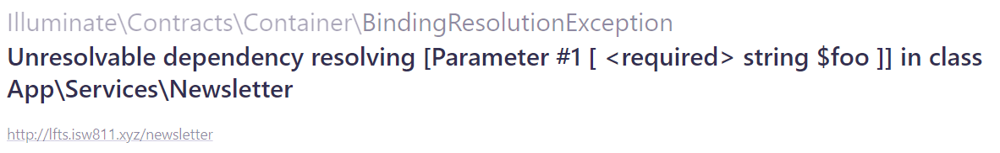

[< Volver al índice](/docs/readme.md)

# Toy Chests and Contracts

En este último capítulo de la sección _"Newsletters and APIs"_, trataremos los temas: "service containers", "providers", y "contracts". Estos temas son considerados de una dificultad un poco más alta que lo tratado anteriormente en el curso.

## Explicación "Toy chest"

Jeffrey Way expresa que cuando pensemos en los "laravel's service container" pensemos en algo como lo siguiente:



¿Por qué una caja de juguetes? Porque podemos añadir cosas y buscarlas para usarlas. Por ejemplo, en nuestro archivo `/app/Http/Controllers/NewsletterController.php` tenemos esto:



En este caso, Laravel resuelve la dependencia del servicio `Newsletter` del parámetro de la siguiente manera:

1. Buscar en la caja de juguetes (contenedor de servicios) si existe el servicio `Newsletter`.

2. Al no encontrarlo, Laravel automáticamente prepara la instancia de este servicio (`new Newsletter()`).

3. Por ende, nos retornará la instancia.

### Dependencia del `ApiClient` en el servicio `Newsletter`

Ahora, si añadiéramos un constructor que tuviera una dependencia como estás al `ApiClient`, un parámetro de configuración y adaptamos el método `subscribe`, como en este ejemplo:

```php
public function __construct(protected ApiClient $client, protected string $foo)
{
    //
}
```

**Laravel hará lo siguiente:**

1. Realiza la búsqueda en el contenedor de servicios y no encontrará nada, pero ahora encuentra que tiene que resolver otra dependencia, el `ApiClient`, la cual puede solucionar correctamente.

2. Posteriormente, observa el parámetro `$foo` y no sabrá cómo resolverlo.

3. En este caso este proceso fallaría y obtendríamos el siguiente error:

    

4. Este es un ejemplo, en el que Laravel hizo todo lo posible para resolver las dependencias, pero chocó con la pared al encontrar a `$foo`.

### ¿Cómo poner algo en el contenedor de servicios?

En la clase `/app/Providers/AppServiceProvider.php` existe un método llamado `register()` en el que podríamos agregar cosas al contenedor, como lo es el parámetro `$foo`. Por ejemplo:

```php
public function register()
{
    app()->bind('foo', function () {
        return 'bar';
    });
}
```

Ahora, si nos vamos a tinker y ejecutamos `app()->get('foo')` o `resolve('foo')`, obtendríamos el valor `bar`. En esta situación ya está en el contenedor de servicios, por lo general se guarda de esta manera (clave-valor). Para solucionar el problema que teníamos en la [sección anterior](#dependencia-del-apiclient-en-el-servicio-newsletter), podríamos realizar lo siguiente:

```php
public function register()
{
    app()->bind(Newsletter::class, function () {
        return new Newsletter(
            new ApiClient(),
            'foobar'
        );
    });
}
```

Por lo que, esto es un ejemplo de poner algo en la caja de juguetes (contenedor de servicios) y estamos solucionando el error "Unresolvable dependency resolving". En esta ocasión, Laravel hará lo siguiente:

1. Buscará en la caja de juguetes por la clase Newsletter.

2. Y en este caso, encontrará una referencia a esta clase.

3. Entonces, seguirá con el flujo normal.

## Modificar `register()` de la clase `/app/Providers/AppServiceProvider.php`

Después de esta explicación de la caja de juguetes, apliquemos un poco nuestros nuevos conocimientos en la clase `AppServiceProvider.php`:

```php
public function register()
{
    app()->bind(Newsletter::class, function () {
        $client = (new ApiClient)->setConfig([
            'apiKey' => config('services.mailchimp.key'),
            'server' => 'us13'
        ]);

        return new Newsletter($client);
    });
}
```

Implementamos la funcionalidad de obtener el cliente de Mailchimp en el contenedor de servicios, por lo que eliminaremos el método `client()` del servicio `Newsletter`.

## Crear contrato (interfaz)

Una interfaz nos permite hacer que las clases que se implementen tengan que cumplir con un contrato, en este caso es con tener los métodos que son referenciados en la interfaz. Para poner en práctica en nuestro proyecto una interfaz, sigamos los siguientes pasos:

Inicialmente, refactorizamos la clase del servicio `Newsletter` para que se llame `MailchimpNewsletter` y por ende todas sus referencias.

Luego, creamos la interfaz `/app/Services/Newsletter.php`:

```php
<?php

namespace App\Services;

interface Newsletter
{
    public function subscribe(string $email, string $list = null);
}
```

Y para implementarlo, únicamente añadimos a la par del nombre de la clase `/app/Services/MailchimpNewsletter.php` esto: `implements Newsletter`. Por lo que, la clase resultará de la siguiente forma:

```php
class MailchimpNewsletter implements Newsletter
{

    public function __construct(protected ApiClient $client)
    {
        //
    }

    public function subscribe(string $email, string $list = null)
    {
        $list ??= config('services.mailchimp.lists.subscribers');

        return $this->client->lists->addListMember($list, [
            'email_address' => $email,
            'status' => 'subscribed'
        ]);
    }
}
```

En el caso de que tengamos otro servicio de suscripción, únicamente implementamos esta interfaz y añadimos el método `subscribe`, con la implementación necesaria.

## Inyección de dependencia en `NewsletterController`

En el método `__invoke`, en lugar de enviar la clase de un servicio en específico y enviar la interfaz, podremos hacer que este controlador pueda manejar más servicios.

```php
public function __invoke(Newsletter $newsletter)
{
    // Código para llamar al servicio y suscribir al usuario...
}
```

Con esto, al controlador le podemos enviar lo que queramos, siempre y cuando implemente la interfaz Newsletter. Pero tenemos un problema, ya que si probamos registrar un usuario, obtendremos que la interfaz no se puede instanciar. Para solucionar esto, regresemos a `/app/Providers/AppServiceProvider.php` y realicemos lo siguiente:

```php
public function register()
{
    app()->bind(Newsletter::class, function () {
        $client = (new ApiClient)->setConfig([
            'apiKey' => config('services.mailchimp.key'),
            'server' => 'us13'
        ]);

        return new MailchimpNewsletter($client);
    });
}
```

Ahora, cuando Laravel busque en el baúl de juguetes por la interfaz, obtendrá una instancia de `MailchimpNewsletter` con el cliente Mailchimp correctamente preconfigurado.

## Resultado final

Veamos lo que realizamos en este episodio en los puntos que se presentarán a continuación.

-   Entendimos el funcionamiento del contenedor de servicios, viendo algunos ejemplos y errores.

-   Creamos una interfaz para poder manejar más servicios.

-   Cambiamos de nombre el servicio anteriormente llamado `Newsletter` por uno más descriptivo `MailchimpNewsletter`.

-   Realizamos una inyección de dependencias en el controlador encargado del newsletter, modificando el archivo de configuración `AppServiceProvider`.

Con todos estos cambios, seguimos implementando buenas prácticas para hacer que nuestro blog en un futuro pueda crecer más fácilmente.
