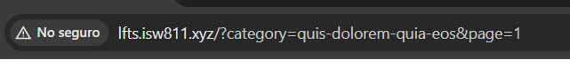
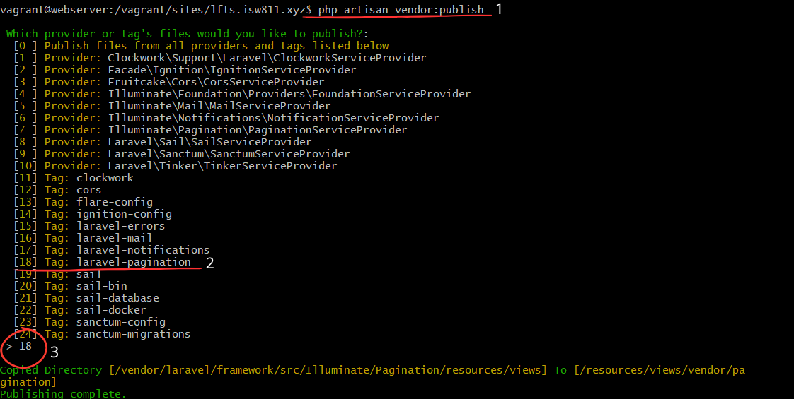
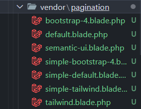
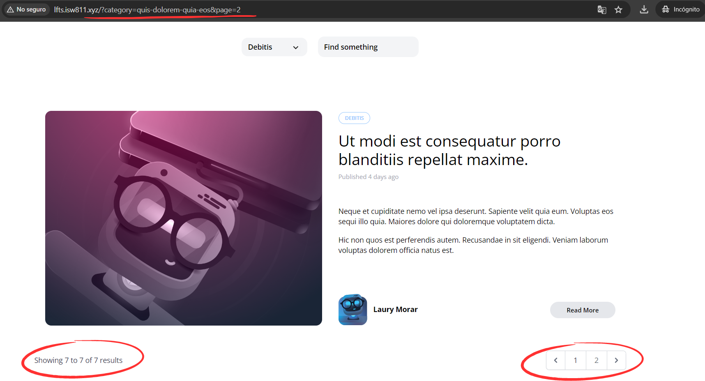

[< Volver al índice](/docs/readme.md)

# Laughably Simple Pagination

En este único episodio de la sección pagination, agregaremos la paginación en nuestro blog utilizando la funcionalidad que nos proporciona Laravel, en la que el framework que estamos utilizando se encarga de gran parte del trabajo, y su implementación es bastante sencilla. Además, publicaremos unos archivos de vista del directorio `vendor` hacia nuestra carpeta `resources`.

## Diferencias entre `->get()` y `->paginate()`

Primero, para comprobar la diferencia entre estas dos funciones, nos posicionamos en el método `index()` del `PostController`.

```php
public function index()
{
    return view('posts.index', [
        'posts' => Post::latest()->filter(
            request(['search', 'category', 'author'])
        )->cambiar()
    ]);
}
```

Aquí, `cambiar()`, será la función que alternaremos para probar la diferencia entre las siguientes dos funcionalidades:

-   `->get()`: Retornar una colección con **todos** los posts que tengamos almacenados en formato JSON.

-   `->paginate()`: Retorna una colección con información sobre la paginación (página actual y siguiente, total de posts, posts por página). Además, si le enviamos un parámetro entero (`->paginate(3)`), este será el número de posts por página.

## Añadir la funcionalidad de paginación

### Modificar `PostController`

Para implementar la paginación en nuestro blog, debemos modificar el método `index()` del `PostController`, remplazando `->get()` y añadiendo una paginación de seis publicaciones por página con `->paginate(6)`. Esto resultaría así:

```php
public function index()
{
    return view('posts.index', [
        'posts' => Post::latest()->filter(
            request(['search', 'category', 'author'])
        )->paginate(6)
    ]);
}
```

Para este punto, la paginación estaría funcionando correctamente y lo podríamos probar ingresando una URL como esta: `http://lfts.isw811.xyz/?page=2`.

### Añadir los enlaces de paginación

Visualmente, no existe cómo navegar entre el paginado, para ello agregaremos los enlaces de paginación en la vista `posts/index.blade.php`. Por lo que, el archivo de vista resultará de la siguiente forma:

```html
<x-layout>
    @include ('posts._header')

    <main class="max-w-6xl mx-auto mt-6 lg:mt-20 space-y-6">
        @if ($posts->count())
        <x-posts-grid :posts="$posts" />
        <!-- Añadimos lo siguiente: -->
        {{ $posts->links() }} @else
        <p class="text-center">No posts yet. Please check back later.</p>
        @endif
    </main>
</x-layout>
```

Al imprimir `$posts->links()`, Laravel renderiza los enlaces de paginación ubicados en el directorio `vendor`.

### Filtrar por categoría y paginado

Al seleccionar una categoría y estar posicionado en un paginado en específico, obtenemos un comportamiento no deseado, por ejemplo:



Lo que queremos es que se filtren las publicaciones por categoría, para ello en el componente `category-dropdown` modificaremos los elementos `x-dropdown-item`, resultando de la siguiente forma:

```html
<x-dropdown-item
    href="/?{{ http_build_query(request()->except('category', 'page')) }}"
    :active="request()->routeIs('home')"
>
    All
</x-dropdown-item>
@foreach ($categories as $category)
<x-dropdown-item
    href="/?category={{ $category->slug }}&{{ http_build_query(request()->except('category', 'page')) }}"
    :active='request()->is("categories/{$category->slug}") '
>
    {{ ucwords( $category->name )}}
</x-dropdown-item>
@endforeach
```

Ambos cambios se realizaron en el atributo `href` de los componentes `x-dropdown-item` para regresar a la página inicial y para generar el ítem de cada categoría. Los cuales aseguran que al cambiar de categoría, se reinicie la paginación.

## Publicar archivos del directorio `vendor`

Existen muchos archivos por defecto con vistas y diferentes funcionalidades en el directorio `/vendor`. Como es el caso de los enlaces de paginación, actualmente estos no son nuestros. Para poder obtenerlos y modificarlos, ejecutamos el comando `php artisan vendor:publish` y los seleccionamos para publicarlos:



Una vez realizado esto, en el directorio `/resources/views`, se nos generará un nuevo directorio `vendor/pagination`, en donde encontraremos todos los recursos necesarios para que la paginación funcione, con la característica de que ahora estos serán nuestros y los podremos manejar de la manera que queramos.



La funcionalidad a nivel visual sigue siendo la misma, aunque internamente Laravel consulta sobre los links en nuestro directorio `/resources`.

## Opción de paginación simple

Existe otra opción de paginación llamada simple, debido a que esta no muestra el número de páginas con posts existentes, nada más muestra un botón de anterior y siguiente. Por ejemplo:

Si en lugar de utilizar `->paginate(6)`, utilizáramos `->simplePaginate(6)`, obtendríamos un resultado como el siguiente:


En nuestro caso, continuaremos usando `->paginate()`.

## Solucionar problema de paginación con categorías

Si una categoría tiene más de seis publicaciones y queremos aplicar una paginación dentro de esta, debemos mantener el query string `category`. Para ello, en el método `index()` del `PostController` añadimos esto `->withQueryString()`.

```php
public function index()
{
    return view('posts.index', [
        'posts' => Post::latest()->filter(
            request(['search', 'category', 'author'])
        )->paginate(6)->withQueryString()
    ]);
}
```

Ahora, podemos realizar una paginación de categorías, porque mantenemos el query string.

## Resultado final

Finalmente, hemos implementado la funcionalidad de paginación en nuestro blog, tanto para navegar entre todos los posts como en el filtrado por categorías. Aquí un ejemplo de paginación filtrada por categoría:


