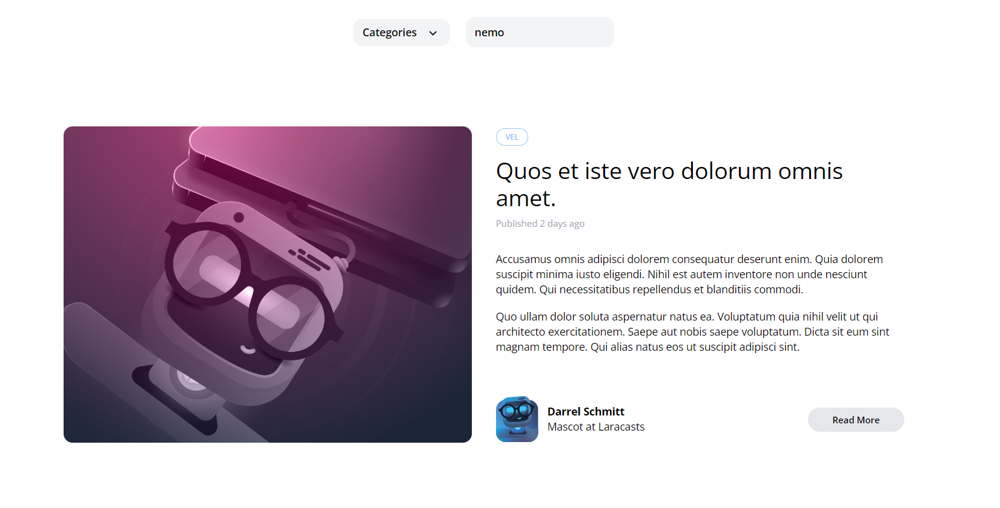

[< Volver al índice](/docs/readme.md)

# Search (The Cleaner Way)

En este capítulo, veremos las clases controladoras y exploraremos el alcance que tienen las consultas Eloquent. También, vamos a refactorizar el código del buscador para hacerlo mucho más legible y reutilizable, en donde separaremos las responsabilidades en rutas, controlador y modelo.

## Controlador `PostController`

En el capítulo anterior, la ruta `home` ubicada en `/routes/web.php` asumió responsabilidades extras y su código resultó siendo bochornoso y desordenado. Para solucionar esto, crearemos un nuevo controlador `PostController` ejecutando el siguiente comando:

```bash
php artisan make:controller PostController
```

Este nuevo controlador lo podremos encontrar en `/app/Http/Controllers`.

### Crear métodos `index` y `show`

A nivel del nuevo controlador, crearemos los nuevos métodos `index` y `show`, de esta forma podremos retornar los valores de posts desde el controlador y simplificar las rutas, debido a que únicamente tendrán que referenciar algún método de `PostController`.

```php
<?php

namespace App\Http\Controllers;

use App\Models\Category;
use App\Models\Post;
use Illuminate\Http\Request;

class PostController extends Controller
{
    public function index()
    {
        return view('posts', [
            'posts' => Post::latest()->filter()->get(),
            'categories' => Category::all()
        ]);
    }

    public function show(Post $post)
    {
        return view('post', [
            'post' => $post
        ]);
    }
}
```

### Método `scopeFilter` en el Modelo `Post`

Antes de realizar los cambios en las rutas, podemos ver que estamos llamando a un nuevo método en el modelo Eloquent `Post`. Este quedaría de la siguiente manera en el archivo `/app/Models/Post.php`:

```php
public function scopeFilter($query)
{
    if (request('search')) {
        $query
            ->where('title', 'like', '%' . request('search') . '%')
            ->orWhere('body', 'like', '%' . request('search') . '%');
    }
}
```

A este nuevo método podremos acceder de la siguiente manera `Post::nuevaConsulta()->filter()`. De esta forma, cuando queramos filtrar por el `title` y el `body` de los posts, debemos añadir `->filter()`.

### Adaptar rutas

Ahora, podremos modificar las rutas. Primero, debemos importar del nuevo controlador, para que no nos indique algún error de referencia (esto lo añadimos en la parte superior):

```php
use App\Http\Controllers\PostController;
```

Posteriormente, modificamos las rutas:

```php
Route::get('/', [PostController::class, 'index'])->name('home');

Route::get('posts/{post:slug}', [PostController::class, 'show']);
```

Con estos cambios, el controlador tendrá sus responsabilidades, y las rutas las suyas.

### Detalle final en el método `scopeFilter()`

Debido a que no es lo más recomendable obtener el query string con la función `request()` desde el modelo Eloquent `Post`, vamos a cambiar esto de la siguiente forma:

```php
public function scopeFilter($query, array $filters)
{
    $query->when($filters['search'] ?? false, fn ($query, $search) =>
        $query
            ->where('title', 'like', '%' . $search . '%')
            ->orWhere('body', 'like', '%' . $search . '%'));
}
```

El método `scopeFilter()` utiliza la función `when()` de la clase `Builder`, lo que permite ejecutar un callback si se cumple una condición. Ahora, para llamar a este método, debemos enviarle un array con los filtros:

```php
Post::latest()->filter(request(['search']))->get()
```

Para definir este array, también se puede hacer usando `request()->only('search')`. Por otra parte, este cambio en la implementación permite que si en un futuro quisiéramos incluir nuevos filtrados, lo podemos hacer utilizando el método `scopeFilter` de una manera más flexible.

## Resultado final

Ahora, con los cambios realizados, el buscador de manera interna se encontrará de manera más limpia y estructurada, permitiendo futuras extensiones sin complicaciones y la separación de responsabilidades entre las diferentes capas del proyecto. Por otro lado, visualmente su funcionalidad será exactamente la misma.


