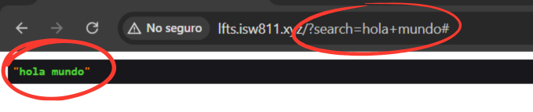
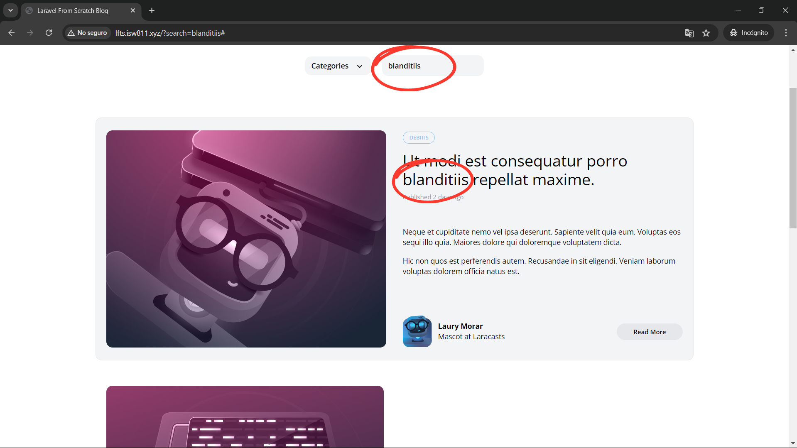

[< Volver al índice](/docs/readme.md)

# Search (The Messy Way)

En este capítulo número 37, iniciamos la sección `Search` del curso, donde implementaremos el funcionamiento de búsqueda de publicaciones en nuestro blog. En este caso, únicamente realizaremos la funcionalidad del buscador. Sin embargo, no realizaremos un código limpio, ordenado o que se pueda reutilizar.

## Funcionalidad inicial del buscador

Para comprobar la funcionalidad del buscador originalmente, podemos añadir un `dd` (dump and die) en la ruta principal ubicada en `/routes/web.php`.

```php
Route::get('/', function () {
    dd(request('search'));
    ...
})->name('home');
```

Por lo que, si ingresemos `hola mundo` en el input del buscador y presionamos la tecla `enter`, podríamos ver algo similar a lo siguiente:



Actualmente, este buscador lo que hace es enviar el texto de búsqueda recibido por medio de "Query String", utilizando el método `GET` recargar la página principal.

## Nueva funcionalidad del buscador

### Modificar ruta de la página `home`

Para manejar la búsqueda, a nivel del endpoint principal, podemos verificar si recibimos un parámetro "Query String" y si es así filtrar los posts en consecuencia. Fue necesario crear la variable `$posts` para poder realizar el filtrado cuando sea necesario:

```php
Route::get('/', function () {
    $posts = Post::latest();

    if (request('search')) {
        $posts
            ->where('title', 'like', '%' . request('search') . '%')
            ->orWhere('body', 'like', '%' . request('search') . '%');
    }

    return view('posts', [
        'posts' => $posts->get(),
        'categories' => Category::all()
    ]);
})->name('home');
```

La búsqueda o filtrado anterior en SQL es equivalente a:

```SQL
SELECT * FROM posts
WHERE title LIKE '%hola%' OR
WHERE title LIKE '%hola%';
```

Donde `hola` es el parámetro "Query String" recibido, sin importar lo que haya detrás o delante de esta palabra.

### Modificar `_post-header`

Para que el parámetro de búsqueda se mantenga en el input de la sección del buscador (Search), debemos modificar `_post-header.blade.php` y quedaría de la siguiente manera:

```html
<div
    class="relative flex lg:inline-flex items-center bg-gray-100 rounded-xl px-3 py-2"
>
    <form method="GET" action="#">
        <input
            type="text"
            name="search"
            placeholder="Find something"
            class="bg-transparent placeholder-black font-semibold text-sm"
            value="{{ request('search') }}"
        />
    </form>
</div>
```

Básicamente, lo que hace es imprimir el parámetro query string `'search'`, lo cual correspondería al valor que se introdujo en el input de búsqueda.

## Resultado final

Ahora, cuando realicemos una búsqueda, los posts se filtrarán por el texto ingresado, si existe en el `body` o `title` del post. Por ejemplo:


