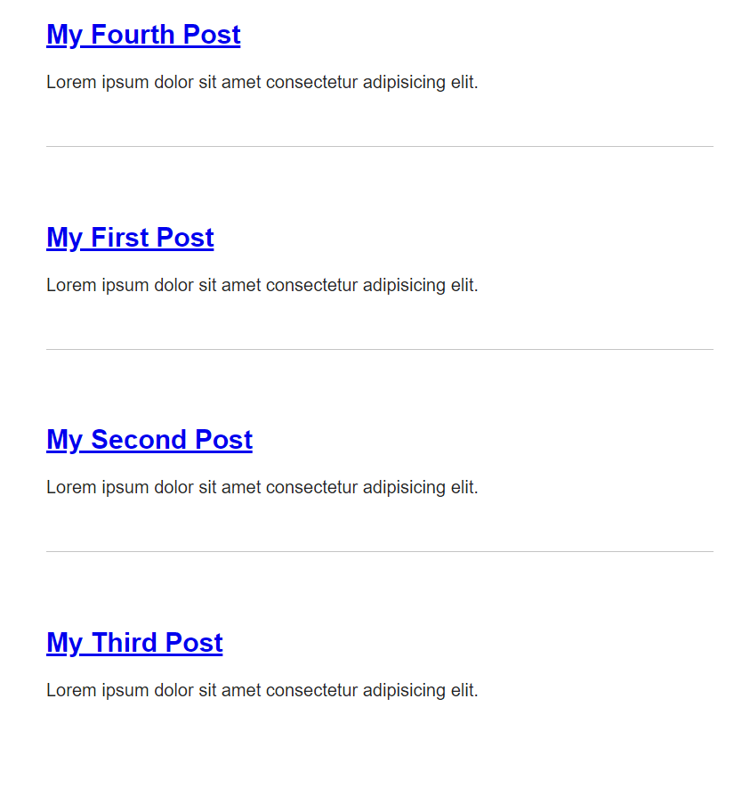
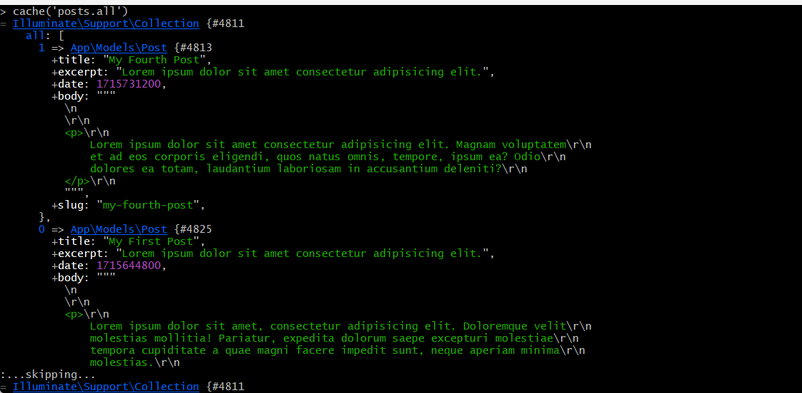
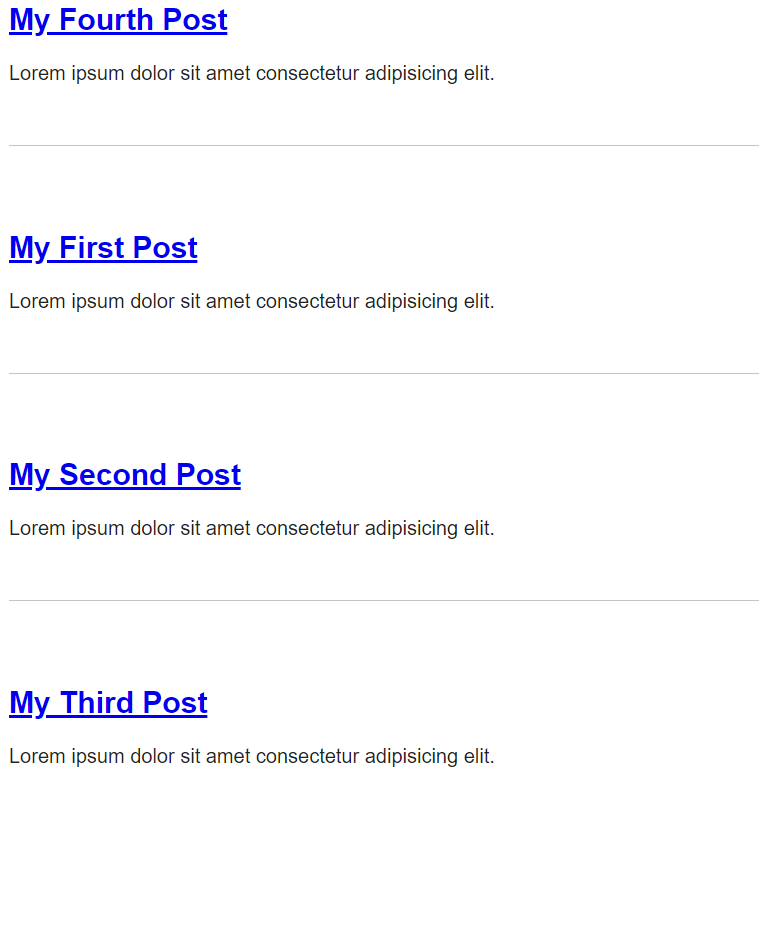

[< Volver al índice](/docs/readme.md)

# Collection Sorting and Caching Refresher

En este episodio, aprovecharemos las facilidades de utilizar collections en Laravel para ordenar todos los posts haciendo uso de los metadatos, específicamente por el valor `date` y configuraremos el almacenamiento en caché "para siempre".

## Ordenar los posts por fecha de creación

Para mostrar los posts ordenados de forma descendente (del más nuevo al antiguo) según su fecha de creación, debemos modificar la función estática `all()` en el archivo del modelo (`/app/Models/Post.php`), donde únicamente añadimos la cláusula `->sortByDesc()`:

```php
public static function all()
{
    return collect(File::files(resource_path("posts")))
        ->map(fn ($file) => YamlFrontMatter::parseFile($file))
        ->map(function ($document) {
            return new Post(
                $document->title,
                $document->excerpt,
                $document->date,
                $document->body(),
                $document->slug
            );
        })
        ->sortByDesc('date');
}
```

El parámetro `date` es la llave por la cual ordenaremos la colección de posts. Esto resultaría de la siguiente manera:



## Cacheo permanente de todos los posts

Ahora, realizaremos un cacheo "para siempre" de todos los posts en la función `all()` del modelo `Post`, esto evitará realizar cargas innecesarias.

```php
public static function all()
{
    return cache()->rememberForever('posts.all', function () {
        return collect(File::files(resource_path("posts")))
            ->map(fn ($file) => YamlFrontMatter::parseFile($file))
            ->map(function ($document) {
                return new Post(
                    $document->title,
                    $document->excerpt,
                    $document->date,
                    $document->body(),
                    $document->slug
                );
            })
            ->sortByDesc('date');
    });
}
```

### Probar el caché con Tinker 

Para abrir tinker (consola de Laravel), ejecutamos el siguiente comando:

```bash
php artisan tinker
```

Una vez en Tinker, probamos la caché ejecutando el comando `cache('posts.all')`, esto sin refrescar la vista nos retornará un valor null. Pero al refrescar la vista principal, nos retornará todo el contenido en caché.



También podemos obtener la caché ejecutando `cache()->get('posts.all')` o para colocar un nuevo valor en la caché con `cache()->put('llave', 'valor')`.

## Crear el quinto post

Para verificar que el cache no se actualiza automáticamente, creamos el siguiente archivo HTML `/resources/posts/my-fifth-post.html`, con el siguiente contenido:

```html
---
title: My Fifth Post
slug: my-fifth-post
excerpt: Lorem ipsum dolor sit amet consectetur adipisicing elit.
date: 2024-05-15
---

<p>
    Lorem ipsum dolor sit amet consectetur adipisicing elit. Magnam voluptatem
    et ad eos corporis eligendi, quos natus omnis, tempore, ipsum ea? Odio
    dolores ea totam, laudantium laboriosam in accusantium deleniti?
</p>
```

Al refrescar la vista principal, podemos observar que el nuevo post no cargará.



## Eliminar el cache en Tinker

Para poder eliminar la caché mediante la consola de comando Tinker, ejecutamos lo siguiente:

```php
cache()->forget('posts.all')
```

Después de eliminar la caché, al refrescar la página principal, podremos ver que cargará el nuevo post. El proceso de cacheo se mantendrá para siempre, pero al final de este episodio se discute que puede depender de las necesidades y puede entrar en juego el rol de los proveedores de servicios.
