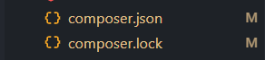
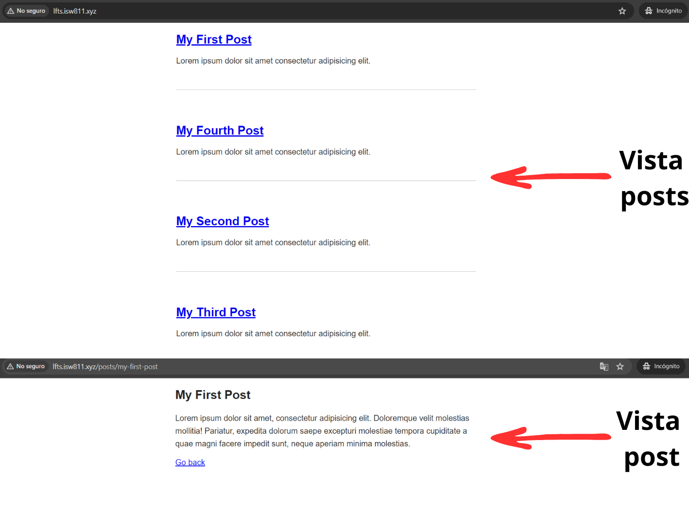

[< Volver al índice](/docs/readme.md)

# Find a Composer Package for Post Metadata

Al finalizar el capítulo anterior, se comentó sobre agregar metadatos en la parte superior de cada post. Para esto, con ayuda de la herramienta Composer, vamos a instalar el paquete _spatie/yaml-front-matter_ que nos permitirá analizar y manejar el formato para los metadatos en cada archivo HTML _Yaml Front Matter_.

## Instalar yaml-front-matter en el proyecto

Para instalar el paquete yaml-front-matter de spatie con Composer, nos movilizamos a la ruta de crafteo en la máquina invitada webserver `/vagrant/sites/lfts.isw811.xyz` y ejecutamos el siguiente comando:

```bash
composer require spatie/yaml-front-matter
```

Una vez finalizada la instalación, no veremos ningún error y podremos ver que se actualizaron los archivos `composer.json` y `composer.lock` para reflejar la nueva dependencia.



## Actualizar archivos HTML (Posts)

Debemos agregar los metadatos en el formato _Yaml Front Matter_ a cada archivo del directorio `/resources/posts/`. Por ejemplo, el archivo `my-fourth-post.html` quedaría de la siguiente forma:

```yaml
---
title: My Fourth Post
excerpt: Lorem ipsum dolor sit amet consectetur adipisicing elit.
slug: my-fourth-post
date: 2024-05-15
---
<p>
Lorem ipsum dolor sit amet consectetur adipisicing elit. Magnam voluptatem
et ad eos corporis eligendi, quos natus omnis, tempore, ipsum ea? Odio
dolores ea totam, laudantium laboriosam in accusantium deleniti?
</p>
```

En los demás archivos se deben realizar los mismos cambios (añadir en formato Yaml Front Matter sus metadatos adaptados a ese archivo y solo dejar la etiqueta HTML `p`).

## Añadir atributos y constructor al modelo Post

Para poder manejar los metadatos y el contenido del post, añadimos al modelo `Post` los atributos para cada valor necesario y el constructor para poder realizar instancias de este modelo.

```php
class Post
{
    public $title;
    public $excerpt;
    public $date;
    public $body;
    public $slug;

    public function __construct($title, $excerpt, $date, $body, $slug)
    {
        $this->title = $title;
        $this->excerpt = $excerpt;
        $this->date = $date;
        $this->body = $body;
        $this->slug = $slug;
    }

    ...
}
```

## Refactorizar función Post::all()

Refactorizamos la función estática `all()` ubicada en `/app/Models/Post.php`. En la que, por medio de `collect()` y utilizando la clase de la nueva dependencia `YamlFrontMatter`, se obtendrá el contenido en el formato _Yaml Front Matter_ y en HTML, y se hará una instancia de cada archivo en un objeto de `Post`.

```php
public static function all()
{
    return collect(File::files(resource_path("posts")))
    ->map(fn ($file) => YamlFrontMatter::parseFile($file))
    ->map(function ($document) {
        return new Post(
            $document->title,
            $document->excerpt,
            $document->date,
            $document->body(),
            $document->slug
        );
    });
}
```

A pesar de que a lo largo del capítulo, realizamos distintas pruebas en el endpoint que retorna la vista principal, este permanece igual:

```php
Route::get('/', function () {
    return view('posts', [
        'posts' => Post::all()
    ]);
});
```

## Cambiar vista principal para recibir datos de los objetos

Modificamos la vista principal para recibir y mostrar los datos de una forma mucho más controlada y diferenciando entre cada dato del objeto `Post`.

```html
<!DOCTYPE html>
<html lang="en">
    <head>
        <title>My blog</title>
        <link rel="stylesheet" href="/app.css" />
    </head>
    <body>
        <?php foreach ($posts as $post) : ?>
        <article>
            <h1>
                <a href="posts/<?= $post->slug; ?>"><?= $post->title; ?></a>
            </h1>
            <div><?= $post->excerpt; ?></div>
        </article>
        <?php endforeach; ?>
    </body>
</html>
```

## Refactorizar método Post::find($slug)

Para que al ingresar a la vista `post` podamos visualizar bien los datos. Debemos actualizar el método `find` del modelo `Post`. Las modificaciones lo que harán es buscar el post que coincida con el slug solicitado, entre todos los posts existentes.

```php
public static function find($slug)
{
    return static::all()->firstWhere('slug', $slug);
}
```

Esto lo que hace específicamente es obtener la colección con todos los posts `static::all()` y con el `firstWhere('slug', $slug)` se obtiene el primero con el que coincida el slug.

## Actualizar vista post

Por último, únicamente debemos cambiar la forma de mostrar  la información en la vista `post`, utilizando los valores del objeto enviado desde el endpoint, lo cual quedaría de la siguiente manera:

```html
<!DOCTYPE html>
<html lang="en">
    <head>
        <title>My blog</title>
        <link rel="stylesheet" href="/app.css" />
    </head>

    <body>
        <article>
            <h1><?= $post->title; ?></h1>
            <div><?= $post->$body; ?></div>
        </article>
        <a href="/">Go back</a>
    </body>
</html>
```

Y el endpoint permanece exactamente igual:

```php
Route::get('posts/{post}', function ($slug) {
    return view('post', [
        'post' => Post::find($slug)
    ]);
})->where('post', '[A-z_\-]+');
```

### Resultado en las vistas `posts` y `post`

Todas las modificaciones realizadas permitirán cargar y mostrar todos los posts con metadatos y su contenido HTML de forma dinámica.


