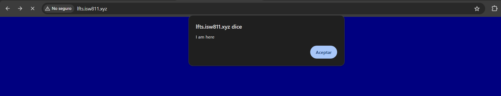
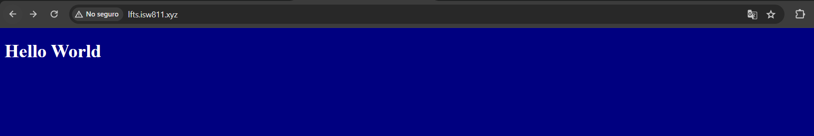

[< Volver al índice](/docs/readme.md)

# Include CSS and JavaScript

Laravel soporta múltiples mecanismos avanzados para gestionar las hojas de estilo en cascada y los archivos JS con una herramienta que es llamada _herramienta de agrupación_, pero en esta primera versión lo haremos de la manera clásica, añadiendo los archivos a la carpeta `public`.

Vamos a crear un archivo `/public/app.css` con el siguiente contenido.

```css
body {
    background: navy;
    color: white;
}
```

Y luego vamos a crear el archivo `/public/app.js` con el siguiente contenido.

```javascript
alert("I am here");
```

Ahora modificamos la vista _Welcome_ remplazando el contenido por defecto, con el siguiente código.

```html
<!DOCTYPE html>
<html lang="en">
    <head>
        <meta charset="UTF-8" />
        <title>LFTS</title>
        <script src="app.js"></script>
        <link rel="stylesheet" href="app.css" />
    </head>
    <body>
        <h1>¡Hola mundo!...</h1>
    </body>
</html>
```

Como resultado, cada vez que se recargue la vista se mostrará el alert creado en el nuevo archivo JS.



Y la vista ahora se puede apreciar de la siguiente forma.


