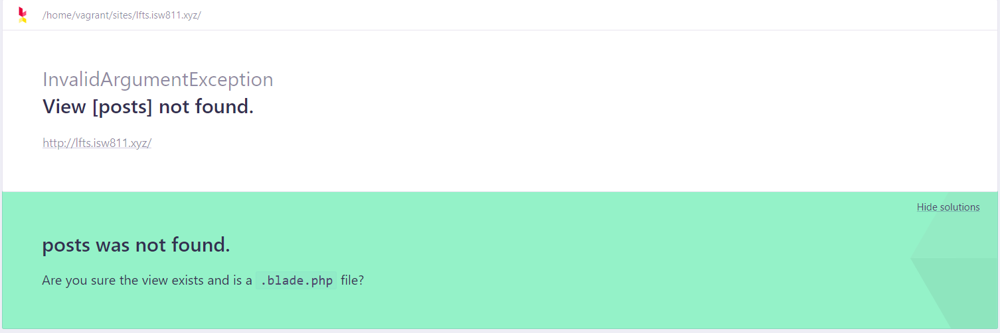
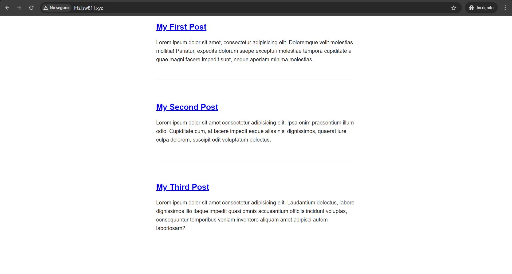

[< Volver al índice](/docs/readme.md)

# Make a Route and Link to it

Para configurar una ruta en Laravel y vincularla a una página específica, debemos crear un endpoint o, como en este caso, cambiar el endpoint ubicado en el archivo `/routes/web.php` que actualmente retorna la vista _Welcome_ para que retorne la vista _Posts_.

```php
Route::get('/', function () {
    return view('posts');
});
```

Si no existe un archivo `posts.blade.php` en la carpeta `/resources/views`, se mostrará un error similar al siguiente:



Para solucionar el error anterior, en la carpeta `/resources/views` se debe renombrar la vista `welcome.blade.php` a `posts.blade.php`.

Además, en la carpeta `/public` eliminamos el archivo `app.js` y su etiqueta script, donde estaba referenciada en la vista `posts.blade.php`. Posteriormente, se cambia el contenido del archivo `app.css`, el cual resultaría con el siguiente código:

```css
body {
    background: white;
    color: #222222;
    max-width: 600px;
    margin: auto;
    font-family: sans-serif;
}

p {
    line-height: 1.6;
}

article + article {
    margin-top: 3rem;
    padding-top: 3rem;
    border-top: 1px solid #c5c5c5;
}
```

Los cambios realizados en `app.css` van a permitir en el `body` que su contenido se vea centrado y el fondo sea más vistoso. Con respecto al selector `p`, es para dar un interlineado entre los distintos párrafos que tendremos de cada post. Y el `article + article` nos permitirá darle un espaciado, padding y borde superior a cada etiqueta de este tipo (la cual envolverá el contenido de los posts), a excepción de la primera etiqueta `article.`

Ahora, agregamos todos los posts al contenido del archivo `/resources/views/posts.blade.php`, esto resultaría de la siguiente forma:

```html
<!DOCTYPE html>
<html lang="en">
    <head>
        <title>My blog</title>
        <link rel="stylesheet" href="/app.css" />
    </head>
    <body>
        <article>
            <h1><a href="/post">My First Post</a></h1>
            <p>
                Lorem ipsum dolor sit amet, consectetur adipisicing elit.
                Doloremque velit molestias mollitia! Pariatur, expedita dolorum
                saepe excepturi molestiae tempora cupiditate a quae magni facere
                impedit sunt, neque aperiam minima molestias.
            </p>
        </article>

        <article>
            <h1><a href="/post">My Second Post</a></h1>
            <p>
                Lorem ipsum dolor sit amet consectetur adipisicing elit. Ipsa
                enim praesentium illum odio. Cupiditate cum, at facere impedit
                eaque alias nisi dignissimos, quaerat iure culpa dolorem,
                suscipit odit voluptatum delectus.
            </p>
        </article>
        <article>
            <h1><a href="/post">My Third Post</a></h1>
            <p>
                Lorem ipsum dolor sit amet consectetur adipisicing elit.
                Laudantium delectus, labore dignissimos illo itaque impedit
                quasi omnis accusantium officiis incidunt voluptas, consequuntur
                temporibus veniam inventore aliquam amet adipisci autem
                laboriosam?
            </p>
        </article>
    </body>
</html>
```

Estos posts, se verán de la siguiente manera:



Ahora, para poder acceder a cada post, es necesario agregar un nuevo endpoint en nuestras rutas ubicadas en `/routes/web.php`

```php
Route::get('post', function () {
    return view('post');
});
```

Luego se debe crear el archivo `resources/views/post.blade.php` con el contenido de `My First Post` y se ingresa un link para poder volver a la página principal.

```html
<!DOCTYPE html>
<html lang="en">
    <head>
        <title>My blog</title>
        <link rel="stylesheet" href="/app.css" />
    </head>
    <body>
        <article>
            <h1><a href="/post">My First Post</a></h1>
            <p>
                Lorem ipsum dolor sit amet, consectetur adipisicing elit.
                Doloremque velit molestias mollitia! Pariatur, expedita dolorum
                saepe excepturi molestiae tempora cupiditate a quae magni facere
                impedit sunt, neque aperiam minima molestias.
            </p>
        </article>
        <a href="/">Go back</a>
    </body>
</html>
```

Ahora, cada título de cada post en la página principal permitirá ingresar a esta página con el contenido del primer post.
