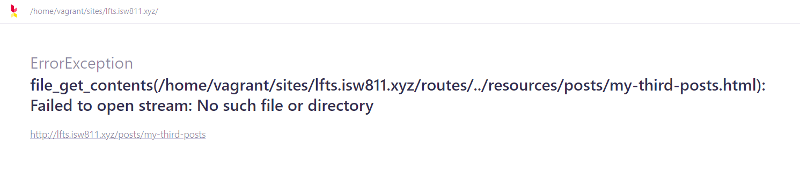

[< Volver al índice](/docs/readme.md)

# Store Blog Posts as HTML Files

Para solucionar el problema donde al abrir cada uno de los posts se muestra únicamente el contenido del primer post, deberemos guardar los posts como archivos HTML y los manejaremos de manera dinámica en el endpoint `posts/{post}`.

## Modificar vista `post`

Para poder mostrar de manera dinámica cada post en la vista `post`, en esta se debe recibir y mostrar el contenido por medio de una variable enviada desde el endpoint.

```html
<!DOCTYPE html>
<html lang="en">
    <head>
        <title>My blog</title>
        <link rel="stylesheet" href="/app.css" />
    </head>
    <body>
        <article>
            <?= $post; ?>
        </article>
        <a href="/">Go back</a>
    </body>
</html>
```

## Crear archivos HTML

Para esto, se crea la carpeta `/resources/posts` para almacenar los archivos HTML de cada post y se crean los siguientes archivos:

Archivo HTML para el primer post `my-first-post.html`:

```html
<h1>
    <a href="/post">My First Post</a>
</h1>
<p>
    Lorem ipsum dolor sit amet, consectetur adipisicing elit. Doloremque velit
    molestias mollitia! Pariatur, expedita dolorum saepe excepturi molestiae
    tempora cupiditate a quae magni facere impedit sunt, neque aperiam minima
    molestias.
</p>
```

Archivo HTML para el segundo post `my-second-post.html`:

```html
<h1>
    <a href="/post">My Second Post</a>
</h1>
<p>
    Lorem ipsum dolor sit amet consectetur adipisicing elit. Ipsa enim
    praesentium illum odio. Cupiditate cum, at facere impedit eaque alias nisi
    dignissimos, quaerat iure culpa dolorem, suscipit odit voluptatum delectus.
</p>
```

Archivo HTML para el tercer post `my-third-post.html`:

```html
<h1>
    <a href="/post">My Third Post</a>
</h1>
<p>
    Lorem ipsum dolor sit amet consectetur adipisicing elit. Laudantium
    delectus, labore dignissimos illo itaque impedit quasi omnis accusantium
    officiis incidunt voluptas, consequuntur temporibus veniam inventore aliquam
    amet adipisci autem laboriosam?
</p>
```

## Modificar el endpoint `post`

Para obtener el contenido de los archivos HTML, utilizamos una función de PHP, llamada `file_get_contents()` junto con la constante `__DIR__` para obtener la ruta completa del archivo.

Inicialmente, se realizan los cambios en el endpoint `post` para obtener el contenido del primer post.

```php
Route::get('post', function () {

    return view('post', [
        'post' => file_get_contents(__DIR__ . '/../resources/posts/my-first-post.html')
    ]);
});
```

Para obtener los posts de manera dinámica, se debe cambiar el endpoint a `posts/{post}`. El wildcard `{post}` nos capturará lo que haga match con esa parte de la ruta y lo almacenará en `$slug`.

```php
Route::get('posts/{post}', function ($slug) {
    $post = file_get_contents(__DIR__ . "/../resources/posts/{$slug}.html");

    return view('post', [
        'post' => $post
    ]);
});
```

Ahora, cada vez que se solicite `posts/nombre-de-post-existente`, lo retornará exitosamente. Pero al solicitar un nombre de un post o archivo que no existe, se da el siguiente error:



Para manejar este problema, se obtiene la ruta del archivo en una variable llamada `$path` y se valida la existencia, con la función `file_exists()`. Si el archivo no existe, redirigimos a la página principal.

```php
Route::get('posts/{post}', function ($slug) {
    $path = __DIR__ . "/../resources/posts/{$slug}.html";

    if (! file_exists($path)) {
        return redirect('/');
    }

    $post = file_get_contents($path);

    return view('post', [
        'post' => $post
    ]);
});
```

## Cambios en la vista `posts`

Para poder acceder a los nuevos archivos HTML, es necesario actualizar las rutas de los links en la página principal.

```html
<article>
    <h1>
        <a href="/posts/my-first-post">My First Post</a>
    </h1>
    <p>
        Lorem ipsum dolor sit amet, consectetur adipisicing elit. Doloremque
        velit molestias mollitia! Pariatur, expedita dolorum saepe excepturi
        molestiae tempora cupiditate a quae magni facere impedit sunt, neque
        aperiam minima molestias.
    </p>
</article>

<article>
    <h1>
        <a href="/posts/my-second-post">My Second Post</a>
    </h1>
    <p>
        Lorem ipsum dolor sit amet consectetur adipisicing elit. Ipsa enim
        praesentium illum odio. Cupiditate cum, at facere impedit eaque alias
        nisi dignissimos, quaerat iure culpa dolorem, suscipit odit voluptatum
        delectus.
    </p>
</article>
<article>
    <h1>
        <a href="/posts/my-third-post">My Third Post</a>
    </h1>
    <p>
        Lorem ipsum dolor sit amet consectetur adipisicing elit. Laudantium
        delectus, labore dignissimos illo itaque impedit quasi omnis accusantium
        officiis incidunt voluptas, consequuntur temporibus veniam inventore
        aliquam amet adipisci autem laboriosam?
    </p>
</article>
```

Con estos cambios, ya podemos acceder desde la vista `posts` a cada uno de los posts, gracias al haber guardado el contenido de cada post en archivos HTML separados y el manejo dinámico en el endpoint.
