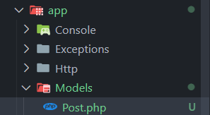
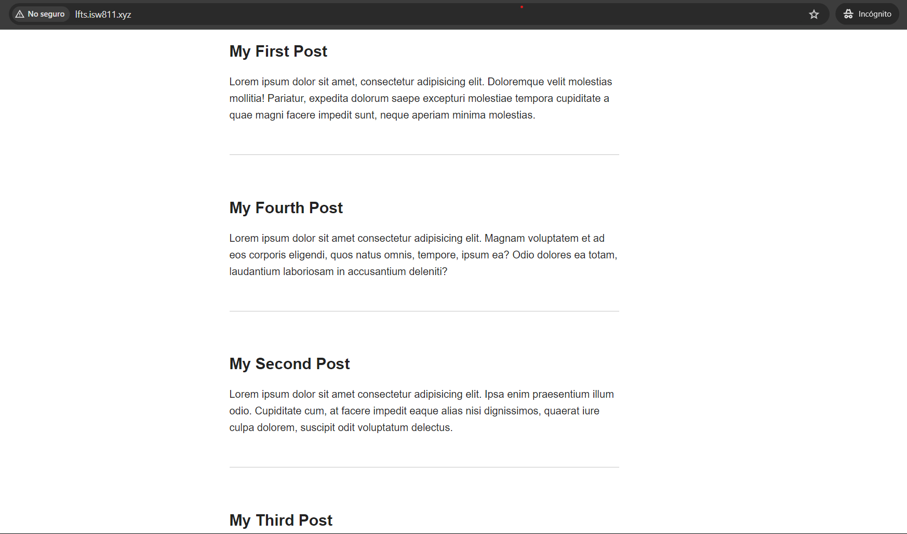

[< Volver al índice](/docs/readme.md)

# Use the Filesystem Class to Read a Directory

Para este episodio, lo que se va a realizar es leer los archivos HTML del directorio `/resources/posts` en la vista principal `posts` de forma dinámica, utilizando la clase `File` de `Illuminate\Support\Facades`.

## Cambios en los archivos HTML de los posts

Inicialmente, eliminamos las etiquetas `a` innecesarias de cada post.

Antes:

```html
<h1>
    <a href="/post">My First Post</a>
</h1>
```

Después:

```html
<h1>My First Post</h1>
```

Este cambio se llevó a cabo en todos los archivos HTML del directorio `resources/posts`.

## Refactorizar el endpoint y crear la clase Post

El código del endpoint `posts/{post}` cumple con su función, pero podemos mejorar su estructura y sus responsabilidades. Para cumplir con esto, mediante un comentario temporal se plantea qué es lo que este debe hacer y lo refactorizamos:

```php
Route::get('posts/{post}', function ($slug) {
    // Find a post by its slug and pass it to a view called "post"
    return view('post', [
        'post' => Post::find($slug)
    ]);
})->where('post', '[A-z_\-]+');
```

Continuamente, vamos a crear en el directorio `app/Models` el modelo `Post`.



Luego debemos importar la clase Post en el archivo `/routes/web.php`. Para ello, agregamos la siguiente línea debajo de la etiqueta de apertura de PHP `<?php`.

```php
use App\Models\Post;
```

Si recargamos la página, nos mostrará el error _Call to undefined method App\Models\Post::find()_, este se debe a que en la clase `Post` no existe un método llamado `find()`. Por esto, en el archivo `app/Models/Post` realizamos lo siguiente:

```php
<?php

namespace App\Models;

use Illuminate\Database\Eloquent\ModelNotFoundException;

class Post
{
    public static function find($slug)
    {
        if (!file_exists($path = resource_path("posts/{$slug}.html"))) {
            throw new ModelNotFoundException();
        }

        return cache()->remember("posts.{$slug}", 1200, fn () => file_get_contents($path));
    }
}
```

Con estos cambios, la función helper `resource_path()` nos permitirá acceder al archivo post deseado en la ruta `/resources` y, si el archivo no existe, se controla con una excepción y se cachearán los post de igual forma.

## Obtener los posts en la vista principal

En la vista principal, obtendremos los posts de manera dinámica. Para ello, en la vista `posts.blade.php` vamos a incrustar código _PHP_ para iterar sobre una variable `$posts`, la cual tendrá todos los posts que serán enviados desde el endpoint.

```html
<!DOCTYPE html>
<html lang="en">
    <head>
        <title>My blog</title>
        <link rel="stylesheet" href="/app.css" />
    </head>
    <body>
        <?php foreach ($posts as $post) : ?>
        <article>
            <?= $post; ?>
        </article>
        <?php endforeach; ?>
    </body>
</html>
```

Esto dará error, debido a que no tenemos la variable `$posts` definida. Para solucionar esto, realizamos lo siguiente:

En el endpoint que retorna la vista principal, obtenemos todos los posts del directorio `/resources/posts`.

```php
Route::get('/', function () {
    return view('posts', [
        'posts' => Post::all()
    ]);
});
```

Agregamos un nuevo método `all()` en el modelo `Post`, en el que utilizando la clase `File` de `Illuminate\Support\Facades` y su método `files()` se lee el contenido de todo el directorio `/resources/posts`. Y se pasa el array con toda esta información a un `array_map` que utilizando `getContents()` obtiene el contenido HTML requerido.

```php
<?php

namespace App\Models;

use Illuminate\Database\Eloquent\ModelNotFoundException;
use Illuminate\Support\Facades\File;

class Post
{
    public static function all()
    {
        $files = File::files(resource_path("posts/"));
        return array_map(fn ($file) =>  $file->getContents(), $files);
    }


    public static function find($slug)
    {...
    }
}

```

## Crear nuevo post

Para comprobar la nueva funcionalidad dinámica, añadimos un nuevo post en `resources/posts` .

Archivo HTML `my-fourth-post.html`:

```html
<h1>My Fourth Post</h1>
<p>
    Lorem ipsum dolor sit amet consectetur adipisicing elit. Magnam voluptatem
    et ad eos corporis eligendi, quos natus omnis, tempore, ipsum ea? Odio
    dolores ea totam, laudantium laboriosam in accusantium deleniti?
</p>
```

Con esto, ahora la vista principal se vería de la siguiente manera:



Para poder ordenar los posts, estructurar y manejar nuestro contenido HTML, sería de interés poder añadir metadatos en cada post. Esto se realizará en el siguiente episodio.
