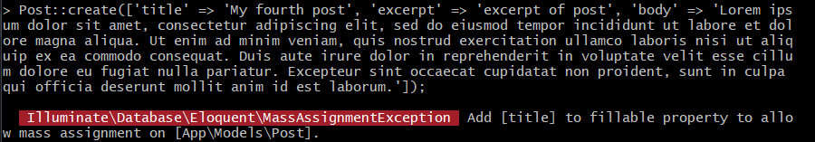
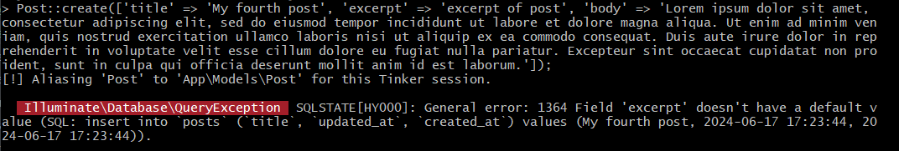
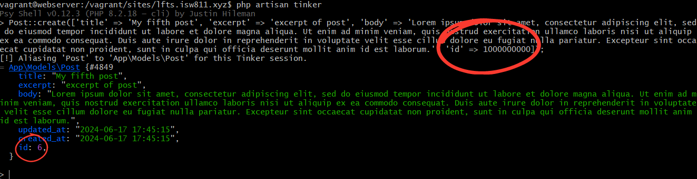

[< Volver al índice](/docs/readme.md)

# 3 Ways to Mitigate Mass Assignment Vulnerabilities

En este capítulo, exploraremos las vulnerabilidades de asignación masiva y veremos tres formas de cómo mitigarlas. Existen dos opciones proporcionadas por Laravel para controlar qué atributos se pueden asignar de manera masiva y una tercera opción un tanto más general y especial.

Inicialmente, accedemos a Tinker desde nuestra máquina virtual, en la raíz del proyecto:

```bash
php artisan tinker
```

Y creamos un nuevo post:

```php
use App\Models\Post;

$post = new Post;

$post->title = 'My Third Post';

$post->excerpt = 'excerpt of post';

$post->body = 'Lorem ipsum dolor sit amet, consectetur adipiscing elit, ...';
```

Además, en la vista `/resources/views/posts.blade.php` en la etiqueta `h1` haremos un ajuste para imprimir el contenido sin escapar:

```html
<h1>
    <a href="posts/{{ $post->id }}"> {!! $post->title !!} </a>
</h1>
```

## Opción 1: usar `fillable`

Existe otra forma de crear nuevos registros de posts utilizando `Post::create([atributos])`. Aunque esto puede llevar a vulnerabilidades de asignación masiva, si no se tiene un manejo adecuado.

Al intentar ejecutar `Post::create()` se nos muestra el siguiente error:



Para solucionar esto, debemos de ingresar al modelo `/app/Models/Post.php` y añadir la propiedad `fillable`:

```php
class Post extends Model
{
    use HasFactory;

    protected $fillable = [
        'title'
    ];
}
```

Reiniciamos Tinker y volvemos a probar el `Post::create()`.



Esto se debe a que SQL no tiene un valor determinado para la columna `excerpt`. Para solucionar esto, vamos a añadir el atributo `excerpt` y body a la propiedad `fillable`.

```php
protected $fillable = [
        'title',
        'excerpt',
        'body'
    ];
```

Ahora al probar lo siguiente nos permitirá guardar el registro correctamente:

```php
Post::create(['title' => 'My fourth post', 'excerpt' => 'excerpt of post', 'body' => 'Lorem ipsum dolor sit amet, consectetur adipiscing elit, sed do eiusmod tempor incididunt ut labore et dolore magna aliqua. Ut enim ad minim veniam, quis nostrud exercitation ullamco laboris nisi ut aliquip ex ea commodo consequat. Duis aute irure dolor in reprehenderit in voluptate velit esse cillum dolore eu fugiat nulla pariatur. Excepteur sint occaecat cupidatat non proident, sunt in culpa qui officia deserunt mollit anim id est laborum.']);
```

## Opción 2: usar `guarded`

También, existe la propiedad `guarded` que nos permite definir que todos son valores rellenables, excepto el o los que se indiquen en la propiedad. Añadamos esta propiedad a nuestro modelo Eloquent `Post`:

```php
protected $guarded = [
        'id'
    ];
```

Esto lo que nos permite es que todos se podrán asignar en masa, excepto el `id`. Por ejemplo:



En este caso, aunque le enviemos un ID, este lo ignorará por completo y seguirá con el siguiente ID autoincremental.

## Opción 3: desactivar la asignación masiva

Esta tercera opción es bastante popular y nos permitirá desactivar la asignación en masa por completo. Esta quedaría así:

```php
class Post extends Model
{
    use HasFactory;

    protected $guarded = [];
}
```

Lo que debemos hacer es establecer una regla interna, que implique que nunca realizaremos una asignación masiva a menos que se tenga el control total de los datos. En otras palabras, si te preocupa la asignación masiva, nunca la hagas.
