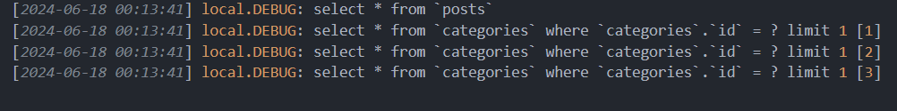
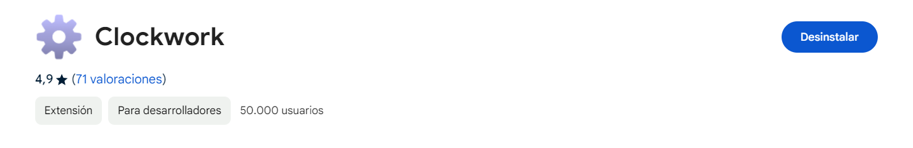

[< Volver al índice](/docs/readme.md)

# Clockwork, and the N+1 Problem

En este episodio, abordaremos el problema N+1, este fue introducido en el capítulo anterior e implica ejecutar una consulta SQL adicional por cada elemento cargado; esto nos puede generar un incremento de consultas totalmente innecesario. Además, exploraremos cómo depurar estas consultas manualmente y con la extensión Clockwork.

## Depurar el problema

El problema ocurre al cargar todos los posts, en donde se ejecuta una consulta adicional para obtener la categoría específica de cada post. Para comprobar esto, accedamos a `/routes/web.php` y modificamos con lo siguiente el endpoint `/`:

```php
Route::get('/', function () {
    \Illuminate\Support\Facades\DB::listen( function ($query){
        logger($query->sql, $query->bindings);
    });

    return view('posts', [
        'posts' => Post::all()
    ]);
});
```

Y si nos vamos al archivo `/storage/logs/laravel.log`, podríamos ver el comportamiento descrito:



Luego de realizar estas pruebas, el endpoint lo devolvemos a su estado anterior.

### Depurar el problema con Clockwork

Depurar el problema manualmente puede ser algo tedioso, por ello usaremos la herramienta Clockwork. Para esto instalaremos esta con el siguiente comando en la máquina virtual y en la dirección de crafteo:

```bash
composer require itsgoingd/clockwork
```

Y también se requiere instalar la extensión del navegador, en nuestro caso la que está disponible para Chrome.



Con Clockwork instalado, podemos depurar las consultas de una manera más intuitiva e interesante.

## Solución del problema de N+1

El problema surge porque Laravel realiza un lazy load (carga diferida) por defecto. Así que si queremos cargar todos los posts junto con sus categorías sin realizar consultas adicionales, debemos realizar el siguiente cambio en el endpoint `/`.

```php
Route::get('/', function () {
    return view('posts', [
        'posts' => Post::with('category')->get()
    ]);
});
```

Anteriormente, se realizaban cuatro consultas: una en la que se cargan todos los posts y las otras tres para cargar las categorías de cada post. Ahora, con esta solución sólo se hacen dos consultas: una que obtiene todos los posts y otra para obtener las categorías de los posts. Esto lo podemos verificar mediante clockwork o depurándose manualmente.

Por último, si pensamos en un caso hipotético que tenemos 50 posts, únicamente se harán las mismas dos queries mencionadas anteriormente, lo cual con el problema N+1 se traduciría a 51 solicitudes.
