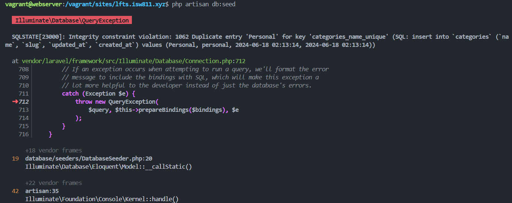
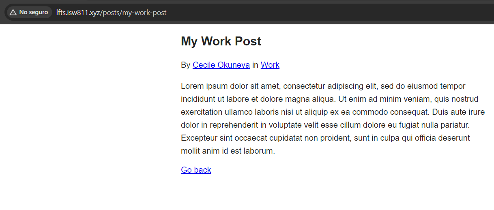

[< Volver al índice](/docs/readme.md)

# Database Seeding Saves Time

En esta sesión, lo que haremos es asignar a las publicaciones un autor o contribuidor y se mostrará esta nueva información en la vista de `post`. Además, exploraremos la funcionalidad del database seeding y veremos cómo este nos puede ahorrar tiempo en el futuro.

## Relación entre modelos Post y User

Para poder mostrar los usuarios de cada post, debemos añadir una nueva llave foránea en el modelo eloquent `Post` que referencie a `User`. Para esto, modificamos la función `up()` del archivo de migraciones `2024_06_17_045210_create_posts_table.php`.

```php
public function up()
{
    Schema::create('posts', function (Blueprint $table) {
        $table->id();
        $table->foreignId('user_id');
        $table->foreignId('category_id');
        $table->string('title');
        $table->string('slug')->unique();
        $table->text('excerpt');
        $table->text('body');
        $table->timestamps();
        $table->timestamp('published_at')->nullable();
    });
}
```

Lo que realizamos fue añadir la llave foránea `user_id`.

### Refrescar la migración

Para que los cambios se apliquen y empecemos desde cero con las tablas, ejecutamos lo siguiente:

```bash
php artisan migrate:fresh
```

Finalizada la migración, podremos ver los cambios realizados en la tabla `posts`.

## Database Seeding

Es muy molesto que cada vez que modificamos la estructura de alguna tabla, perdamos constantemente los datos que ya teníamos. Para solucionar este problema utilizamos los seeders, estos nos permiten persistir unos datos de prueba pre-configurados cuando queramos.

Para utilizar estos, nos dirigimos al directorio `/database/seeders/` y abrimos el archivo `DatabaseSeeder.php`. Y eliminamos el comentario que tiene la función `run()`.

```php
public function run()
{
    $user = User::factory()->create();
}
```

Ahora, podríamos ejecutar el siguiente comando y ver como se crean 10 registros en la tabla `users`:

```bash
php artisan db:seed
```

Debemos de tener en cuenta que si volvemos a ejecutar el comando anterior no elimina los diez usuarios que ya agregó, en lugar de eso agrega otros diez.

## Modificar slug y name en el modelo `Category`

Para evitar duplicaciones de categorías, añadimos una clave única a la columna `slug` y `name`.

```php
public function up()
{
    Schema::create('categories', function (Blueprint $table) {
        $table->id();
        $table->string('name')->unique();
        $table->string('slug')->unique();
        $table->timestamps();
    });
}
```

Y también podríamos modificar el seeder, para ingresar unas nuevas categorías:

```php
public function run()
{
    $user = User::factory()->create();

    Category::create([
        'name' => 'Personal',
        'slug' => 'personal'
    ]);

    Category::create([
        'name' => 'Family',
        'slug' => 'family'
    ]);

    Category::create([
        'name' => 'Work',
        'slug' => 'work'
    ]);
}
```

Ahora podríamos ejecutar el siguiente comando y ver cómo se modifica la tabla `categories` y cómo se aplica el database seeding:

```bash
php artisan migrate:fresh --seed
```

### Volver a ejecutar el seed

Si volvemos a ejecutar ahora el comando para el databa seeding, obtendremos un error porque intentará ingresar categorías que ya existen. Podemos verificarlo de la siguiente manera:



## Reformular el método `run()` del archivo `DatabaseSeeder.php`

Para evitar problemas de duplicación de datos, lo que se puede realizar es truncar las tablas. Además, podríamos generar en este método todos los registros de las tablas `categories`, `users` y `posts`. Por lo que esta quedará de la siguiente manera:

```php
public function run()
{
    User::truncate();
    Category::truncate();
    Post::truncate();

    $user = User::factory()->create();

    $personal = Category::create([
        'name' => 'Personal',
        'slug' => 'personal'
    ]);

    $family = Category::create([
        'name' => 'Family',
        'slug' => 'family'
    ]);

    $work = Category::create([
        'name' => 'Work',
        'slug' => 'work'
    ]);

    Post::create([
        'user_id' => $user->id,
        'category_id' => $family->id,
        'title' => 'My Family Post',
        'slug' => 'my-first-post',
        'excerpt' => '<p>Lorem ipsum dolor sit amet</p>',
        'body' => '<p>Lorem ipsum dolor sit amet, consectetur adipiscing elit, sed do eiusmod tempor incididunt ut labore et dolore magna aliqua. Ut enim ad minim veniam, quis nostrud exercitation ullamco laboris nisi ut aliquip ex ea commodo consequat. Duis aute irure dolor in reprehenderit in voluptate velit esse cillum dolore eu fugiat nulla pariatur. Excepteur sint occaecat cupidatat non proident, sunt in culpa qui officia deserunt mollit anim id est laborum.</p>'
    ]);

    Post::create([
        'user_id' => $user->id,
        'category_id' => $work->id,
        'title' => 'My Work Post',
        'slug' => 'my-work-post',
        'excerpt' => '<p>Lorem ipsum dolor sit amet</p>',
        'body' => '<p>Lorem ipsum dolor sit amet, consectetur adipiscing elit, sed do eiusmod tempor incididunt ut labore et dolore magna aliqua. Ut enim ad minim veniam, quis nostrud exercitation ullamco laboris nisi ut aliquip ex ea commodo consequat. Duis aute irure dolor in reprehenderit in voluptate velit esse cillum dolore eu fugiat nulla pariatur. Excepteur sint occaecat cupidatat non proident, sunt in culpa qui officia deserunt mollit anim id est laborum.</p>'
    ]);
}
```

Ahora, al volver a ejecutar lo siguiente:

```php
php artisan migrate:fresh --seed
```

Se realizarán todos los cambios pertinentes de cada archivo de migración y se poblará la base de datos con los registros creados manualmente desde el archivo `DatabaseSeeder.php`.

## Mostrar autores de los posts

Para mostrar los autores en cada post, debemos realizar lo siguiente:

### Crear relación de Post a User y viceversa

En el modelo Eloquent `Post`, creamos la siguiente relación representativa:

```php
public function user()
{
    return $this->belongsTo(User::class);
}
```

En el modelo Eloquent `User`, creamos la siguiente relación representativa:

```php
public function posts() {
    return $this->hasMany(Post::class);
}
```

## Actualizar vista `post`

En este punto, para poder mostrar los usuarios autores de cada post, debemos realizar la siguiente modificación en la vista `post.blade.php`:

```html
<x-layout>
    <article>
        <h1>{{ $post->title }}</h1>
        <!-- Cambios acá: -->
        <p>
            By <a href="#">{{ $post->user->name }}</a> in
            <a href="/categories/{{ $post->category->slug }}"
                >{{ $post->category->name }}</a
            >
        </p>
        <div>{!! $post->body !!}</div>
    </article>
    <a href="/">Go back</a>
</x-layout>
```

### Resultado final


