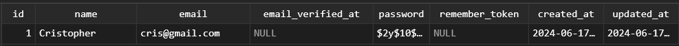

[< Volver al índice](/docs/readme.md)

# Eloquent and the Active Record Pattern

En este capítulo, utilizaremos Eloquent, que es la implementación de Active Record de Laravel. Eloquent nos permitirá interactuar con la base de datos mediante objetos o modelos de tipo Eloquent, permitiéndonos asignar y manipular un registro de tabla de base de datos, en este caso lo haremos utilizando la consola `Tinker`.

Inicialmente, restablecemos el archivo `/database/migrations/2014_10_12_000000_create_users_table.php`, en especial el método `up()` en su estado en el que estaba al inicializar el proyecto.

```php
public function up()
{
    Schema::create('users', function (Blueprint $table) {
        $table->id();
        $table->string('name');
        $table->string('email')->unique();
        $table->timestamp('email_verified_at')->nullable();
        $table->string('password');
        $table->rememberToken();
        $table->timestamps();
    });
}
```

Y aplicamos `php artisan migrate:fresh` para aplicar nuestras migraciones desde cero.

## Modelo Eloquent `User`

El modelo `User` que encontramos en `/app/Models/` es un modelo Eloquent. Este modelo nos permitirá realizar diferentes acciones de forma sencilla en registros de la base de datos.

## Añadir un nuevo registro con Eloquent

Para añadir un nuevo registro utilizando Eloquent, primero accedemos a `Tinker`:

```bash
php artisan tinker
```

Luego, podemos crear un modelo `User` de dos formas distintas:

1. Utilizando la ruta completa de donde se encuentra el modelo:

    ```php
    $user = new App\Models\User;
    ```

2. Indicando únicamente el nombre del modelo (Tinker interpreta la ruta):

    ```php
    $user = new User;
    ```

Posteriormente, se indican los valores para este nuevo objeto eloquent creado.

```php
$user->name = 'Cristopher';
$user->email = 'cris@gmail.com';
$user->password = bcrypt('!password');
```

Estos datos aún no se han persistido en la base de datos. Para persistir los cambios, debemos ejecutar lo siguiente:

```php
$user->save();
```

Si lo anterior nos retorna `true`, esto quiere decir que el registro se ha guardado en la base de datos en la tabla `users`.



Ahora, desde Tinker podemos obtener cada valor del objeto del modelo Eloquent, podemos cambiarle valores con `$user->valor = nuevo-valor` y nuevamente aplicar el `$user->save();` para que estos cambios persistan en la tabla.

## Encontrar un registro

Además, podemos buscar el registro anteriormente creado en el sistema por medio de su ID de la siguiente forma:

```php
User::find(1);
```

En el caso anterior, el `1` es el ID del registro, pero si buscamos un ID inexistente, nos retornará null. Aunque, para lanzar una excepción si no se encuentra el registro, podemos utilizar:

```php
User::findOrFail(10);
```

## Obtener todos los usuarios

Para poder obtener todos los usuarios, realizamos lo siguiente:

```php
User::all();
```

Esto retornará una colección con todos los usuarios que se encuentren registrados en la tabla `users`.

## Manejar los usuarios mediante la colección

Si asignamos a una variable `$users` todo lo que retorna `User::all();`, podríamos obtener cada nombre o valor deseado de cada registro realizando lo siguiente:

```php
$users->pluck('name');
```

Lo cual sería equivalente a:

```php
$users->map(function ($user) { return $user->name; });
```

También, podríamos obtener el primer registro con:

```php
$users->first();
```

O podemos usar:

```php
$users[0];
```

En esta última, podríamos remplazar el valor `0` con cualquier índice para obtener el registro correspondiente.
